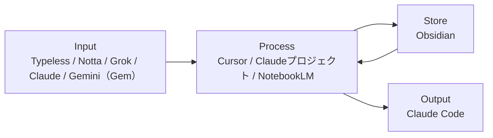
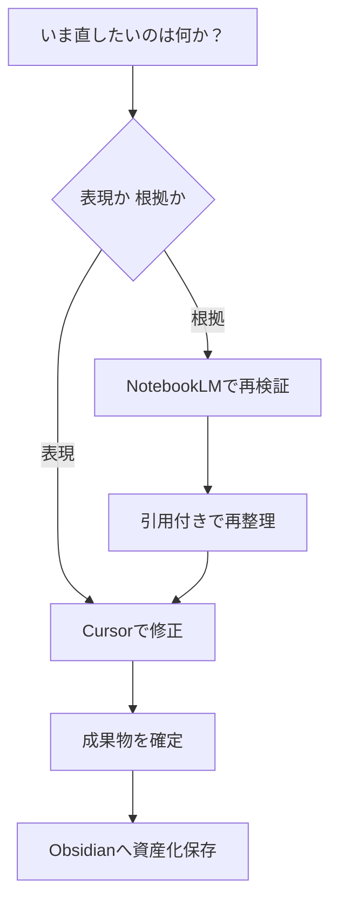
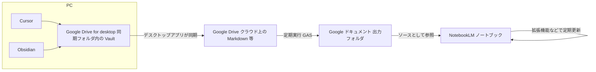

# AI活用整理

環境・ツール運用の正本（旧：AI戦略_01／ファイル名 `01_AI活用整理.md`）

---

## 0. 全体像

- Input：Typeless / Notta / Grok / Claude / Gemini（Gem）
- Process：Cursor / Claudeプロジェクト / NotebookLM
- Store：Obsidian
- Output：Claude Code

---

## 0.5 ツール構成図



補足：
- 図の Input は**日常の主経路**を示す。`Gemini` は Google連携、および `Gem` の**用途別プリセット実行**で利用する。**役割と出番の定義は §1・§2 を正とする**。
- 日常の入力・壁打ちは `Claude` を優先
- `Gemini` は Googleサービス連携が必要なとき、または NotebookLMソース前提で（Gemの用途別プリセットで）補助推論するときのみ利用

---

## 1. ツール役割定義（確定版）

| ツール | 役割 | 一言定義 |
|--------|------|----------|
| Typeless | 音声入力 | 思考を瞬時にテキスト化 |
| Notta | 議事録・書き起こし | 会議・面談を自動テキスト化 |
| Grok | リアルタイム情報収集 | 最新トレンド・X情報のキャッチアップ |
| Gemini（Gem） | Google連携／用途別プリセット実行 | Gmail・カレンダー統合／Instructions固定で同じ型を再現 |
| Claude（通常） | 壁打ち・下書き | その場の問い・短いドラフト（文脈の長期蓄積はプロジェクトへ） |
| Claudeプロジェクト | 戦略壁打ち・文脈蓄積 | 会話履歴が育つ思考パートナー |
| Cursor | 全操作の中核UI・最終出力 | あらゆるアウトプットの起点 |
| NotebookLM | ソース限定の壁打ち・履歴追従 | 一次情報に基づき、文脈を維持したまま改善・思考を深める |
| Obsidian | 知識の永久保存 | 第二の脳 |
| Claude Code | 業務自動化・エージェント | 業務をフローとして再現する |

補足：`Gemini` は上表どおり **Google連携／Gemの用途別プリセット実行が主**。NotebookLMソース前提の補助推論は例外として §2 を参照。

---

## 2. ツールの使い分け判断

「リアルタイム情報・トレンドを収集したい」  
→ Grok

「Google系サービスと連携したい」  
→ Gemini

「同じ作業を毎回同じ型で回したい（用途別プリセットで回したい）」  
→ Gemini（Gem）→（必要に応じて）NotebookLM参照

「特定のソース・領域に限定して深掘りしたい」  
→ NotebookLM（該当ノートブック）

「過去の会話の文脈を踏まえて戦略を考えたい」  
→ Claudeプロジェクト

「その場の壁打ち・短い初稿だけで足りる」  
→ Claude（通常）

「会議・面談をテキスト化したい」  
→ Notta（入力パターンの細部は §5.5）

「文章・コンテンツ・アウトプットを作りたい」  
→ Cursor（全操作の起点）

「業務を自動化・フロー化したい」  
→ Claude Code

「音声で素早くインプットしたい」  
→ Typeless → 各ツールへ

### Claude と Claudeプロジェクトの切り替え

- **Claude（通常）**：その場の壁打ち・下書き・短い問いへの回答。セッションをまたいで参照しないならこちらで足りる。
- **Claudeプロジェクト**：同テーマで**複数回**壁打ちし、**文脈・前提・過去のやり取りを蓄積**したいとき。戦略・設計・長期タスクの判断軸をプロジェクト側に残す。

---

## 3. 情報フロー

### 原則（5段階）

1. 収集
2. 理解
3. 構造化
4. 実行
5. 蓄積

補足：Obsidianには「生ログ」ではなく「資産化済みアウトプット」を保存する。

### パターン別

#### パターンA：直接蓄積

良い記事・読書ハイライト・気づき  
↓  
Obsidian（直接保存）  
↓  
Cursor で読み込んでアウトプット生成

#### パターンB：NotebookLM経由

業務資料・音声ジャーナル・特定テーマのソース群  
↓  
NotebookLM（こねる・分析・パターン抽出）  
↓  
出てきた洞察・ノウハウ・気づきのみ  
↓  
Obsidian（パーマネントノートとして保存）  
↓  
Cursor で横断的に活用

#### パターンC：Claude経由

Claude プロジェクトで戦略設計・壁打ち  
↓  
重要な意思決定・気づきのみ抽出  
↓  
Obsidian（意思決定ログとして保存）

#### パターンD：統一オペレーションフロー

① 収集 — Grok / Claude Web検索で情報取得  
② 理解 — NotebookLMで精読・構造把握  
③ 構造化 — Cursorで骨格を組む  
④ 実行 — Claude Codeで自動化・量産  
⑤ 蓄積 — Obsidianに知識として保存

---

## 4. Vault フォルダ構成（2026-04 時点）

| フォルダ | 役割 |
|---|---|
| `00_Inbox` | 未整理の一時受信 |
| `03_Career` | キャリア戦略・転職管理（外向き・長期） |
| `01_Work` | 本業実務・スキル蓄積（Sales/CS）|
| `03_Business` | 個人事業の戦略・意思決定（`RINGBELL/`含む） |
| `03_Business/RINGBELL/` | 副業（婚活CS）の実務ナレッジ |
| `07_Asset` | 所有物の購入・管理 |
| `09_Athlete` | 競技・身体パフォーマンス |
| `11_Beauty` | 美容・アンチエイジング |
| `05_Life` | 人生設計・資産・住宅（`11_health` / `20_events` / `30_finance` / `40_agreements` 等） |
| `06_Child` | 子ども関連 |
| `08_Relationship` | パートナー・家族・人間関係（一般） |
| `80_Journal` | 思考の生ログ・日次記録 |
| `04_AI` | AI戦略・自動化・メソッド（このフォルダ） |
| `98_NotebookLM_Sync` | NotebookLM ソース用同期ルート |
| `20_Input/02_Clippings` | Web記事・クリップ・教養・インスピレーション系 |
| `20_Input/01_Kindle` | 読書ハイライト（旧 `09_Culture` の読書ログ相当をこちらへ） |
| `99_System` | Vault設定・システムファイル |

補足：`01_Work` は本業実務ノウハウの蓄積場所。NotebookLMノートブックは業務量増加後に追加検討。

---

## 4.5 NotebookLM運用

- **NotebookLM に載せるソースは Google ドキュメントに限定する**（Markdown を直接ソースにしない）。**正本 → クラウド MD → GAS → Docs → NotebookLM** の流れは **§4.6** を正とする。
- 11冊構成で領域分離（Career / Business / RINGBELL / Asset / Athlete / Beauty / Life / Relationship / Culture / Journal / AI活用）。Obsidian では Relationship を **`06_Child`** と **`08_Relationship`** に分け、Culture 相当の正本は **`20_Input/02_Clippings`** / **`20_Input/01_Kindle`**（`09_Culture` 廃止）。
- すべてのノートは「意思決定のため」に運用し、概念ではなく実態ベースで分類する
- NotebookLMで抽出した洞察のみをObsidianへ転記し、生ログはNotebookLM側で保持する
- 「答えられない質問」を記録し、ソース追加と分類見直しで精度を改善する
- 詳細設計は `04_AI/01_ツール運用/03_NotebookLM運用.md` を参照

### NotebookLM × Gem（Gemini）

- **同一ノートブック（ソース束）を読む前提**なら、知識の「倉庫」は同じなので、**引用・根拠に寄せる発想は同系**。一方で、運用上の差分は「どこを入口にするか（UI・動線）」に加えて、**推論に使えるモデル性能**にも出る。
- 現状の理解では **NotebookLM 側のモデルが相対的に古い（例：Gemini 3.0 Flash 相当）**可能性があるため、**基本動線は Gemini（Gem）の用途別プリセット実行**に寄せる。  
  - **Gem**：役割・禁止事項・出力形式・チェック観点を固定（毎回の指示入力を削減）  
  - **NotebookLM**：ソース束（根拠）の参照・引用・検証を担う（必要に応じて参照）
- よって **NotebookLM × Gem を基本方針として採用**する。例外として、NotebookLM 単体が扱いやすいのは「精読・構造把握に集中したい」「ノートブック内で完結したい」など、入口の定型化が不要なケース。

詳細メモ・比較表は `04_AI/01_ツール運用/NotebookLM×Gem.md` を参照。

---

## 5. Android 運用設計

### 移動中：Typeless（音声入力）

↓

```
├── 業務・日常の思考ログ → NotebookLM【10 Journal】
├── 重要な気づき → Obsidian【00_Inbox】
└── 戦略の壁打ち → Claude アプリ
```

### 移動中：Grok（リアルタイム情報収集）

↓

気になった情報 → Obsidian【20_Input/02_Clippings】または NotebookLM【11 AI活用】

### 帰宅後（週次）

- `00_Inbox` を各フォルダへ整理
- NotebookLM【10 Journal】の月次分析 → Obsidian【80_Journal】へ（洞察のパーマネント化）

補足：会議・面談の取り込みは §5.5。Vault 内の `00_Inbox` / `20_Input/02_Clippings` / `80_Journal` 等の有無・命名は環境に合わせて読み替える。NotebookLM の冊番号と Obsidian トップフォルダの対応は `03_NotebookLM運用.md` §6 を正とする。

---

## 5.5 会議運用（資産化）

- 入力（場合分け）：
  - オンライン
    - botを入れられる：Notta
    - botを入れられない
      - イヤホンあり：Hidock P1
      - イヤホンなし：Nottaスマホ録音 or Hidock P1
  - オフライン
    - Nottaスマホ録音 or Hidock P1
- 処理：Notta等で得た**録音・文字起こしテキスト（または要約）をNotebookLMのソースとして投入**し理解・検証 -> 要点をObsidianに保存 -> Cursorで議事録・成果物化 -> 必要ならClaude Codeでタスク化
- 原則：会議は一過性の記録ではなく、再利用可能な業務資産として残す

---

## 5.6 CursorとNotebookLMの使い分け（実務判断）

### まず結論

- NotebookLM：ソースに基づく壁打ち・検証、履歴を踏まえたブラッシュアップ（ソース限定）
- Cursor：横断統合・文章化・最終成果物化
- Obsidian：再利用価値のある知識だけを保存

### 迷ったときの判断基準

- 表現を直す（文体、構成、読みやすさ） -> Cursor
- 根拠を直す（前提、引用、事実確認） -> NotebookLM
- 複数ノートをつないで実行計画にする -> Cursor
- 根拠資料が更新された -> NotebookLMで再検証

### 1分で判断するクイックチャート



---

## 5.7 標準オペレーション（初心者向け）

1. NotebookLMに対象ソースを入れる（領域別ノート）
2. 目的を1行で定義して壁打ちする（何を決めるか）
3. 引用付きで論点と判断軸を出す
4. Cursorで実務成果物に整える（提案文、議事録、計画）
5. 確定版のみObsidianへ保存する
6. 繰り返し業務はClaude Codeで自動化する

実務メモ：
- 「とりあえず保存」はしない。再利用できる形にしてから保存する
- 判断に使った根拠ソースは、成果物の末尾にメモで残す

---

## 5.8 運用品質チェック（プロ向け）

### 最低限の記録ルール

- 重要文書には「更新日時」「根拠ソース」を記載
- NotebookLMソースは週次で棚卸し（古い資料を除外）
- 機微情報は投入前に匿名化し、必要時は承認を取る（**データ区分・投入可否・承認の詳細は `02_AIキャッチアップ.md` を正とする**）

### 自動化の優先順位（小さく始める）

1. 問い合わせ返信生成
2. 面談準備
3. 面談後レポート整理

この順で進めると、成果が見えやすく改善ループを作りやすい。

---

## 6. 運用品質ルール

- 1ツール1責任（役割を混ぜない）
- 生成物は利用前に事実・文脈を確認
- ツール停止時は代替経路を準備（例：Notta停止時は標準書き起こし）

---

## 7. 他ドキュメントへの委譲

- Claude Code を **1日約3時間・実戦ファースト**で進める手順・週末キャッチアップ枠は [[04_ClaudeCode_爆速実戦キャッチアップ手順]] を参照
- データ区分・投入可否・保存ルールは `02_AIキャッチアップ.md` を正本とする
- 品質ゲート（Green/Yellow/Red判定含む）は `02_AIキャッチアップ.md` を正本とする
- KPI実績・対外説明の**実数・本文**は `03_Career` 等で管理する（定型枠の参考は `99_archive/AI戦略_02_実績と対外説明.md`）

---

## 8. 拡張ツール（任意）

- Google Workspace Studio / Opal：権限/承認/ログを重視したチーム運用時に採用
- Whisk / Veo / nanobanana Pro：画像・動画生成の試作/本番を分離して運用
- 導入判断は「再現性」「監査性」「運用コスト」の3点で行う

---

## 9. リサーチと文章制作の実務プロトコル（今回の学び）

### 結論

- リサーチと文章制作は、**Cursorを起点**に進めると最もスループットが高い
- NotebookLMは「特定ソースで深掘り・壁打ち」が必要な場面に限定して使う

### 進め方（固定）

1. 先に調査範囲を固定する（対象URL、記事数、期間）
2. Cursorで一次要約を作る（各記事5-10行）
3. Cursorで丁寧版に拡張する（要旨、根拠、実務示唆、注意点）
4. NotebookLM投入用の索引版を同時に作る（URL付き）
5. 確定版だけObsidianへ保存する（未整理メモは残さない）

### 品質チェック（最低限）

- 各要約に元URLを付ける
- 数値は「母数」「期間」「定義」を1セットで残す
- 断定が強い箇所は「示唆」「傾向」として表現を調整する

---

## 4.6 NotebookLM ソースパイプライン（確定構成）

**目的**：後から読んですぐ分かるように、**PC 上の編集**から **NotebookLM（ソース＝Google ドキュメントのみ）**までの経路を固定する。

### 単一の正本（SSOT）

- **編集の正本**：Vault 内の **Markdown**（主に **Cursor** で編集。**Obsidian** でも同一フォルダを開ける）。
- **クラウド上**でも **`.md` として**存在させる（下記「PC ↔ Drive」）。

### NotebookLM 側のルール

- **NotebookLM のソースは Google ドキュメントに限定**する。  
- **理由**：Markdown をそのままソースにすると取り込み・表示・長文運用の体感が劣ることがある。**Google ドキュメント**の方が NotebookLM との相性を優先する。

### データの流れ（End-to-End）



**言語化（あなたの理解どおりの流れ）**

1. **Cursor** は、**PC にマウントされた Google Drive（デスクトップ版）**内の Vault ファイルを開いて編集する。  
2. **Obsidian** も **同じローカル同期フォルダ**の Vault を開ける。  
3. **保存**すると、**ローカル上のファイルが更新**される。  
4. **クラウドの Google Drive へ載せる主役は「Google Drive デスクトップアプリ」の同期**（双方向）。スマホの Google Drive アプリは主に閲覧・別端末用。  
5. **Markdown** のままクラウド上にも残る。  
6. **Google Apps Script（GAS）**が、クラウド上の **対象 Markdown** を **定期実行**で **Google ドキュメントに複製・変換**する。  
7. 生成された **Google ドキュメント**を、**NotebookLM のソースとしてのみ**参照する。  
8. **NotebookLM 拡張機能**等で、ソースの **定期同期／更新** を行う（製品の UI 表記は変わりうる）。

### Vault 内 `98_NotebookLM_Sync/` との関係

- **`98_NotebookLM_Sync/`** は **NotebookLM 用に集約した Markdown 束**などの **中間の置き場**として Vault に残る場合がある（**NotebookLM が読む正本ではない**。**NotebookLM が読む正は GAS 出力の Google ドキュメント**）。  
- 冊・領域の対応・命名は `04_AI/01_ツール運用/03_NotebookLM運用.md` §6 を参照（例：実フォルダは `04_Asset` / `05_Athlete` 等）。

### 守りたいルール（最短）

- **編集**は常に **Markdown（Vault）**で行う。  
- **NotebookLM 上でソースを「正」として編集しない**（分析・質問のみ）。  
- **GAS の入出力パス／ファイル ID** は Vault を移したら必ず見直す。

---

## 4.7 連携健全性チェック（NotebookLM まで一通り）

**切り分けのコツ**：NotebookLM の回答が古いとき、**Google ドキュメントが古い**なら GAS か Drive 同期。**ドキュメントは新しい**なら NotebookLM 側のソース更新・再インデックス。

### A. PC ↔ Google Drive（Markdown 正本）

- [ ] Google Drive **デスクトップアプリ**に **同期エラー・保留中**がない  
- [ ] テスト：Cursor で任意の `.md` に目印を入れて保存 → **数分以内に** Google Drive **ウェブ**で同じファイルを開き、**最終更新時刻**が追従している  

### B. GAS（Markdown → Google ドキュメント）

- [ ] Apps Script の **実行数／エラー**（実行ログ）で直近実行が **成功**している  
- [ ] **出力先フォルダ**の対象 **Google ドキュメント**の「最終更新」が、想定する GAS 周期の範囲で新しい  
- [ ] Vault の **フォルダ再編・リネーム**後、GAS が参照する **親フォルダ ID・ファイル一覧**が破綻していない  

### C. NotebookLM

- [ ] 各ノートブックの **Sources** が **意図した Google ドキュメントだけ**になっている（**Markdown 直指定に戻っていない**）  
- [ ] Sources に **エラー・権限・未取得**がない  
- [ ] **拡張機能**の「同期」相当を **手動で一度実行**し、チャットで「直前に入れた目印」をソースに根拠付きで答えられるか確認  

### D. Git を併用している場合

- [ ] `git status` で意図しない大量変更が出ていない（Drive 同期と Git の二重管理のズレに注意）
