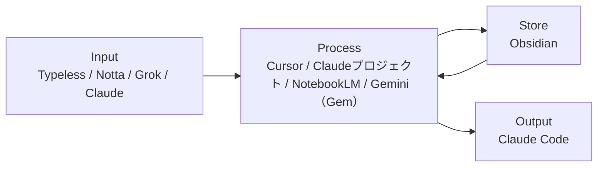
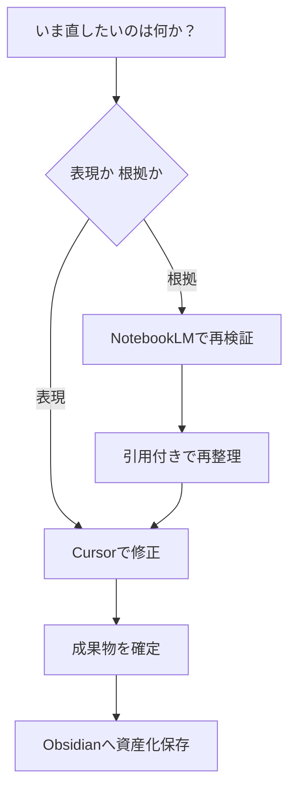
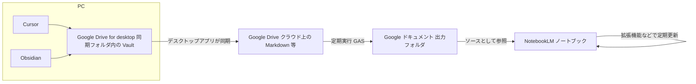

# ツール役割と運用

環境・ツール運用の正本（旧ドキュメント名：**AI活用整理**／旧ファイル名：`01_AI活用整理.md`）

---

## 0. 全体像

- Input：Typeless / Notta / Grok / Claude
- Process：Cursor / Claudeプロジェクト / NotebookLM / Gemini（Gem）
- Store：Obsidian
- Output：Claude Code

---

## 0.5 ツール構成図



補足：
- `Gemini（Gem）` は Google連携・用途別プリセット実行のため **Process** に分類（情報収集のInputではない）。
- 日常の入力・壁打ちは `Claude` を優先
- `Gemini` は Googleサービス連携が必要なとき、または Gemの用途別プリセットで補助推論するときのみ利用。**役割と出番の定義は §1・§2 を正とする**。

---

## 1. ツール役割定義（確定版）

| ツール | 役割 | 一言定義 |
|--------|------|----------|
| Typeless | 音声入力 | 思考を瞬時にテキスト化 |
| Notta | 議事録・書き起こし | 会議・面談を自動テキスト化 |
| Grok | リアルタイム情報収集 | 最新トレンド・X情報のキャッチアップ |
| Gemini（Gem） | Google連携／用途別プリセット実行 | Gmail・カレンダー統合／Instructions固定で同じ型を再現 |
| Claude（通常） | 壁打ち・下書き | その場の問い・短いドラフト（文脈の長期蓄積はプロジェクトへ） |
| Claudeプロジェクト | 戦略壁打ち・文脈蓄積 | 会話履歴が育つ思考パートナー |
| Cursor | 全操作の中核UI・最終出力 | あらゆるアウトプットの起点 |
| NotebookLM | ソース限定の壁打ち・履歴追従 | 一次情報に基づき、文脈を維持したまま改善・思考を深める |
| Obsidian | 知識の永久保存 | 第二の脳 |
| Claude Code | 業務自動化・エージェント | 業務をフローとして再現する |

補足：`Gemini` は上表どおり **Google連携／Gemの用途別プリセット実行が主**。NotebookLMソース前提の補助推論は例外として §2 を参照。

---

## 2. ツールの使い分け判断

「リアルタイム情報・トレンドを収集したい」  
→ Grok

「Google系サービスと連携したい」  
→ Gemini

「同じ作業を毎回同じ型で回したい（用途別プリセットで回したい）」  
→ Gemini（Gem）→（必要に応じて）NotebookLM参照

「特定のソース・領域に限定して深掘りしたい」  
→ NotebookLM（該当ノートブック）

「過去の会話の文脈を踏まえて戦略を考えたい」  
→ Claudeプロジェクト

「その場の壁打ち・短い初稿だけで足りる」  
→ Claude（通常）

「会議・面談をテキスト化したい」  
→ Notta（入力パターンの細部は §5.5）

「文章・コンテンツ・アウトプットを作りたい」  
→ Cursor（全操作の起点）

「業務を自動化・フロー化したい」  
→ Claude Code（**境界条件・コスト最適化は §2.5 を正とする**）

「音声で素早くインプットしたい」  
→ Typeless → 各ツールへ

### Claude と Claudeプロジェクトの切り替え

- **Claude（通常）**：その場の壁打ち・下書き・短い問いへの回答。セッションをまたいで参照しないならこちらで足りる。
- **Claudeプロジェクト**：同テーマで**複数回**壁打ちし、**文脈・前提・過去のやり取りを蓄積**したいとき。戦略・設計・長期タスクの判断軸をプロジェクト側に残す。

---

## 2.5 Claude Code と Cursor エージェントの使い分け

> **本章の位置づけ** §0・§1 の「Process／Output」区分と、§1.5 の課金前提を **衝突なく接続**するための**意思決定フレーム**である。Cursor のエージェントと Claude Code の能力は部分重複するため、**「何ができるか」ではなく「どの経済制約とアーキテクチャに最適か」**で切る。

### 2.5.1 エグゼクティブ・サマリー

| 論点 | 結論 |
|:--|:--|
| **狙い** | **総コストを抑えつつ、アウトプット品質と再現性を最大化**する。 |
| **経済論拠** | Claude **Max** は月額が **Pro の約10倍**（§1.5）。Max の主目的の一つは **Claude Code のボリューム緩和**であるため、**Cursor 側へ寄せられる実行を Claude Code に載せない**ことで **Max 到達確率を下げる**。 |
| **技術論拠** | 本書の情報フローでは **Process＝Cursor**、**Output（フロー実行）＝Claude Code**（§0・§1）。エージェント機能は両方に存在するが、**「編集・統合・構造化・人間が差分を確証する工程」は Process** に寄せ、**「繰り返しジョブの実行・Skill 化・CLI 前提のフロー」は Output** に寄せると **責務が一意**になる。 |
| **運用の2原則** | **(1) Claude Code は Pro 一本で運用し、「Claude Code でしかできないこと」に限定する**。**(2) Cursor のエージェントで完結できることは、すべて Cursor で実行する。** |

### 2.5.2 問題設定（なぜ混線するか）

1. **機能の重複** — いずれも「複数ファイルを読み、書き換え、コマンドを実行する」外表を持つ。  
2. **インタフェースの違い** — Cursor は **IDE と同一視界**、Claude Code は **ターミナル＋リポジトリ文脈（`CLAUDE.md`・Skills・Hooks）** が中心。  
3. **課金単位の非対称** — Cursor Pro と Claude Pro は別契約。Claude Code の利用密度を上げると **Max 誘惑**が生じる（§1.5）。

したがって本章では **「比較表」→「配分原則」→「Claude Code 専用の定義」→「逸脱時の扱い」** の順で網羅する。

### 2.5.3 比較マトリクス（論理軸の網羅）

| 評価軸 | Cursor（エージェント含む） | Claude Code |
|:--|:--|:--|
| **本書上の役割** | §1：全操作の中核UI・**Process**（構造化・文章化・最終成果物化の起点） | §1：業務の **Output**・**フロー再現** |
| **最適なタスク粒度** | 短〜中：**判断と編集が交互**に起きる仕事 | 中〜長：**手順が言語化済み**／**同型反復** |
| **人間の認知負荷** | **低め（同一画面で差分確認）** | やや高め（ログ追跡・承認設計が要る） |
| **再現性の載せ先** | チャット履歴／プロンプト断片（**Skill 化は別**） | **Skills・スクリプト・Hooks** に寄せやすい |
| **典型アウトプット** | ノート統合、索引整合、リファクタ、ドキュメント調整 | 週次バッチ、`/command` 型の定型処理、クロスディレクトリ一括変換 |
| **セッション／上限の考え方** | **Cursor 契約側の枠**で処理すべきボリュームに留める | **Claude Pro 内で完結する「バッチ単位」**に分割し、Max に依存しない |
| **コスト最適化への寄与** | **Claude Code の起動回数・トークン密集タスクを削減** | Max が不要なら **ここにだけ**集約 |

### 2.5.4 配分原則（ユーザ方針の形式化）

以下は **意思決定ルール**として運用する（毎回の迷いを排除する）。

**原則 A — Claude Code（Output）**

1. **課金は Pro に留める**（§1.5）。Max は **要件駆動**（外部求人・長時間バッチがビジネス上必須のときのみ検討）。  
2. **投入は「Claude Code 専用バンドル」単位に限定**する。定義は §2.5.5。  
3. **同一内容を「試行錯誤しながら直す」作業**は載せない（それは Process＝Cursor）。

**原則 B — Cursor（Process／エージェント）**

1. **エージェントで完結するなら 100% Cursor** — フォルダ横断の統合、リンク更新方針の検討、複数ファイルの一貫性チェック、リライト、索引のたたき台作成など。  
2. **§3 パターンD の ③「構造化」**は原則として Cursor（本原則と一致）。  
3. Claude Code へ渡すときは **「入力・出力・完了条件」が書ける状態**にしてから渡す（**曖昧な丸投げ禁止**）。

### 2.5.5 「Claude Code でしかできないこと」の定義（肯定リスト）

次の**いずれかを満たす**場合のみ Claude Code を第一候補とする。満たさないなら **Cursor 先行**。

| # | 条件（いずれか） | 例 |
|:--|:--|:--|
| C1 | **`.claude/skills`・Hooks・CLI 前提**で初めて安定する | 週次処理の定型プロンプトを `/skill` 化 |
| C2 | **無人に近いバッチ**（承認点は別として、手順が機械的） | 大量パス置換、テンプレ一括生成、ログ集計 |
| C3 | **ターミナルとファイルシステムの往復が主**で、IDE 上の微米編集が主ではない | スクリプト連携、生成物の配置規約に沿った配置 |
| C4 | **同じジョブを週に複数回**実行し、Cursor で毎回やると **説明コスト > 実行コスト** | Clippings 処理、インデックス追随、週次レポート生成 |
| C5 | **Output レイヤ**として §3 の④に明示的に相当 | 「実行→量産→再利用可能フロー」 |

**反例（Cursor に寄せる）** — 「方針がまだ固まらない」「差分を見ながら言い換えたい」「この1時間は探索」→ **Process**。

### 2.5.6 逸脱・例外の扱い（ガバナンス）

| 状況 | 対応 |
|:--|:--|
| **Claude Code が詰まった** | **Cursor でログを読み、方針を1枚に書き直してから**再実行（探索を CC に載せない） |
| **Cursor だけでは重い** | まず **タスク分割**（ファイル単位・ディレクトリ単位）。それでも無理なら C1–C5 を再判定 |
| **Pro 上限が現実的に苦しい** | (1) Cursor へ寄せ戻し (2) バッチ細分化 (3) **Max はビジネス要件で正当化できてから** §1.5 に従い検討 |

### 2.5.7 他節との整合（参照関係）

| 参照先 | 関係 |
|:--|:--|
| §0・§1 全体像 | Process／Output の**上位設計** |
| §3 パターンD | ③ Cursor → ④ Claude Code の**業務プロセス宣言** |
| §1.5 | **Pro／Max の経済制約の正本** |
| `../04_学習/今後やること.md` §6 | Claude Code **実戦・スプリント**（実行の細部） |

---

## 3. 情報フロー

### 原則（5段階）

1. 収集
2. 理解
3. 構造化
4. 実行
5. 蓄積

補足：Obsidianには「生ログ」ではなく「資産化済みアウトプット」を保存する。

### パターン別

#### パターンA：直接蓄積

良い記事・読書ハイライト・気づき  
↓  
Obsidian（直接保存）  
↓  
Cursor で読み込んでアウトプット生成

#### パターンB：NotebookLM経由

業務資料・音声ジャーナル・特定テーマのソース群  
↓  
NotebookLM（こねる・分析・パターン抽出）  
↓  
出てきた洞察・ノウハウ・気づきのみ  
↓  
Obsidian（パーマネントノートとして保存）  
↓  
Cursor で横断的に活用

#### パターンC：Claude経由

Claude プロジェクトで戦略設計・壁打ち  
↓  
重要な意思決定・気づきのみ抽出  
↓  
Obsidian（意思決定ログとして保存）

#### パターンD：統一オペレーションフロー

① 収集 — Grok / Claude Web検索で情報取得  
② 理解 — NotebookLMで精読・構造把握  
③ 構造化 — Cursorで骨格を組む  
④ 実行 — Claude Codeで自動化・量産  
⑤ 蓄積 — Obsidianに知識として保存

---

## 1.5 課金ツール一覧（2026-04 時点）

> 月次コストの全体把握と契約判断の正本。変更時はここを更新する。

### 必須課金（コア4ツール）

> **Claude** は一旦 **有料プラン＝Pro（$20/月）** を選択した前提で記載。上限・要件に応じて下の **課金（Claude Max）** へ昇格する。

| ツール | プラン | 金額 | 主な理由 |
|---|---|---|---|
| Claude | **Pro**（$20/月） | ≈¥3,000 | 壁打ち・プロジェクト・Claude Codeは **Pro の上限内**で運用する前提 |
| Cursor Pro | Pro（$20/月） | ≈¥3,000 | AI補完・エージェント機能。Vault全操作の中核UI |
| Gemini Advanced | Google One AI Premium（¥2,900/月） | ¥2,900 | Gemの用途別プリセット実行・Google Workspace連携。**NotebookLM Plusを含む**（別契約不要） |
| Typeless | 有料プラン（$30/月） | ≈¥4,500 | 音声入力の精度・制限なし利用 |
| **合計（必須）** | | **≈¥13,400/月** | |

### 課金（Claude Max：Pro からの昇格オプション）

| ツール | プラン | 金額 | 主な理由 |
|---|---|---|---|
| Claude Max | Max（$200/月） | ≈¥30,000 | Claude Code・Projects・長文対話の**上限緩和**。求人・コンサルで Max が要件のときは **Pro の置き換え**として検討（併課金ではない） |

### 検討中・任意課金

| ツール | プラン | 金額 | 判断基準 |
|---|---|---|---|
| Notta | Business（$19.99/月〜） | ≈¥3,000 | 会議が週2回以上あれば費用対効果あり。少ない場合は無料プランで対応 |
| ~~NotebookLM Plus~~ | ~~Plus（$19.99/月）~~ | ~~≈¥3,000~~ | **Google One AI Premium（Gemini Advanced）に含まれるため不要**。上位プランが必要になった場合のみ再検討 |
| Grok（X Premium） | Basic（¥980/月〜） | ¥980〜 | **要再評価**：リアルタイムX情報はClaudeのWeb検索で代替可能。X利用頻度が高い場合のみ継続 |
| Obsidian Sync | Personal（$10/月） | ≈¥1,500 | Google Drive同期で代替中のため現状不要 |

### 課金停止で代替できるケース

| 停止ツール | 代替手段 |
|---|---|
| Grok | Claude Web検索 / Perplexity（無料）でリアルタイム情報収集 |
| Notta | Google Meet自動文字起こし（無料）+ Whisper API |
| Typeless | iOS/Androidの標準音声入力 + Claude音声メモ |

---

## 4. Vault フォルダ構成（2026-04 時点）

| フォルダ | 役割 |
|---|---|
| `00_Inbox` | 未整理の一時受信 |
| `03_Career` | キャリア戦略・転職管理（外向き・長期） |
| `01_Work` | 本業実務・スキル蓄積（Sales/CS）|
| `02_Business` | 個人事業の戦略・意思決定（`RINGBELL/`含む） |
| `02_Business/RINGBELL/` | 副業（婚活CS）の実務ナレッジ |
| `07_Asset` | 所有物の購入・管理 |
| `09_Athlete` | 競技・身体パフォーマンス |
| `11_Beauty` | 美容・アンチエイジング |
| `05_Life` | 人生設計・資産・住宅（`11_health` / `20_events` / `30_finance` / `40_agreements` 等） |
| `06_Child` | 子ども関連 |
| `08_Relationship` | パートナー・家族・人間関係（一般） |
| `80_Journal` | 思考の生ログ・日次記録 |
| `04_AI` | AI戦略・自動化・メソッド（このフォルダ） |
| `98_NotebookLM_Sync` | NotebookLM ソース用同期ルート |
| `20_Input/02_Clippings` | Web記事・クリップ・教養・インスピレーション系 |
| `20_Input/01_Kindle` | 読書ハイライト（旧 `09_Culture` の読書ログ相当をこちらへ） |
| `99_System` | Vault設定・システムファイル |

補足：`01_Work` は本業実務ノウハウの蓄積場所。NotebookLMノートブックは業務量増加後に追加検討。

---

## 4.5 NotebookLM運用

- **NotebookLM に載せるソースは Google ドキュメントに限定する**（Markdown を直接ソースにしない）。**正本 → クラウド MD → GAS → Docs → NotebookLM** の流れは **§4.6** を正とする。
- 11冊構成で領域分離（Career / Business / RINGBELL / Asset / Athlete / Beauty / Life / Relationship / Culture / Journal / AI活用）。Obsidian では Relationship を **`06_Child`** と **`08_Relationship`** に分け、Culture 相当の正本は **`20_Input/02_Clippings`** / **`20_Input/01_Kindle`**（`09_Culture` 廃止）。
- すべてのノートは「意思決定のため」に運用し、概念ではなく実態ベースで分類する
- NotebookLMで抽出した洞察のみをObsidianへ転記し、生ログはNotebookLM側で保持する
- 「答えられない質問」を記録し、ソース追加と分類見直しで精度を改善する
- 詳細設計は `04_AI/01_ツール運用/03_NotebookLM.md` を参照

### NotebookLM × Gem（Gemini）

- **同一ノートブック（ソース束）を読む前提**なら、知識の「倉庫」は同じなので、**引用・根拠に寄せる発想は同系**。一方で、運用上の差分は「どこを入口にするか（UI・動線）」に加えて、**推論に使えるモデル性能**にも出る。
- 現状の理解では **NotebookLM 側のモデルが相対的に古い（例：Gemini 3.0 Flash 相当）**可能性があるため、**基本動線は Gemini（Gem）の用途別プリセット実行**に寄せる。  
  - **Gem**：役割・禁止事項・出力形式・チェック観点を固定（毎回の指示入力を削減）  
  - **NotebookLM**：ソース束（根拠）の参照・引用・検証を担う（必要に応じて参照）
- よって **NotebookLM × Gem を基本方針として採用**する。例外として、NotebookLM 単体が扱いやすいのは「精読・構造把握に集中したい」「ノートブック内で完結したい」など、入口の定型化が不要なケース。

詳細メモ・比較表は `04_AI/01_ツール運用/03_NotebookLM.md` の **§9 付録（NotebookLM × Gemini（Gem））** を参照。

---

## 5. Android 運用設計

### 移動中：Typeless（音声入力）

↓

```
├── 業務・日常の思考ログ → NotebookLM【10 Journal】
├── 重要な気づき → Obsidian【00_Inbox】
└── 戦略の壁打ち → Claude アプリ
```

### 移動中：Grok（リアルタイム情報収集）

↓

気になった情報 → Obsidian【20_Input/02_Clippings】または NotebookLM【11 AI活用】

### 帰宅後（週次）

- `00_Inbox` を各フォルダへ整理
- NotebookLM【10 Journal】の月次分析 → Obsidian【80_Journal】へ（洞察のパーマネント化）

補足：会議・面談の取り込みは §5.5。Vault 内の `00_Inbox` / `20_Input/02_Clippings` / `80_Journal` 等の有無・命名は環境に合わせて読み替える。NotebookLM の冊番号と Obsidian トップフォルダの対応は `03_NotebookLM.md` §6 を正とする。

---

## 5.5 会議運用（資産化）

- 入力（場合分け）：
  - オンライン
    - botを入れられる：Notta
    - botを入れられない
      - イヤホンあり：Hidock P1
      - イヤホンなし：Nottaスマホ録音 or Hidock P1
  - オフライン
    - Nottaスマホ録音 or Hidock P1
- 処理：Notta等で得た**録音・文字起こしテキスト（または要約）をNotebookLMのソースとして投入**し理解・検証 -> 要点をObsidianに保存 -> Cursorで議事録・成果物化 -> 必要ならClaude Codeでタスク化
- 原則：会議は一過性の記録ではなく、再利用可能な業務資産として残す

---

## 5.6 CursorとNotebookLMの使い分け（実務判断）

### まず結論

- NotebookLM：ソースに基づく壁打ち・検証、履歴を踏まえたブラッシュアップ（ソース限定）
- Cursor：横断統合・文章化・最終成果物化
- Obsidian：再利用価値のある知識だけを保存

### 迷ったときの判断基準

- 表現を直す（文体、構成、読みやすさ） -> Cursor
- 根拠を直す（前提、引用、事実確認） -> NotebookLM
- 複数ノートをつないで実行計画にする -> Cursor
- 根拠資料が更新された -> NotebookLMで再検証

### 1分で判断するクイックチャート



---

## 5.7 標準オペレーション（初心者向け）

1. NotebookLMに対象ソースを入れる（領域別ノート）
2. 目的を1行で定義して壁打ちする（何を決めるか）
3. 引用付きで論点と判断軸を出す
4. Cursorで実務成果物に整える（提案文、議事録、計画）
5. 確定版のみObsidianへ保存する
6. 繰り返し業務はClaude Codeで自動化する

実務メモ：
- 「とりあえず保存」はしない。再利用できる形にしてから保存する
- 判断に使った根拠ソースは、成果物の末尾にメモで残す

---

## 5.8 運用品質チェック（プロ向け）

### 最低限の記録ルール

- 重要文書には「更新日時」「根拠ソース」を記載
- NotebookLMソースは週次で棚卸し（古い資料を除外）
- 機微情報は投入前に匿名化し、必要時は承認を取る（**データ区分・投入可否・承認の詳細は `02_フェーズとガバナンス.md` を正とする**）

### 自動化の優先順位（小さく始める）

1. 問い合わせ返信生成
2. 面談準備
3. 面談後レポート整理

この順で進めると、成果が見えやすく改善ループを作りやすい。

---

## 6. 運用品質ルール

- 1ツール1責任（役割を混ぜない）
- 生成物は利用前に事実・文脈を確認
- ツール停止時は代替経路を準備（例：Notta停止時は標準書き起こし）

---

## 7. 他ドキュメントへの委譲

- Claude Code を **1日約3時間・実戦ファースト**で進める手順・週末キャッチアップ枠は [[../04_学習/今後やること|今後やること]] **§6** を参照
- データ区分・投入可否・保存ルールは `02_フェーズとガバナンス.md` を正本とする
- 品質ゲート（Green/Yellow/Red判定含む）は `02_フェーズとガバナンス.md` を正本とする
- KPI実績・対外説明の**実数・本文**は `03_Career` 等で管理する（定型枠の参考は `99_archive/AI戦略_02_実績と対外説明.md`）

---

## 8. 拡張ツール（任意）

- Google Workspace Studio / Opal：権限/承認/ログを重視したチーム運用時に採用
- Whisk / Veo / nanobanana Pro：画像・動画生成の試作/本番を分離して運用
- 導入判断は「再現性」「監査性」「運用コスト」の3点で行う

---

## 9. リサーチと文章制作の実務プロトコル（今回の学び）

### 結論

- リサーチと文章制作は、**Cursorを起点**に進めると最もスループットが高い
- NotebookLMは「特定ソースで深掘り・壁打ち」が必要な場面に限定して使う

### 進め方（固定）

1. 先に調査範囲を固定する（対象URL、記事数、期間）
2. Cursorで一次要約を作る（各記事5-10行）
3. Cursorで丁寧版に拡張する（要旨、根拠、実務示唆、注意点）
4. NotebookLM投入用の索引版を同時に作る（URL付き）
5. 確定版だけObsidianへ保存する（未整理メモは残さない）

### 品質チェック（最低限）

- 各要約に元URLを付ける
- 数値は「母数」「期間」「定義」を1セットで残す
- 断定が強い箇所は「示唆」「傾向」として表現を調整する

---

## 4.6 NotebookLM ソースパイプライン（確定構成）

**目的**：後から読んですぐ分かるように、**PC 上の編集**から **NotebookLM（ソース＝Google ドキュメントのみ）**までの経路を固定する。

### 単一の正本（SSOT）

- **編集の正本**：Vault 内の **Markdown**（主に **Cursor** で編集。**Obsidian** でも同一フォルダを開ける）。
- **クラウド上**でも **`.md` として**存在させる（下記「PC ↔ Drive」）。

### NotebookLM 側のルール

- **NotebookLM のソースは Google ドキュメントに限定**する。  
- **理由**：Markdown をそのままソースにすると取り込み・表示・長文運用の体感が劣ることがある。**Google ドキュメント**の方が NotebookLM との相性を優先する。

### データの流れ（End-to-End）



**言語化（あなたの理解どおりの流れ）**

1. **Cursor** は、**PC にマウントされた Google Drive（デスクトップ版）**内の Vault ファイルを開いて編集する。  
2. **Obsidian** も **同じローカル同期フォルダ**の Vault を開ける。  
3. **保存**すると、**ローカル上のファイルが更新**される。  
4. **クラウドの Google Drive へ載せる主役は「Google Drive デスクトップアプリ」の同期**（双方向）。スマホの Google Drive アプリは主に閲覧・別端末用。  
5. **Markdown** のままクラウド上にも残る。  
6. **Google Apps Script（GAS）**が、クラウド上の **対象 Markdown** を **定期実行**で **Google ドキュメントに複製・変換**する。  
7. 生成された **Google ドキュメント**を、**NotebookLM のソースとしてのみ**参照する。  
8. **NotebookLM 拡張機能**等で、ソースの **定期同期／更新** を行う（製品の UI 表記は変わりうる）。

### Vault 内 `98_NotebookLM_Sync/` との関係

- **`98_NotebookLM_Sync/`** は **NotebookLM 用に集約した Markdown 束**などの **中間の置き場**として Vault に残る場合がある（**NotebookLM が読む正本ではない**。**NotebookLM が読む正は GAS 出力の Google ドキュメント**）。  
- 冊・領域の対応・命名は `04_AI/01_ツール運用/03_NotebookLM.md` §6 を参照（例：実フォルダは `04_Asset` / `05_Athlete` 等）。

### 守りたいルール（最短）

- **編集**は常に **Markdown（Vault）**で行う。  
- **NotebookLM 上でソースを「正」として編集しない**（分析・質問のみ）。  
- **GAS の入出力パス／ファイル ID** は Vault を移したら必ず見直す。

---

## 4.7 連携健全性チェック（NotebookLM まで一通り）

**切り分けのコツ**：NotebookLM の回答が古いとき、**Google ドキュメントが古い**なら GAS か Drive 同期。**ドキュメントは新しい**なら NotebookLM 側のソース更新・再インデックス。

### A. PC ↔ Google Drive（Markdown 正本）

- [ ] Google Drive **デスクトップアプリ**に **同期エラー・保留中**がない  
- [ ] テスト：Cursor で任意の `.md` に目印を入れて保存 → **数分以内に** Google Drive **ウェブ**で同じファイルを開き、**最終更新時刻**が追従している  

### B. GAS（Markdown → Google ドキュメント）

- [ ] Apps Script の **実行数／エラー**（実行ログ）で直近実行が **成功**している  
- [ ] **出力先フォルダ**の対象 **Google ドキュメント**の「最終更新」が、想定する GAS 周期の範囲で新しい  
- [ ] Vault の **フォルダ再編・リネーム**後、GAS が参照する **親フォルダ ID・ファイル一覧**が破綻していない  

### C. NotebookLM

- [ ] 各ノートブックの **Sources** が **意図した Google ドキュメントだけ**になっている（**Markdown 直指定に戻っていない**）  
- [ ] Sources に **エラー・権限・未取得**がない  
- [ ] **拡張機能**の「同期」相当を **手動で一度実行**し、チャットで「直前に入れた目印」をソースに根拠付きで答えられるか確認  

### D. Git を併用している場合

- [ ] `git status` で意図しない大量変更が出ていない（Drive 同期と Git の二重管理のズレに注意）
---

## 付録（短）gog / Google Cloud API 有効化メモ

**用途:** [gog（gogcli）](https://gogcli.sh) など Google Workspace CLI 向けに、**同一 Google Cloud プロジェクトで有効化済み**の API の棚卸し。OAuth の JSON・鍵は **Vault に置かない**。

### コア

| API | 用途 |
|-----|------|
| Gmail API | メール送受信・検索・ラベル管理 |
| Google Calendar API | 予定の作成・取得・管理 |
| Google Drive API | ファイルのアップロード・ダウンロード・検索 |
| Google Sheets API | スプレッドシートの読み書き |
| Google Docs API | ドキュメントの作成・編集 |
| People API | 連絡先の管理 |
| Tasks API | タスク・ToDo の管理 |

### あると便利（自動化向け）

| API | 用途 |
|-----|------|
| Google Slides API | スライドの作成・エクスポート |
| Google Forms API | フォームの作成・回答取得 |
| Admin SDK API | Workspace の管理（**個人アカウントでは通常不要**） |

**更新:** API を追加・無効化したら本表を合わせる。認証手順は `gog auth credentials` → `gog auth add`（詳細は gogcli 公式）。

---

## 付録A Vault 横断運用（旧 `07_Vault運用ガイド.md`）

**日次・週次・月次の手順の正本:** [[10_運用ルール]]。本付録は思想・ライフサイクル・フロントマター・Clippings 処理・テンプレ・よくある間違いの参照用。

### 0. このシステムの思想

#### なぜこのVaultを作ったか

> 「知識を持っているだけでは意味がない。再利用できる形に整理され、行動に繋がって初めて資産になる。」

このVaultは「第二の脳」であると同時に「自動化エンジンの燃料庫」。
- 人間がやること：判断・承認・経験を入力する
- AIがやること：構造化・検索・生成・提案をする

#### 人生のどこにAIを置くか

```
人生の出来事・思考
      ↓ 記録（Obsidian）
      ↓ 分析（NotebookLM）
      ↓ 実行（Claude Code）
      ↓ 蓄積（Vault）
      ↓ 次の行動へ
```

このループを回すことで、経験が資産に変わる。

---

### 1. ツール役割・使い分け

→ **`01_ツール役割と運用.md`** を正本とする（ツール定義・判断フローはそちらで管理）

**このガイドでの最重要ルール：役割を混ぜない。**
- NotebookLMで編集しない（分析・壁打ちのみ）
- Claude Codeの生成物は `reviewed: false` のまま送信・提出しない
- 00_Inbox に入れたら翌日中に処理する

---

### 2. 日次・週次・月次ルーティン

#### 毎日（5〜10分）

```
朝：
□ 00_Inbox を確認 → 適切なフォルダへ振り分け or 削除
□ 今日のタスクを確認（05_Life/20_events/ や 03_Career/40_転職活動/）

夜：
□ その日の重要な出来事・決定をObsidianに記録
□ 面接・商談があった日は即日記録（記憶が鮮明なうちに）
```

#### 毎週（30分・週末推奨）

```
□ 80_Journal/ に週次振り返りを記録
   → Claude Codeに「今週のログをまとめて週次振り返りを作って」と頼む
□ 20_Input/02_Clippings/ と 20_Input/01_Kindle/ を処理
   → Claude Codeに「Clippingsを処理してドメインへ転記して」と頼む
□ 80_メモ（01_Work）のメモを昇格判断
   → 再利用できそうなものを 10_スキル/ か 20_プレイブック/ へ
□ 各フォルダのdraftファイルをレビュー → activeへ昇格 or 削除
□ **AI 日次・週次ルーティン（Voice リネーム等）：** `04_AI/01_ツール運用/10_運用ルール.md` の「週次」「週末 品質チェック」を実施
```

#### 毎月（60分・月初推奨）

```
□ NotebookLMで月次パターン分析
   → 80_Journal の週次振り返りを読み込み → 繰り返すパターンを抽出
□ 04_AI/80_実験ログ/ の一時メモを整理（正式フォルダへ昇格 or 削除）
□ 各ドメインのstatus確認（activeのままになっているが実は終わったものを archived に）
□ 05_Life/30_finance/ の家計・サブスクを見直し
□ 03_Career の転職活動状況を棚卸し
```

---

### 3. ファイルライフサイクル

全ファイルは以下の3状態を持つ。

```
draft → active → archived
```

| 状態 | 意味 | やること |
|---|---|---|
| `draft` | 草稿・未完成 | Claude Codeが生成した直後・人間が書きかけ |
| `active` | 現役・使用中 | 定期的に参照・更新する |
| `archived` | 完了・保存のみ | 更新しないが参照は残す → 99_archive/ へ移動 |

#### archiveにするタイミング

| イベント | 対象ファイル | 操作 |
|---|---|---|
| 転職活動終了 | 03_Career/40_転職活動/ 配下 | status: archived → 99_archive/ へ |
| ライフイベント完了 | 05_Life/20_events/ のファイル | status: archived → 05_Life/99_archive/ へ |
| 設計書が古くなった | 04_AI 配下の設計ファイル | status: archived → 99_archive/ へ |
| 副業終了 | 02_Business/RINGBELL/ 配下 | status: archived → 99_archive/ へ |

**Claude Codeへの頼み方：**
```
「03_Career/40_転職活動/ 配下のファイルを全てarchived にして 99_archive/ へ移動して」
```

---

### 4. フロントマター運用ガイド

#### 必須フィールド

```yaml
---
date: YYYY-MM-DD       # 作成日（更新日ではない）
type: [種別]           # 下記参照
domain: [ドメイン]     # 下記参照
status: active         # active / draft / archived
source: human          # human / claude-code / auto-sync
tags: []
---
```

#### type 一覧

| type | 使う場面 |
|---|---|
| `index` | フォルダの目次・インデックスファイル |
| `resume` | 履歴書・職務経歴書 |
| `work-history` | 実績・経歴の詳細 |
| `pipeline` | 転職・案件の進捗管理 |
| `log` | 面接・トレーニング・日々の記録 |
| `playbook` | 業務フロー・手順書・再現可能な手順 |
| `design` | 自動化・システム設計 |
| `reference` | 参考資料・外部情報の整理 |
| `strategy` | 中長期方針・戦略ドキュメント |
| `template` | 繰り返し使う雛形 |
| `decision-log` | 意思決定の根拠・経緯 |
| `weekly-review` | 週次振り返り |
| `monthly-review` | 月次分析 |

#### domain 一覧

| domain | 対応フォルダ |
|---|---|
| `career` | 03_Career/ |
| `work` | 01_Work/ |
| `business` | 02_Business/ |
| `asset` | 07_Asset/ |
| `athlete` | 09_Athlete/ |
| `beauty` | 11_Beauty/ |
| `life` | 05_Life/ |
| `relationship` | 08_Relationship/ |
| `journal` | 80_Journal/ |
| `ai` | 04_AI/ |
| `culture` | 10_Culture/ |

#### AI生成ファイルの扱い

Claude Codeが生成したファイルには必ず付ける：

```yaml
source: claude-code
generated_at: YYYY-MM-DD
reviewed: false    # 人間がレビュー・編集したらtrue に変更
```

レビュー後：`source: human`・`reviewed: true` に更新。

---

### 5. 新ファイル作成テンプレート

#### 週次振り返り

```markdown
---
date: YYYY-MM-DD
type: weekly-review
domain: journal
status: active
source: human
tags: [振り返り]
---

## 週次振り返り YYYY-WXX

### 良かったこと
- 

### 改善したいこと
- 

### 来週のアクション
- 

### 気づき・洞察
- 
```

#### 意思決定ログ

```markdown
---
date: YYYY-MM-DD
type: decision-log
domain: [career/life/business]
status: active
source: human
tags: [意思決定]
---

## [決定事項のタイトル]

### 状況
何が起きていたか

### 選択肢
1. 
2. 

### 判断の根拠
なぜその選択をしたか

### 決定
何を選んだか

### 期待する結果
- 

### 振り返り（後日記入）
実際はどうだったか
```

#### 面接ログ

```markdown
---
date: YYYY-MM-DD
type: log
domain: career
status: active
source: human
tags: [面接, 企業名]
---

## 面接ログ｜[企業名]｜[何次面接]

### 基本情報
- 日時：
- 面接官：（役職のみ）
- 形式：

### 聞かれたこと・答えたこと
| 質問 | 回答 | 反省 |
|---|---|---|

### 自分から聞いたこと
- 

### 感触・所感
- 

### 次のアクション
- 
```

---

### 6. Claude Code 活用パターン集

#### キャリア・転職

```
「03_Career/10_プロフィール/ の実績データをもとに、[企業名]向けの志望動機を書いて」
「面接Q&Aログを整理して、よく聞かれる質問トップ10をまとめて」
「[企業名]の求人票と自分のスキルを比較して、強調すべき点と補強すべき点を整理して」
```

#### 週次処理

```
「20_Input/02_Clippings/ の未処理ファイルを確認して、各ドメインへ洞察を転記して _processed_log.md を更新して」
「20_Input/01_Kindle/ の[書籍名]のハイライトから、実践できる学びを3つ抽出して 10_Culture/ に読書ログを作って」
「今週の80_Journal/ の記録をもとに週次振り返りを作って」
```

#### ライフ管理

```
「05_Life/20_events/ のファイルを確認して、今月中にやることをリストアップして」
「05_Life/30_finance/ のサブスク一覧を見て、削減できそうなものを提案して」
```

#### RINGBELL業務

```
「02_Business/RINGBELL/ の業務フローをもとに、[状況]の返信文案を3パターン作って」
「今月のKPIを記録して月次レポートを作って」
```

#### Vault整理

```
「status: draft のファイルを全部リストアップして」
「99_archive/ に移動すべきファイルを提案して」
「フロントマターが付いていないファイルを探して一覧で出して」
```

---

### 7. Clippings・Kindle 処理フロー

#### 処理の流れ

```
1. Claude Codeを起動
2. 「20_Input/02_Clippings/ を処理して」と依頼
3. Claude Codeが各ファイルを読んで
   → ドメイン判断（career/work/business/ai/athlete…）
   → 洞察・アクションを抽出
   → 該当ドメインフォルダへ転記
   → _processed_log.md に記録
4. 転記内容を人間がレビュー
5. 問題なければ完了
```

#### 保存先の判断基準

| 記事・本の内容 | 転記先 |
|---|---|
| SaaS・営業・CS関連 | `01_Work/10_スキル/` |
| 転職・キャリア戦略 | `03_Career/30_キャリア戦略/` |
| AI・自動化・プロンプト | `04_AI/03_手法/` |
| 競技・トレーニング・栄養 | `09_Athlete/` 該当フォルダ |
| 美容・アンチエイジング | `11_Beauty/` |
| ライフプラン・お金 | `05_Life/30_finance/` |
| 人間関係・コミュニケーション | `08_Relationship/50_patterns/` |
| 読書・映画・文化 | `10_Culture/` |

---

### 8. NotebookLM 連携フロー

→ 詳細設計・ノートブック構成は **`03_NotebookLM.md`** を正本とする
→ ツール間の使い分けは **`01_ツール役割と運用.md` §4.5・§5.6** を参照

#### このガイドでの要点のみ

| やること | 使うツール | 結果の保存先 |
|---|---|---|
| 月次パターン分析 | NotebookLM（80_Journal ノートブック） | `80_Journal/` に月次分析として保存 |
| トレーニング分析 | NotebookLM（09_Athlete ノートブック） | `09_Athlete/10_トライアスロン/` に保存 |
| ソース更新 | Obsidian側を編集 → 自動反映 | `98_NotebookLM_Sync/` 配下（直接編集しない） |

---

### 9. ドメイン別 活用重点ポイント

#### 03_Career（転職中・最優先）
- 面接後は即日 `20_interviews.md` に記録
- 志望動機は企業ごとに `companies/<企業名>/` に保存
- 実績数値の正本は `10_プロフィール/20_work_history.md`（ここを正として書類を派生させる）

#### 01_Work（入社後に本格稼働）
- `80_メモ/` に貯めたメモを週次で `10_スキル/` か `20_プレイブック/` へ昇格
- 「この会社でしか通じない情報」は書かず「次でも使えるナレッジ」を残す

#### 02_Business/RINGBELL
- 返信文はClaude Codeで生成→必ず人間がトーン確認→送信
- 月次KPIは `02_Business/RINGBELL/50_AI自動化/` の設計に従って記録

#### 09_Athlete
- ログは `98_NotebookLM_Sync/` に、分析結果・実行計画は `09_Athlete/` に
- 大会前はNotebookLMでテーパリング計画を生成

#### 80_Journal
- 週次振り返りはClaude Codeに生成させて人間が加筆する運用でOK
- 月次はNotebookLMで週次ログを分析→パターン抽出→Journal に保存

---

### 10. よくある間違い・アンチパターン

| やりがちなこと | 正しい運用 |
|---|---|
| とりあえず保存して整理しない | 保存時に必ずフロントマターとドメインを決める |
| NotebookLMで直接編集する | 分析のみ。編集はObsidian側で行う |
| 生ログをそのまま残す | 洞察・アクションに変換してから保存 |
| CLAUDE.mdを更新せずフォルダを変える | フォルダ変更時は必ず対応するCLAUDE.mdも更新 |
| AI生成物をそのまま使う | `reviewed: false` のまま送信・提出しない |
| 全部00_Inboxに入れる | 入れたら必ず翌日中に処理する |

---

---

### 残課題（実装待ち）

#### D. Clippings・Kindle 処理スクリプト
- **内容：** `20_Input/02_Clippings/` と `20_Input/01_Kindle/` の未処理ファイルを読んで、ドメイン判断・洞察抽出・転記・`_processed_log.md` 更新までを一連で行うスクリプトまたは定型プロンプト
- **効果：** 毎週「処理して」と一言頼むだけで完結する
- **推定工数：** 1〜2時間
- **優先度：** ★★★

#### ④. Hook定義（自動トリガー）
- **内容：** `.claude/hooks/` にPost-Toolフックを定義し、「`20_Input/01_Kindle/` に新ファイルが追加されたら自動処理を起動」等のトリガーを設定する
- **効果：** 手動実行すら不要になる。真の自動化
- **推定工数：** 2〜3時間
- **優先度：** ★★（Dが完成してから）

---

**最終更新：2026-04-10**
