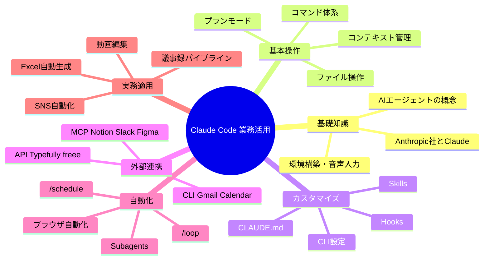

# 今後やること

**配置:** `04_AI/03_学習/01_実行計画.md`（学習・実行計画のハブ。講座資料と同フォルダ）

**このノートの役割:** DigiRise「30日ロードマップ」のカリキュラムと、Vault 内 **`01_運用/02_フェーズとガバナンス.md`** の Phase・直近アクションを **1ファイルで横断**できる実行用ハブ。**§0**＝毎週毎月続けるデータ蓄積・ルーティン、**§1〜**＝プロジェクト的な進行。

| 観点 | どこが正本か |
|:--|:--|
| **ツール役割・課金** | `01_運用/01_ツール役割と運用.md` §1.5 |
| **Phase 定義・完了条件・KPI・ガバナンス・品質ゲート** | `01_運用/02_フェーズとガバナンス.md` |
| **日次・週次・月次の型（詳細チェックリスト）** | `01_運用/00_運用ルール.md` |
| **Vault への蓄積ルール（何をどこに）** | `01_運用/05_データ蓄積ガイド.md` |
| **30日の詳細解説・用語・事例TOP20・MCP一覧の全文** | 同フォルダ `24_講座資料_ClaudeCode30日ロードマップ_チャエン_20260329.md`（講座資料） |
| **実戦3h・Sprint・チェックリスト（旧 `04`）** | **本書 §6** |

> **講座出典（再掲）:** Notion「【30日ロードマップ】Claude Code の全てを学べる最強ガイドブック」／DigiRise 受講者向け。最新仕様は [Claude Code 公式ドキュメント](https://code.claude.com/docs) も参照。

---

## 0. 継続的にやること（データ蓄積・運用ルール）

「講座を終えたあとも止めない」ライン。**詳細は各正本へ。ここはカレンダー用の塊だけ。**

### データ蓄積

**正本:** [[../01_ツール運用/05_データ蓄積ガイド]]

- ノートを増やすときは **必ず `05` を開き**、ドメインと置き場所を決めてから書く（二重保管・「とりあえず」の長期放置を防ぐ）。
- **随時:** `20_Input/01_Kindle`・`02_Clippings` の投入と処理、`00_Inbox` の仕分け（`10` の日次◯と同じ流れ）。
- **週次:** インプット処理の残りをゼロに近づける（`10` 週次・付録Aの週次儀式と整合）。
- **意識:** 生ログではなく **資産化できる形**だけを本体フォルダへ（`01` のストック原則）。

### 運用ルール（ルーティン）

**正本:** [[../01_ツール運用/10_運用ルール]]

| 頻度 | やること（要約） |
|:--|:--|
| **日次（◎）** | デイリーノート、AI学習（目安1h）、夜の音声日記（NotebookLM【10 Journal】） |
| **日次（◯ 随時）** | Kindle／Clippings 処理コマンド、**`00_Inbox` 仕分け**（溜まったら） |
| **週次（◎）** | **`02` §20 KPI**、**Voice `.m4a` の `YYYY-MM-DD` リネーム**、Inbox 整理 |
| **週次（◇ 任意）** | 実験ログ1行、NotebookLM ソース棚卸し |
| **週末** | `10` の品質チェック（`reviewed: false`、GAS 同期、スキル改善 等） |
| **月次** | Vault 根 `CLAUDE.md` 正字・索引マスター・`04_AI/README.md` 正本表の照合（`10` 月次コピペ） |

チェックボックス全文・Voice スクリプト・月次の具体操作は **`10` を開く**。

---

## 1. 現在地スナップショット（`02` と同期）

| 項目 | 状態 | メモ |
|---|---|---|
| **現在フェーズ** | **Phase1完了 → Phase2着手直前** | 詳細・更新は `02` 冒頭 |
| Claude Code 実戦投入 | ✅ 完了 | Vault 自動化・キャリアスキル稼働中 |
| CLAUDE.md 設計 | ✅ 完了 | Vault 全体＋ドメイン別 |
| Skills 作成 | ✅ 一部完了／Tips・事例は継続 | career 系。→§2 の 7〜8 |
| Claude 課金プラン | ❓ 要確認 | `01` §1.5。Pro で足りるか／Max が必要か |
| GitHub リポジトリ | ❌ 未着手 | Phase2 必須。**直近①** |
| MCP 連携 | ❌ 未着手 | Phase2 必須。Gmail / Slack 優先 |
| 自動化フロー稼働数 | 計測中 | **KPI 週次**を `02` §20 に記録 |

---

## 2. 直近でやること（統合・重複除去）

**いま〜数週間の優先順（Phase2 入口 + 今週）**

1. **GitHub リポジトリ作成** — Skills・CLAUDE.md・自動化スクリプトの置き場（面接・対外で見せられる状態へ）
2. **Claude 課金の整理** — `01` §1.5 に沿い、**Pro で足りるか**／**Max が外部要件で必要か**を確定
3. **コスト全体の整理** — 月額合計を把握（Max は採用時のみ行に足す）
4. **MCP を 1 本動かす** — Gmail または Slack（業務フローに直結するものから）
5. **KPI 週次記録を開始** — `02` §18 の指標・§20 のテンプレで毎週末
6. **`02` §14「一つだけ今週」に近い単位で業務ツールを回す** — 例: **面談準備 AI** を実務で動かす（設計より先に、動かす）
7. **スキル作成 Tips のキャッチアップ** — Vault 正本 [[../03_手法/20_ClaudeCode/20_ClaudeCode設計_スキル設計要点]] を読み、運用中スキルに **description・番号手順・出力形式・エラー時** を足す。必要なら講座 **M6**／[[20_講座・セミナー資料/チャエン_20260329/ClaudeCode業務活用マスター講座]] のスキル化パートと突き合わせる。
8. **スキル事例紹介のキャッチアップ** — [[10_リサーチ/ClaudeCodeチャエン_スキルMCP運用]] 第2章（スキルカタログ）を眺め、**自分用に取り込む候補を1〜2個**メモする（丸コピーではなく「型だけ借りる」）。

**「今すぐ」最小セット（`02` §2 と整合）:** 課金整理 → GitHub → コスト把握 →（並行して）下記 **30日 Day 〜** か **Phase1 ツール** のどちらかを毎日 15〜30 分。

---

## 3. 30日スプリント（講座カリキュラムの再掲）

> **目安:** 毎日 15〜30 分。急がなくてよい。  
> Notion 子ページの **Day 表記と「通算 Day」がずれる**ことがある。**子ページ URL は講座 Notion を正**とする（講座資料本文に注釈あり）。

### 3.1 プログラム概要・モジュール M1〜M10

| eラーニング | WS（全4回） | 事前課題 | 合計 |
|-------------|-------------|----------|------|
| 5時間50分（M1〜M10） | 6時間（90分×4） | 2時間（各WS前30分） | **13時間50分** |

| Phase | モジュール | テーマ | 時間 | レベル | 学べること |
|-------|------------|--------|------|--------|------------|
| 導入 | **M1** | AIエージェント概論 | 30分 | 初級 | Anthropic社、Claude体系、エージェントの概念 |
| 導入 | **M2** | 環境構築 | 40分 | 初級 | Cursor、Claude Code、音声入力 |
| 基本 | **M3** | 基本コマンド | 35分 | 初級 | `/help`、`/clear`、`/compact`、ファイル操作 |
| 基本 | **M4** | コンテキスト管理 | 30分 | 初級 | プランモード、`/btw` |
| 中級 | **M5** | `CLAUDE.md` & Memory | 40分 | 中級 | 業務マニュアル、記憶の仕組み |
| 中級 | **M6** | Skills & Hooks | 45分 | 中級 | カスタムコマンド、自動実行 |
| 中級 | **M7** | CLI & Checkpoints | 30分 | 中級 | `--continue`、`/rewind`、`/fork` |
| 上級 | **M8** | MCP連携 | 50分 | 上級 | Notion / Slack / Figma / Gmail / Calendar |
| 上級 | **M9** | 自動化 | 45分 | 上級 | Subagents、`/schedule`、`/loop`、ブラウザ自動化 |
| 実践 | **M10** | 実務適用 | 45分 | 上級 | Excel、議事録、SNS、動画編集、業務設計 |

### 3.2 レベル別スタート地点

| レベル | 状態 | ここから | 所要（目安） |
|--------|------|----------|----------------|
| **完全初心者** | Claude Code を聞いた程度 | Day 0〜2 | 約1.5時間 |
| **初心者** | 起動してチャットできる | Day 3〜9 | 約3時間 |
| **中級者** | `CLAUDE.md` 等が使える | Day 10〜16 | 約4時間 |
| **上級者** | MCP / Hooks 設定できる | Day 17〜30 | 約5時間 |

### 3.3 Week 0 — Day 0〜2

| 通算Day | テーマ | やること | 時間 | 対応 |
|---------|--------|----------|------|------|
| 0 | Anthropic社とClaude概要 | 企業・モデル体系・AIエージェント概念 | 30分 | M1 |
| 1 | 環境構築 | Cursor、Claude Code CLI、動作確認 | 40分 | M2 |
| 2 | 音声入力 | スペース長押しと Typeless の使い分け | 15分 | M2 |

### 3.4 Week 1 — 通算 Day 3〜9

| 通算Day | テーマ | やること | 時間 | 対応 |
|---------|--------|----------|------|------|
| 3 | 基本コマンド | `/help` `/clear` `/compact` `/btw` | 30分 | M3 |
| 4 | コンテキスト管理 | 膨張 → `/compact` → `/clear` | 30分 | M4 |
| 5 | ファイル操作 | 作成・編集・削除・検索 | 20分 | M3 |
| 6 | プランモード | Shift+Tab×2。設計 → `/clear` → 実装 | 30分 | M4 |
| 7 | 音声入力（応用） | スペース長押し、Typeless 比較 | 15分 | M2 |
| 8 | Memory | `/memory`、`MEMORY.md` | 30分 | M5 |
| 9 | `CLAUDE.md` 作成 | Why / Structure / Rules / Workflow | 45分 | M5 |

### 3.5 Week 2 — Day 10〜16

| 通算Day | テーマ | やること | 時間 | 対応 |
|---------|--------|----------|------|------|
| 10 | Skills入門 | `.claude/skills/` に1つ、`/スキル名` | 45分 | M6 |
| 11 | フォルダ整理スキル | Downloads 自動整理 | 30分 | M6 |
| 12 | 議事録スキル | 文字起こし → 議事録 + メール下書き | 45分 | M6 |
| 13 | Hooks入門 | `settings.json`、deny list 等 | 45分 | M6 |
| 14 | CLI Basics | `claude --continue` `--resume` 等 | 30分 | M7 |
| 15 | Checkpoints | `/rewind` `/fork` `/rename` | 30分 | M7 |
| 16 | `CLAUDE.md` 改善 | claude-md-improver、A〜F スコア | 30分 | M5 |

### 3.6 Week 3 — Day 17〜23

| 通算Day | テーマ | やること | 時間 | 対応 |
|---------|--------|----------|------|------|
| 17 | MCP入門 | Notion or Slack を1つ | 60分 | M8 |
| 18 | Gmail/Calendar | GOG CLI 等で Workspace 操作 | 60分 | M8 |
| 19 | Firecrawl | Web検索・スクレイピング | 45分 | M8 |
| 20 | Subagents | Agent Teams、並列調査 | 60分 | M9 |
| 21 | `/schedule` | クラウド定期実行 | 45分 | M9 |
| 22 | `/loop` | ローカル繰り返し | 30分 | M9 |
| 23 | ブラウザ自動化 | Chrome DevTools / Playwright | 60分 | M9 |

### 3.7 Week 4 — 講座表記 Day 22〜30（実務 9 本）

> 講座原本では Week4 表の左列が **22〜30**。**通算との対応は講座資料の表を正**。

| Day | テーマ | やること | 時間 | 対応 |
|-----|--------|----------|------|------|
| 22 | Excel自動生成 | ヒアリングメモから提案書一式 | 60分 | M10 |
| 23 | 議事録パイプライン | Notta → 議事録 → Gmail → Slack | 60分 | M10 |
| 24 | SNS自動化 | X投稿スキル、Typefully API | 60分 | M10 |
| 25 | Figma連携 | デザイン・スライド生成 | 45分 | M10 |
| 26 | freee連携 | 請求書・家計簿アプリ | 60分 | M10 |
| 27 | 動画編集自動化 | 縦型・字幕・BGM 等 | 60分 | M10 |
| 28 | Advanced Features | `/remote-control`、Writer/Reviewer 等 | 60分 | M9 |
| 29 | 業務設計 | 業務棚卸し、MCP/CLI/API 接続設計 | 90分 | M10 |
| 30 | 自動化ロードマップ | 3ヶ月計画、優先順位、実行開始 | 60分 | M10 |

### 3.8 API / MCP / CLI（使い分けの核）

**鉄則:** MCP 対応があれば **MCP 優先** → なければ CLI → それもなければ API。

| | API | MCP | CLI |
|---|-----|-----|-----|
| 難易度 | 中〜高 | **低（設定中心）** | 低〜中 |
| 設定 | コードで呼び出し | **`settings.json`** | インストール |
| 最適 | MCP未対応サービス | **対応があれば第一候補** | Google Workspace 等 |

**主要 CLI 例（講座資料より）:** `gh`（GitHub）、gogcli 系（Workspace）、`firecrawl`、`sf`（Salesforce）など。

### 3.9 教材側に全文があるもの（ここでは要約のみ）

- **チャエン MCP 連携（6カテゴリ表）**、**X 事例 TOP20**、**用語集50+** → 同フォルダ `24_講座資料_ClaudeCode30日ロードマップ_チャエン_20260329.md` の該当節を開く。
- **Notion 子ページへの直リンク**は講座資料本文に集約。

---

## 4. 長期 Phase（`02` のタイムライン要約）

| Phase | 目安週 | 目的（1行） |
|:--:|:--|:--|
| **1** | Week1〜2 | 毎日使い倒す事実を作る（自動化5本+・週3回稼働 等） |
| **2** | Week3〜6 | CLAUDE.md・Skills・MCP を**デモ可能**に。GitHub 公開 |
| **3** | Week7〜9 | 社外1社へ AI 活用診断〜提案の実績 |
| **4** | Week10〜12 | 自分用ミニツールを5つ日常稼働 |
| **5** | Week13〜16 | Webアプリ1本以上デモ可能 |
| **6** | Week17〜20 | レクチャー・導入支援の実績 |
| **7** | Week21〜 | ナレッジ・発信の資産化 |
| **8** | Week24〜 | 新規事業オプション（採用後に設計） |

**応募目安（`02`）:** Phase3 完了後が最速、Phase6 後が万全。  
**Plan B（緩め）** の週番号も `02` §3.1 にあり。

**Phase1 の業務優先（RINGBELL 直結例）:** 面談準備 AI → 面談報告 → メール返信 → Slack 報告 → 議事録整理 → …（詳細表は `02` §4）。

---

## 5. 計測・ルーティン・ガバナンス（参照先だけ）

| テーマ | 開くファイル |
|:--|:--|
| KPI 定義・閾値 | `02` §18 |
| KPI 週次テンプレ・記録欄 | `02` §20 |
| 日次必須（デイリー・学習1h・音声）・随時（Kindle/Clippings/Inbox） | `00_運用ルール.md` §日次 |
| 週次必須（KPI・Voice リネーム・Inbox）・月次索引照合 | `00_運用ルール.md` §週次・月次 |
| データ区分 A/B/C・投入ルール | `02` §16 |
| 品質ゲート Gate1〜4 | `02` §17 |

---

## 6. Claude Code 実践手順（旧 `04_ClaudeCode_実践手順.md` 統合）

実戦ファースト・日次約3h・週末キャッチアップ（旧ファイル名：`04_ClaudeCode_爆速実戦キャッチアップ手順.md`）

> **目的**: 1日あたり **約3時間** を投下し、**実戦（手元で動く成果物）を最優先**で Claude Code 運用を本番レベルまで引き上げる。  
> **方針**: 平日はインプットより**実装**。派生ツールのキャッチアップ・トレンド把握は **週末に一括**（ユーザー方針に合わせる）。  
> **[[20_講座・セミナー資料/チャエン_20260329/ClaudeCode30日ロードマップ]]**: **1日ずつ順番通りでなくてよい**が、**§1.3 の全項目は必ず通過**（実演または再現可能な成果物）。

---

### 正本・参照（このVault内）

| 役割 | ドキュメント |
|------|----------------|
| ツール役割・情報フロー | [[01_ツール役割と運用]] |
| ガバナンス・品質ゲート・データ区分 | [[02_フェーズとガバナンス]] |
| NotebookLM 11冊・運用 | [[03_NotebookLM]] |
| Claude Code 30日構成・M1〜M10 | [[20_講座・セミナー資料/チャエン_20260329/ClaudeCode30日ロードマップ]] |
| CS自動化の実装設計 | [[Ringwell_CS_AI自動化設計]]（`02_Business/01_RINGBELL/50_業務自動化/20_設計/`。汎用棚は `04_AI/04_テンプレート/`、RINGBELL棚は `50_業務自動化/00_AI自動化_フォルダ設計.md`） |
| NotebookLM × Gem 併用 | [[03_NotebookLM]]（§9 付録） |

---

### 0. 運用ルール（この手順独自の約束）

1. **実戦第一**: 動画・記事を「全部見終える」より、**その日1つだけリポジトリに残る成果**（Skill / `CLAUDE.md` 差分 / ジョブ手順書 / MCP 設定メモ）を優先する。  
2. **平日はトレンド禁止**: X・コミュニティの探索は**週末バッチ**へ送る（通知オフ推奨）。  
3. **キャッチアップは週1・週末**: 並行インプットは**週末にまとめて**よい（下記 §6）。例外は「詰まった時の公式ドキュメント／講座該当パートのみ」に限定。  
4. **1ツール1責任**: [[01_ツール役割と運用]] の表を崩さない（Claude Code＝実行レイヤ、NotebookLM＝根拠レイヤ、 Cursor＝統合・文章化）。  
5. **品質ゲート**: 顧客・会員向けの自動生成は、設計書どおり **人間承認前に送信しない**。[[02_フェーズとガバナンス]] を正とする。

---

### 1. 全体スプリント（順序固定）

| Sprint | 狙い | 目安（3h/日換算） |
|--------|------|-------------------|
| **A** | 実戦基盤：コンテキスト・Skills・Hooks・CLI 復帰 | **5〜7 日** |
| **B** | **接続・自動化（必須）**：MCP（Slack 等）＋ Workspace 系の必要分＋ Subagents / スケジュール系の**使う分だけ** | **4〜6 日** |
| **C** | **Ringwell 実装**：[[Ringwell_CS_AI自動化設計]] Phase1→2 を「本番相当」で通す | **7〜12 日** |
| **D** | **本業展開**：同一パターンを本業フローへ（ジョブ定義・品質ゲート・ログ） | 案件次第 |
| **E** | **＋α**：バイブコーディング／発信（note・X・YouTube）— **Sprint C の完了定義を満たしてから** | 継続 |

> **重要**: ロードマップ上の Week4「実務に適用」に入る**前に Sprint B を必ず通す**。MCP・自動化なしだと Ringwell が「コピペ運用」に劣化しやすい。

#### 1.1 何日プログラムか（目安）

| 区分 | 日数目安（1日約3時間・実戦ファースト） | 備考 |
|------|----------------------------------------|------|
| **Sprint A + B + C** | **約 16〜25 日** | A 5〜7 + B 4〜6 + C 7〜12 の合算（**実戦の主戦場**） |
| **Sprint D（本業）** | **案件次第**（数週〜） | 完了定義は手順書 §5 |
| **Sprint E（＋α）** | **継続** | 定常運用 |
| **§1.3 ロードマップ全項目** | **A〜E と並行**（週末・C 後の補完） | **順不同**。未チェックゼロを正とする |

**実戦の一区切り（＋α前）**は、目安 **最短約16日・余裕を見て約25日**（A〜C 完走）。

**ガイドブックの内容を「カリキュラムとして完了」した判定**は、**§1.3 のチェックがすべて埋まったとき**（1日1行の縛りはない）。

#### 1.2 [[20_講座・セミナー資料/チャエン_20260329/ClaudeCode30日ロードマップ]] の扱い（全項目通過・順不同）

| 原則 | 内容 |
|------|------|
| **必達** | **§1.3 の全行**（通算 Day 0〜23 ＋ Week4「実務に適用」9本 ＋ M1〜M10 確認）を、それぞれ **少なくとも1回**「実演 or 再現可能な成果物」まで通す。 |
| **順序** | **ガイドブックの日付順に追う必要はない。** Sprint A〜C を最優先し、未チェックを **平日の余力・週末の「ロードマップ消化」・Sprint E 前後**で埋める。 |
| **正本** | 手順・Notion リンク・所要時間は **常にガイドブック／Notion 子ページ**。 |
| **重複番号について** | ガイドブックでは **通算 Day 22 = `/loop`（Week3）** と **Week4 の「Day 22 = Excel」** など **番号が衝突する表記**がある。**テーマ名**で区別し、§1.3 の行をそれぞれ埋める。 |

**消化のコツ**: Week4 の Excel・Figma・freee・動画・SNS は Ringwell と無関係でも **必ず1回通す**。Sprint E の発信・サムネに **Figma／動画／Typefully** を寄せると二度手間が減る。

#### 1.3 ロードマップ全項目チェックリスト（完了まで全行チェック）

[[20_講座・セミナー資料/チャエン_20260329/ClaudeCode30日ロードマップ]] の表に準拠。

##### Week 0〜3（通算 Day 0〜23）

| ☐ | 通算 | テーマ | Mod |
|---|------|--------|-----|
| ☐ | 0 | Anthropic社とClaude概要・AIエージェント概念 | M1 |
| ☐ | 1 | 環境構築（Cursor / Claude Code CLI / 動作確認） | M2 |
| ☐ | 2 | 音声入力（スペース長押し・Typeless の使い分け） | M2 |
| ☐ | 3 | 基本コマンド（`/help` `/clear` `/compact` `/btw`） | M3 |
| ☐ | 4 | コンテキスト管理（膨張→回復） | M4 |
| ☐ | 5 | ファイル操作 | M3 |
| ☐ | 6 | プランモード（Shift+Tab×2） | M4 |
| ☐ | 7 | 音声入力（応用） | M2 |
| ☐ | 8 | Memory（`/memory`・`MEMORY.md`） | M5 |
| ☐ | 9 | `CLAUDE.md` 作成（Why/Structure/Rules/Workflow） | M5 |
| ☐ | 10 | Skills 入門（`.claude/skills/` に1つ） | M6 |
| ☐ | 11 | フォルダ整理スキル（Downloads 等） | M6 |
| ☐ | 12 | 議事録スキル（文字起こし→議事録＋メール下書き） | M6 |
| ☐ | 13 | Hooks 入門（`settings.json`・deny list 等） | M6 |
| ☐ | 14 | CLI Basics（`--continue` `--resume` 等） | M7 |
| ☐ | 15 | Checkpoints（`/rewind` `/fork` `/rename`） | M7 |
| ☐ | 16 | `CLAUDE.md` 改善（claude-md-improver・A〜F 等） | M5 |
| ☐ | 17 | MCP 入門（Notion **または** Slack を1つ以上。可能なら両方） | M8 |
| ☐ | 18 | Gmail/Calendar（GOG CLI 等・講座手順） | M8 |
| ☐ | 19 | Firecrawl（Web 検索・スクレイピング・スキル連携） | M8 |
| ☐ | 20 | Subagents（Agent Teams・並列調査） | M9 |
| ☐ | 21 | `/schedule`（クラウド定期実行） | M9 |
| ☐ | 22 | `/loop`（ローカル繰り返し）※Week3 通算 | M9 |
| ☐ | 23 | ブラウザ自動化（Chrome DevTools / Playwright） | M9 |

##### Week 4：実務に適用（全9本）

| ☐ | # | テーマ | Mod |
|---|---|--------|-----|
| ☐ | 1 | Excel 自動生成（ヒアリングメモから提案書一式） | M10 |
| ☐ | 2 | 議事録パイプライン（Notta→議事録→Gmail→Slack） | M10 |
| ☐ | 3 | SNS 自動化（X 投稿スキル・Typefully API） | M10 |
| ☐ | 4 | Figma 連携（デザイン・スライド生成） | M10 |
| ☐ | 5 | freee 連携（請求書・家計簿アプリ） | M10 |
| ☐ | 6 | 動画編集自動化（縦型・字幕・BGM・無音カット等） | M10 |
| ☐ | 7 | Advanced Features（`/remote-control`・並列・Writer/Reviewer） | M9 |
| ☐ | 8 | 業務設計（業務棚卸し・MCP/CLI/API/スキル接続設計） | M10 |
| ☐ | 9 | 自動化ロードマップ（3ヶ月計画・優先順位・実行開始） | M10 |

##### 動画 M1〜M10（最終確認・抜け漏れ防止）

上表で原則カバー。**カリキュラム完了前**に、次をすべて満たすこと。

| ☐ | Mod | 確認（最低1つ） |
|---|-----|------------------|
| ☐ | M1 | エージェント概念を、自分の業務で一言定義したメモ |
| ☐ | M2 | 環境・音声入力が、再現手順付きでメモ済み |
| ☐ | M3 | 基本コマンド＋ファイル操作を実演済み |
| ☐ | M4 | プランモード＋コンテキスト回復を実演済み |
| ☐ | M5 | `CLAUDE.md` と Memory を実装済み |
| ☐ | M6 | Skills と Hooks をそれぞれ1本以上 |
| ☐ | M7 | CLI と Checkpoints を実演済み |
| ☐ | M8 | MCP・Workspace・Firecrawl を実演済み |
| ☐ | M9 | Subagents・`/schedule`・`/loop`・ブラウザ・Advanced を実演済み |
| ☐ | M10 | Week4 表9本＋業務設計・3ヶ月ロードマップまで到達済み |

##### ガイドブック後半（API / MCP / CLI 解説）

必須ではないが、**読了＋自分のスタックでの使い分けを1枚**（Obsidian 可）残すと、運用の再現性が上がる。

---

### 2. 平日「3時間」のブロック設計（テンプレ）

| ブロック | 時間 | 中身 |
|----------|------|------|
| **起動** | 15分 | 昨日の成果物を開く。今日の **完了定義を1行**（例：「Job-A 草案を実入力3パターンで生成」）。 |
| **実戦コア** | 2時間 | Claude Code で**触れる状態**まで仕上げる（設定・Skill・スクリプト・手順のどれか）。講義は**詰まった箇所だけ**巻き戻し視聴。 |
| **資産化** | 45分 | **確定版だけ** Obsidian / 運用Repo に残す。生ログは残さない（[[01_ツール役割と運用]] §3 原則）。翌日タスクを1つ書く。 |

**爆速のコツ**: 毎日「新しい講義モジュール」を増やすのではなく、**昨日の延長で1インチ深く**（ゲート追加、例外分岐、ログ1行）を繰り返す。

---

### 3. Sprint A：実戦基盤（ロードマップ対応の要所）

**ゴール**: `CLAUDE.md`・最低1 Skill・（必要なら）Hooks・`/compact` 等の腕が身体に付き、**Ringwell 向けの「文面生成」をSkill化できる状態**。

**§1.3 対応**: 通算 **D0〜16** の全行をチェックする（Sprint A 内で埋めきれなければ **§6.6 週末**で補完）。

| 優先 | ロードマップ相当 | 実戦アウトプット（例） |
|------|------------------|------------------------|
| 1 | Day 0〜2 + M3〜M4 | 作業Repoで日次作業ログ、`/clear` `/compact` の運用習慣 |
| 2 | M5 | **Ringwell 品質ポリシー**を `CLAUDE.md` に移植（文体・禁止事項・承認フロー） |
| 3 | M6 | **文面生成 Skill 1本**（日程調整 or リマインドのどちらか） |
| 4 | M6 Hooks / M7 CLI | 危険コマンド対策・`--resume` で翌日続き |

**卒業条件**: Skill から **実入力3ケース**で草案が出る。自己採点で品質ゲートのチェック項目に手戻りがないこと。

---

### 4. Sprint B：接続・自動化（Ringwell 前提）

**ゴール**: トリガとデータが**エージェントから参照できる**（手入力コピペ最小）。

| 優先 | ロードマップ相当 | 実戦アウトプット |
|------|------------------|------------------|
| 1 | M8 Day 15〜16 | **Slack MCP** または **Gmail/Calendar（講座どおりの経路）** のどちらかを Ringwell の「実運用」と**一致させて**生きた状態にする |
| 2 | M9 | Subagents / `/schedule` / `/loop` — **§1.3 の D20〜22 チェック**まで通す（朝礼ブリーフィング等で可） |
| 3 | M8〜M9 | **Firecrawl（D19）・ブラウザ自動化（D23）**は §1.3 で必達。Ringwell と無関係でも週末枠で実演する |

**卒業条件**: 「Slack（またはメール）を起点に、Claude Code で草案まで**ワンショット**」が再現できる（最終送信は人間）。かつ **§1.3 の D17〜23 がすべてチェック済み**（未了は週末で補完）。

---

### 5. Sprint C：Ringwell 実装 → Sprint D：本業

#### 5.1 Ringwell（[[Ringwell_CS_AI自動化設計]]）

1. **Phase1**（Job-A/B/C から2本）を選び、**入力スキーマ**（必須フィールド）をMarkdownで固定。  
2. 各 Job に **共通品質ゲート**（宛先・日時・文体・PII）を Skill 先頭に書く。  
3. **17:00–18:00 運用**に合わせ、生成→レビュー→送信の**チェックリスト**をObsidianに1枚。  
4. **週次改善**: 「答えられない質問」を NotebookLM 側のソース追加タスクに回す（§6①）。

#### 5.2 本業（Sprint D）

- Ringwell で得た **ジョブ定義・ゲート・ログ形式**をそのままテンプレ化。  
- [[01_ツール役割と運用]] §5.8 の自動化優先順位（問い合わせ返信 → 面談準備 → 面談後レポート）を**本業向けに言い換え**て Phase 化。

**Sprint C 完了の定義（例）**:

- Phase1 相当が **最低2 Job**、**2週間**運用ログが残っている。  
- 例外時フォールバック（手動・電話指示）が**1行でも**手順化されている。

**＋α（Sprint E）に入る条件**: 上記完了＋「本業で1本、同構造のジョブが回り始めた」ことを推奨。

---

### 6. 週末バッチ：継続キャッチアップ（週1・まとめて）

想定時間の目安: **90〜150分**（NotebookLM 発信追従を含む）。平日は実施しない。

#### 6.1 NotebookLM（週1・最優先）

- **チェックしている NotebookLM 系発信者**の今週分を追う（手順・テンプレ・新機能）。  
- [[03_NotebookLM]] の該当ノートにソース追加、**古いソース棚卸し**（[[01_ツール役割と運用]] §5.8）。  
- [[03_NotebookLM]] §9 に沿い、**Gem プリセットの更新が必要か**だけ判断（大工事はしない、差分メモのみ）。

#### 6.2 Grok → クリッピング（週1）

- **ホワイトリスト**（信頼アカウント／検索クエリ）だけで収集。  
- 行き先：Obsidian `20_Input/02_Clippings` または NotebookLM【11 AI活用】（[[01_ツール役割と運用]] §5 Android 週次と整合）。

#### 6.3 パターンD一括（[[01_ツール役割と運用]] §3）

1週間分の「気になったメモ」を、週末に一度だけ：

1. 収集（Grok / 保存済みクリップ）  
2. 理解（該当ノートブックで精読・構造把握）  
3. 構造化（Cursor で骨子）  
4. **来週の「1実行タスク」**だけに落とす（残りは捨てる or アーカイブ）

#### 6.4 クローズドコミュニティ / SNS（任意・残り時間）

- **ダイジェスト1本化**（週報レベルでよい）。  
- Claude Code 公式・講座Notionの**差分だけ**チェック（新コマンド・MCP名）。

#### 6.5 ガバナンス最小メンテ

- [[02_フェーズとガバナンス]]：データ区分・投入可否の見直し（**5〜15分**）。  
- 数値・実績の対外説明は `03_Career` 側の正本に触れるだけ（本手順では深追いしない）。

#### 6.6 ロードマップ全項目の消化（§1.3）

- **A〜C の最中**に取り込めなかった **§1.3 の未チェック行**を、週末に **1〜3 行**ずつ埋める（**Excel・Figma・freee・動画**などはここでまとめてよい）。  
- Sprint C（Ringwell）と **テーマが重なる行**（例：議事録・業務設計）は、**実務成果物のコピー**でチェックを付けてよい。  
- **M1〜M10 最終確認**は、§1.3 末尾の表がすべて埋まるまで **Sprint E の直前**に必ず実施。

---

### 7. [[01_ツール役割と運用]] から繰り込んだ「継続で見るもの」チェックリスト

平日は見ない。**週末バッチで一括**。

| 領域 | 週末でやること |
|------|----------------|
| **NotebookLM** | 発信者追従、ソース棚卸し、必要なら Gem 連携方針メモ |
| **Grok** | ホワイトリスト収集 → Clippings / 【11 AI活用】 |
| **パターンD** | 収集→理解→構造化→**翌週1タスク** |
| **会議資産** | Notta→NotebookLM→Obsidian→Cursor の詰まり解消（バックログあれば） |
| **品質** | NotebookLMソース棚卸し、[[02_フェーズとガバナンス]] 抜粋確認 |

---

### 8. Sprint E：＋α（任意・後段）

- **バイブコーディング**: [[20_講座・セミナー資料/チャエン_20260329/ClaudeCodeバイブコーディング講座ノート]] 等は **週末または Sprint E 専用枠**（平日の実戦を食わない）。  
- **発信**（note / X / YouTube）: ロードマップ M10・SNS/動画系と相性よし。**公開前チェック**は業務と同じゲートを適用。

---

### 9. 片付け：迷ったときの優先順位

1. 今日の **完了定義1行** を満たす実装（Claude Code）  
2. Ringwell／本業の **品質ゲート**  
3. Obsidian への **確定版のみ** 保存  
4. 週末へ送った **キャッチアップ・トレンド**  
5. **§1.3 の未チェック**があれば、翌週末までに **週1〜3行** 消化する計画をメモ

---

**最終更新**: 2026-04-06（1日3h・実戦第一・週末一括キャッチアップ・NotebookLM発信は週1・**30日ロードマップは§1.3 全項目必達・順不同**）

## 7. 学習マインドマップ（講座資料と同一）

---

## 8. メンテナンス

- **現在地テーブル**は `02` を更新したあと、必要なら本書 §1 を数行で追従する（または `02` のみ更新し、本書は §2 直近リスト中心にする運用でも可）。
- **講座カリキュラムの差分**が出たら、まず `03_学習/` の講座資料を直し、本書 §3 を追随する。
- **実戦 Sprint・§1.3 チェック**を変えたら、本書 **§6** を更新する（旧 `04_ClaudeCode_実践手順` の役割）。
- 自動化アイデアのストックは **`01_運用/06_自動化バックログ.md`**。Vault への蓄積判断は **`01_運用/05_データ蓄積ガイド.md`**。

---

## 9. 関連リンク

- [[ClaudeCode_30日ロードマップ|30日ガイドブック（講座資料・全文）]]
- [[../01_ツール運用/02_フェーズとガバナンス|フェーズとガバナンス（詳細正本）]]
- [[../01_ツール運用/10_運用ルール|運用ルール（日次・週次・月次）]]
- [[../01_ツール運用/05_データ蓄積ガイド|データ蓄積ガイド]]
- [[../01_ツール運用/01_ツール役割と運用|ツール役割と運用（課金・フロー・付録A Vault横断）]]
