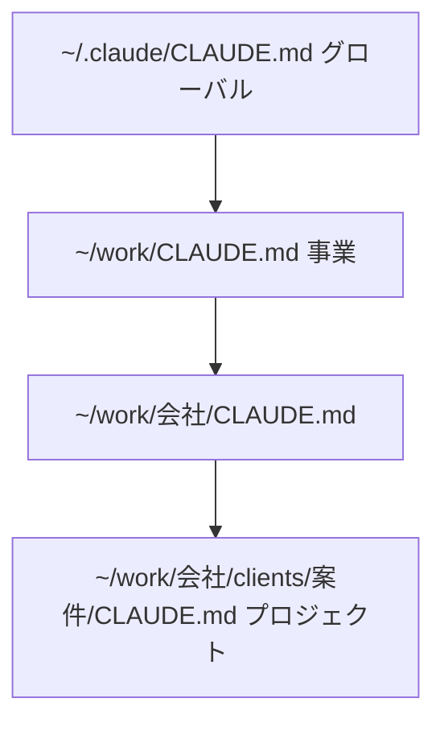
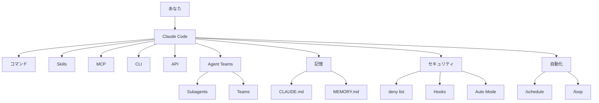

# 非エンジニア向け Claude Code 業務活用マスター講座 ─ 完全レジュメ

> **出典**: Notion投影資料「【投影用】非エンジニア向けClaude Code業務活用マスター講座」／講師: 茶圓将裕（チャエン）／2026年3月29日開催


---

## このページの使い方

- 上部で全体像（タイムスケジュール）を把握する
- 目次から該当セクションへジャンプする
- 用語解説はコールアウトで拾い読みする
- 特典リンクはセミナー後共有想定（外部Notion・Loom等）

---

## 特典・関連リンク一覧

| # | 内容 | URL |
|---|------|-----|
| ① | 事前質問の質疑応答集・参加者分析 | [Notion](https://www.notion.so/Claude-Code-2026-3-29-3310c6378bf18151b5cde7c69528fb88?pvs=21) |
| ② | 本日の投影資料（Notion） | [Notion](https://www.notion.so/Claude-Code-_-3300c6378bf181d3b0a4e84081cb4be6?pvs=21) |
| ③ | アーカイブ動画 | [Loom](https://www.loom.com/share/5ac6322ea9a746aeb6d628968aaa69a0) |
| ④ | チャエンのClaude Code完全まとめ | [Notion](https://www.notion.so/Claude-Code-MCP-3300c6378bf1818d8ee6d31464c0bc4f?pvs=21) ／ Markdown: [[10_リサーチ/ClaudeCodeチャエン_スキルMCP運用]] |
| ⑤ | セミナーレポート | [Notion](https://www.notion.so/Claude-Code-3320c6378bf180c38680e8eefcf0d1d2?pvs=21) |
| ⑥ | 質疑応答132問（スプレッドシート） | [Googleスプレッドシート](https://docs.google.com/spreadsheets/d/1B1nvYTss6CfEckhlMnE2jRwljZo8bI96siooRhUbAEo/edit?usp=sharing) ／ 同一内容のMarkdown: [[20_講座・セミナー資料/チャエン_20260329/ClaudeCode業務活用QA132問]] |
| ⑦ | バイブコーディング・マスターガイド | [Notion](https://www.notion.so/Claude-Code-3310c6378bf1811084d0f943779f384f?pvs=21) ／ Markdown: [[20_講座・セミナー資料/チャエン_20260329/ClaudeCodeバイブコーディング講座ノート]] |
| ⑧ | 30日勉強ロードマップ | [Notion](https://www.notion.so/30-Claude-Code-_20260329-3300c6378bf1814090c3e4efcf39bc3e?pvs=21) ／ Markdown: [[20_講座・セミナー資料/チャエン_20260329/ClaudeCode30日ロードマップ]] |
| ⑨ | 復習アシスタントBot（NotebookLM） | [NotebookLM](https://notebooklm.google.com/notebook/785062ac-f2aa-48fe-9504-f84f2218ac42/preview) |

**質疑応答・個別質問**: デジライズ AIスクールの Discord グループで対応（[digirise.school](https://digirise.school/)）

**追加支援の紹介**: [Notion](https://www.notion.so/Claude-Code-3300c6378bf1811eb479f27dc9c603e3?pvs=21)

### デジライズ AIスクール（案内・投影資料より）

AIスキル×ビジネススキル向けの個人向けスクール。[digirise.school](https://digirise.school/) にて eラーニング・Discord質問・認定バッジ・案件マッチング等。本講座の個別質問も Discord で対応する旨が資料に記載あり。

---

## 講師紹介

**茶圓将裕（チャエン）** — 株式会社デジライズ CEO

- SNS総フォロワー 18万人超／500社以上のDX支援／年間150回以上のセミナー・講演
- Google Gemini 公式AIアドバイザー、GMO AI&Web3 顧問
- 著書「AI脳」（KADOKAWA / 2026年3月）
- X: [@masahirochaen](https://x.com/masahirochaen)／YouTube: [AI研究所チャエン](https://www.youtube.com/@chaen-ai-lab)／Web: [digirise.ai](http://digirise.ai)

---

## アクティブラーニング・Slido

- 学びや感想は Zoom チャットにシェア
- 質問: [Slido](https://app.sli.do/event/5XHLSrKnfXVVmBH2d6uJyB)
- 投影用Notion（別URL）: [chaen-work 版](https://www.notion.so/chaen-work/Claude-Code-_-_20260329-3300c6378bf181d3b0a4e84081cb4be6)
- ハッシュタグ: `#チャエン` `#ClaudeCode講座`

---

## 目次

1. タイムスケジュール・ゴール
2. Claude Code の概要と基礎知識
3. 他のAIサービスとの比較
4. 重要概念（API / MCP / CLI / Skills / CLAUDE.md / Agent Teams / 自動化）
5. 第1部: チャエンの運用テクニック10選
6. 第2部: 実践ワークショップ
7. 第3部: 明日からのアクションプラン
8. 付録（コマンド・用語集）
9. セキュリティ・deny list・スマホ連携
10. セミナー後の実践Tips（参加者メモ）

---

## タイムスケジュール

| 時間 | 所要 | 内容 |
|------|------|------|
| 14:00〜14:10 | 10分 | オープニング・自己紹介・環境確認 |
| 14:10〜14:30 | 20分 | 座学: Claude Code概要・Cursor・IDE/CLI・音声・API/MCP/CLI |
| 14:30〜15:00 | 30分 | 活用事例10選 |
| 15:00〜15:10 | 10分 | 休憩 |
| 15:10〜15:20 | 10分 | テクニック（CLAUDE.md・Skills・自動化） |
| 15:20〜15:30 | 10分 | Work ① フォルダ整理 |
| 15:30〜15:40 | 10分 | Work ② CLAUDE.md 作成 |
| 15:40〜15:55 | 15分 | Work ③ 文字起こし→議事録・Word・メール・Excel |
| 15:55〜16:00 | 5分 | クロージング・Q&A |

---

## 今日のワークショップのゴール

| # | ゴール | 確認 |
|---|--------|------|
| 1 | Claude Codeが何かを人に説明できる | ☐ |
| 2 | Cursor上でClaude Codeを起動し、自然言語で指示を出せる | ☐ |
| 3 | フォルダ整理・CLAUDE.md作成・Excel生成を体験する | ☐ |
| 4 | 自分の業務でどんなMCP/CLI/APIと繋ぐか方針を持てる | ☐ |
| 5 | 自分の業務の自動化のロードマップを設計できる | ☐ |

> **進め方**: Cursor のターミナルから Claude Code に**日本語で話しかけて操作**する。プログラミング知識は不要。

---

## 0. なぜ Cursor × Claude Code なのか

### 0.1 Cursor とは（IDE と CLI）

> **用語**: **IDE** = ファイル一覧・エディタ・ターミナルが一体のアプリ（Cursor / VS Code 等）。**CLI** = テキストコマンドで操作するインターフェース。**GUI** = マウス操作中心（Cowork 等）。

**Cursor** は VS Code ベースのAI搭載エディタ。非エンジニアには **ファイルマネージャー兼プレビューア** としても有効。

- [Cursor（公式）](https://cursor.com/ja)

**Cursorを選ぶ理由（4つ）**

1. ファイルが見える（左サイドバー）
2. プレビューできる（Excel・画像・HTML・MD）
3. ターミナルが統合されている
4. 並列起動しやすい（ターミナル「+」）

```
Cursor の画面構成（概念）:
┌────────────────────────────────────────┐
│ 左: フォルダ  │ 中央: エディタ／プレビュー  │
├──────────────┴──────────────────────────┤
│ 下: ターミナル（ここで claude を起動）      │
└────────────────────────────────────────┘
```

| 比較 | CLI単体 | IDE（Cursor）推奨 |
|------|---------|-------------------|
| ファイルの中身 | 見えにくい | 一覧で見える |
| プレビュー | 困難 | MD/Excel/HTML 等 |
| 並列 | 手動で複数ターミナル | 「+」で追加が簡単 |

### 余談: ステータスライン（ccsl）

本田さん（[@usedhonda](https://github.com/usedhonda)）作 **ccsl** で Claude Code の状態を可視化。

```bash
brew install usedhonda/tap/ccsl
ccsl --setup
# または: pip install ccsl && ccsl --setup
```

出典: [usedhonda/statusline](https://github.com/usedhonda/statusline)（MIT）

### 0.2 Cursor 機能・プラン・ショートカット

| 機能 | 説明 |
|------|------|
| サイドバー | フォルダツリー |
| エディタ | ファイル表示・編集・プレビュー |
| ターミナル | `Ctrl+\`` |
| ターミナル分割・複数 | 右上「+」／分割 |
| コマンドパレット | `Cmd+Shift+P` / `Ctrl+Shift+P` |
| Cursor Agent | `Cmd+L` / `Ctrl+L` |

| プラン | 月額 | メモ |
|--------|------|------|
| Hobby | 無料 | 本講座の「器」として十分な場合あり |
| Pro | $20 | Agent回数増など |
| Business | $40 | チーム向け |

> **重要**: Cursor無料でも可。Claude Code本体のAIは Anthropic 側の契約（例: Claude Pro $20/月）で賄うイメージ。

**ショートカット（抜粋）**

| 操作 | Mac | Windows |
|------|-----|---------|
| ターミナル表示 | Ctrl+\` | 同左 |
| エディタ分割 | Cmd+\\ | Ctrl+\\ |
| 新規ウィンドウ | Cmd+Shift+N | Ctrl+Shift+N |
| ファイル検索 | Cmd+P | Ctrl+P |
| MDプレビュー | Cmd+Shift+V | Ctrl+Shift+V |

> **プロの使い方**: ターミナルを複数開き、それぞれで `claude` — **Writer / Reviewer パターン**の基本。

### 0.3 AIコーディングツール比較

| ツール | 提供元 | 特徴 | 料金目安 |
|--------|--------|------|----------|
| Claude Code | Anthropic | ターミナルエージェント、ファイル操作・MCP・Skills | $20/月〜 |
| Codex | OpenAI | クラウドサンドボックス中心 | 高価格帯 |
| Copilot | GitHub/MS | 補完・チャット | $10/月〜 |
| Cursor Agent | Cursor | エディタ内エージェント | $20/月〜 |

### 0.3 音声入力

| 方法 | 操作 | 特徴 |
|------|------|------|
| Claude Code内蔵 | スペース長押し | ターミナル内完結 |
| Typeless 等 | ショートカット | 日本語精度が高い場合あり |

### 0.4 Auto Mode（Yes地獄からの解放）

1. 不明点はまず **Cursor Agent（Cmd+L）** で確認（Claude Codeのコンテキストを汚さない）
2. 慣れたら:

```bash
claude --permission-mode auto
```

- **deny list との併用必須**
- `--dangerously-skip-permissions` は使わない（全確認スキップは危険）

3. 音声入力と組み合わせる

### 0.5 初心者向けTips

**(a) 通知**: Claude Code 内 `/config` → Notifications。併せて Cursor の `terminal.integrated.enableBell` 等。

**(b) ターミナル分割・複数ウィンドウ**: 並列作業用。

**(c) `@ファイル名`**: プロンプトでファイル参照。エディタにドロップして「今開いているファイルを読んで」も可。

### 0.6 /lp コマンド（ペースト制限回避の例）

Claude Code にペースト上限がある前提で、クリップボード・エディタ・ファイル読込を使うカスタムコマンド例。

```
/lp この内容を要約して   → クリップボード
/le                      → 長文入力（Ctrl+G）
/lf ~/doc/report.md      → ファイル直接
```

自作: `.claude/skills/` に `lp.md` 等を置く。

### 0.7 `.claude` フォルダ構成・CLAUDE.md階層

**`.claude/` の例**

| パス | 役割 | Git管理 |
|------|------|---------|
| settings.json | MCP・deny・Hooks・env（共有用） | ✔ |
| settings.local.json | 個人・秘密情報 | ✖（.gitignore） |
| rules/ | ルール分割（paths で動的読込可） | ✔ |
| commands/ | カスタムコマンド | ✔ |
| skills/ | スキル | ✔ |
| agents/ | サブエージェント | ✔ |
| hooks/ | イベント処理 | ✔ |

**CLAUDE.md の階層（概念）**: `~/.claude/CLAUDE.md` → 事業ルート → 会社 → プロジェクト… と下位ほど具体。



**`.claude/rules/` 分割例（paths で動的読込・講義）**

```yaml
---
paths:
  - src/api/**/*.ts
  - src/services/**/*.ts
---
# API設計ルール（例）
- エラーは try-catch で扱う
- レスポンス形式を統一する
```

**トークン管理**

- 日本語はトークン消費が大きめ → `/clear`・`/compact`・Plan分離・失敗時は `/clear` 等

---

## 1. Claude Code の概要と基礎知識

### 1.1 AIエージェントとは

| 観点 | 従来チャット | エージェント（Claude Code） |
|------|--------------|---------------------------|
| やり取り | 1往復中心 | 目標に向け複数ステップ |
| ファイル | 基本不可 | 読み書き可能 |
| コマンド | 不可 | 実行可能 |
| 長時間 | 途切れやすい | 完走しやすい |

**4要素（講義での整理）**: Profile / Memory（CLAUDE.md・MEMORY.md等）/ Planning / Action（Skills・MCP・Hooks）

**従来チャット vs エージェント（講義の対比例）**

```
【従来のチャットAI】
  人: 「議事録を作って」
  AI: テンプレを返すだけ → 人がコピー・貼り付け・保存

【Claude Code】
  人: 「議事録を作って」
  AI: 文字起こし読込 → .md 作成 → .docx 化 → Gmail下書き → Slack報告 …まで実行
```

### 1.2 Anthropic・モデル体系（講義時点の整理）

- Haiku / Sonnet / Opus 等の使い分け（資料上の推奨は複雑タスクで Opus 等）

### 1.3 Claude Code とは

PC上のファイルを直接操作する **ターミナルAIエージェント**。非エンジニアでも日本語指示で業務自動化の素地になる、という位置づけ。

---

## 2. 他のAIサービスとの比較

### 2.1 ChatGPT（ブラウザ） vs Claude Code

| 観点 | ブラウザAI | Claude Code |
|------|-------------|---------------|
| ファイル | アップ/ダウンロード中心 | ローカル直接操作 |
| 外部連携 | 限定的になりがち | MCP で拡張 |
| カスタム | プロンプト中心 | CLAUDE.md・Skills・Hooks |

### 2.2 Cowork vs Claude Code（Cursor）

Cowork = Claude デスクトップのGUI系。講義では **並列・Skills・Hooks・Agent Teams・安定した長時間** など観点で Cursor + Claude Code を推す整理。

---

## 3. 知っておくべき重要概念

### 3.1 API / MCP / CLI

**たとえ話（講義）**: API＝厨房直談判、CLI＝カウンター注文、MCP＝タッチパネル。

| 接続 | あなた | Claude Code | 難易度感 |
|------|--------|-------------|----------|
| MCP 推奨 | 設定中心 | 自動実行寄り | 低 |
| CLI | インストール | helpを読んで実行 | 中 |
| API | 方針指示 | コード生成して呼び出し | 高め |

**MCP追加例**

```bash
claude mcp add notion -- npx -y @notionhq/notion-mcp-server
```

**注意**: MCPはスキーマ注入等でトークンを食う場合がある → **git/gh・docker 等はCLI優先** などのチューニング事例が紹介される。

**選び方（講義まとめ）**: MCP対応ならMCP → CLIがあるならCLI → なければAPI。公式: [MCP](https://modelcontextprotocol.io)、[Claude Code MCP](https://code.claude.com/docs/en/mcp)

**トークン・認証・メリデメ（講義表・要約）**

| 観点 | API | CLI | MCP（推奨されやすい） |
|------|-----|-----|----------------------|
| トークン | 多くなりがち | 中程度 | 相対的に抑えやすい場合あり |
| 認証 | キー管理が重い | OAuth多い | OAuth or 環境変数参照 |
| メリット | 自由度最大 | Claudeが--helpで自学 | 設定中心で繋げる |
| デメリット | 実装・キー負担 | 要インストール | 対応サービスは限定的な場合あり |

**サービス別の接続例（講義）**

| サービス | MCP | CLI | API | 講義での傾向 |
|----------|-----|-----|-----|----------------|
| Notion | ✔ | ✖ | ✔ | MCP |
| Gmail/Calendar/Sheets | ✖ | GOG CLI 等 | ✔ Google API | CLI（OAuth） |
| Slack | ✔ | ✖ | ✔ | MCP |
| Figma | ✔ | ✖ | ✔ | MCP |
| freee | ✔ | ✖ | ✔ | MCP |
| Salesforce | ✖ | sf CLI | ✔ | CLI |
| Typefully（X） | ✖ | ✖ | ✔ | API |

> **注意**: 同じタスクでも MCP と CLI でトークン消費が大きく違う検証がある、と講義で言及（GitHub MCP のスキーマ肥大など）。**既にCLIがあるものはCLI**、なければMCP、という整理が紹介される。

**settings.json に MCP を書く例**

```json
{
  "mcpServers": {
    "notion": {
      "command": "npx",
      "args": ["-y", "@notionhq/notion-mcp-server"]
    }
  }
}
```

### 3.2 CLAUDE.md

業務マニュアル。Why / Structure / Rules / Workflow。手書き推奨の話。**階層**で持つ。

### 3.3 Skills

`.claude/skills/` に置き `/スキル名` で再利用。

### 3.4 Agent Teams と Subagents

- **Subagents**: 1セッション内の委任（コンテキスト分離）
- **Agent Teams**: 複数セッション的な並列（設定例として `CLAUDE_CODE_EXPERIMENTAL_AGENT_TEAMS` の記載あり）

**セッション**: ターミナルで `claude` を起動してから `/clear` または終了まで。

**組み込み Subagent（講義表）**

| Subagent | モデル | 役割 |
|----------|--------|------|
| Explore | Haiku | 読み取り専用・探索 |
| Plan | 継承 | プランモード時の調査 |
| General | 継承 | 複雑タスク全ツール |

**Agent Teams 有効化例**

```json
{
  "env": {
    "CLAUDE_CODE_EXPERIMENTAL_AGENT_TEAMS": "1"
  }
}
```

**カスタム Subagent 作成**: ターミナルで `/agents` または `.claude/agents/*.md` で定義。

公式: [Subagents](https://code.claude.com/docs/en/sub-agents) ｜ [Agent Teams](https://code.claude.com/docs/en/agent-teams)

### 3.5 定期実行: cron / /loop / /schedule / GitHub Actions

| | PC要 | PC不要 |
|---|------|--------|
| AIなし | cron | GitHub Actions（タイマーのみ） |
| AIあり | /loop | /schedule（クラウド） |

- **/loop**: セッション内、ターミナルを閉じると消える
- **/schedule**: クラウド実行。**繰り返しは3日で失効する安全装置**あり（長期はGHA等を検討）
- **GitHub Actions + Claude Code**: チーム共有・無期限運用の候補

**8項目比較（講義表）**

| 項目 | cron | /loop | /schedule | GitHub Actions |
|------|------|-------|-----------|----------------|
| AI判断 | ✖ | ✔ | ✔ | ✔（CC連携時） |
| PC不要 | ✖ | ✖ | ✔ | ✔ |
| 有効期限 | 無制限 | セッション限り | **約3日で失効（仕様）** | 無制限 |
| チーム共有 | 個人依存 | 個人 | 個人 | YAMLで共有 |
| 設定の簡単さ | cron式 | 自然言語 | コマンド | YAML |

**チャエンの自動実行例（講義の表）**

| 時間 | 手段 | スキル例 | 内容 |
|------|------|----------|------|
| 毎朝 7:00 | /schedule | /morning-briefing | ニュース・Gmail・カレンダー・Slack |
| 毎朝 7:00 | /schedule | /pre-meeting-setup | 新規会議フォルダ作成 |
| 毎週月曜 | /schedule | /downloads-triage | Downloads整理 |
| 毎日 | /schedule | /sf-daily-report | Salesforce日次 |

### 3.5 Claude Code 全体像（Mermaid・講義）



### 3.6 各機能の位置づけ（講義表）

| 機能 | 役割 | 位置づけ |
|------|------|----------|
| コマンド | 直接指示 | 操縦の基本 |
| Skills | 再利用テンプレ | 業務の資産化 |
| MCP | 外部サービス接続 | 橋渡し |
| CLI | コマンドツール | MCPがない時の代替 |
| API | 通信規約 | 最終手段 |
| CLAUDE.md | 業務マニュアル | 指示の土台 |
| MEMORY.md | 自動蓄積 | 個人最適化 |
| Agent Teams | 並列協調 | 大規模タスク |
| Subagents | 子エージェント | 委任・分離 |
| Hooks | 前後処理 | セキュリティ等 |
| /schedule | クラウド定期 | PCオフでも |
| /loop | ローカル繰り返し | 監視・ポーリング |
| Plugins | 公式拡張パック | まとめて機能追加 |

### 3.7 機能の階層（講義・テキスト）

```
レベル1: コマンド・ショートカット・自然言語
レベル2: CLAUDE.md / MEMORY.md / settings.json
レベル3: Skills / Hooks / Plugins
レベル4: MCP / CLI / API
レベル5: Agent Teams / Subagents / /schedule / /loop
```

### 3.8 コマンド一覧（講義・抜粋）

| コマンド | 用途 |
|----------|------|
| /clear | コンテキスト全クリア |
| /compact | 要約圧縮 |
| Esc | 中断 |
| /btw | 本題を汚さず別質問 |
| /rewind | 巻き戻し |
| /fork | 分岐 |
| /model | モデル変更 |
| /memory | 記憶管理 |
| /copy | 最後の回答をコピー |
| /schedule | クラウド定期 |
| /loop | ローカル繰り返し |
| /remote-control | スマホ等から操作 |

**ショートカット**: Shift+Tab×2（Plan）、スペース長押し（音声）、Ctrl+G（エディタ長文）等。

**起動例**: `claude --continue` `claude --resume` `claude --permission-mode auto`

### 3.9 主要プラグイン（講義）

| プラグイン | 用途 |
|------------|------|
| claude-md-improver | CLAUDE.md の品質監査 |
| feature-dev | 機能開発フロー |
| code-review | レビュー |
| code-simplifier | 簡素化 |
| frontend-design | UI生成 |

---

## 4. 第1部: チャエンの運用テクニック10選

### ① コンサル提案書を一撃で生成

ヒアリングメモ → Excel（複数シート）・PPT・Word 等。**フォルダは「人間のため」より「AIが読みやすい」設計**というメッセージ。

**例のディレクトリ構造（講義）**

```
~/work/
├── CLAUDE.md
├── .claude/skills/
├── clients/
│   └── client-a/
│       ├── CLAUDE.md
│       ├── minutes/
│       └── proposals/
├── templates/
└── content/
```

トップレベル例: `work/` `dev/` `content/` `personal/` `agents/` `archive/`

**プロンプト例**

```
> このヒアリングメモを元に、AI活用の提案書一式を作成してください。
  Excel（課題一覧・見積・ガント・体制図）＋PPT＋Wordで。
```

### ② Excel生成

「人事評価システムをExcelで」等、VLOOKUP・条件付き書式・ドロップダウン・グラフまで、と講義で紹介。

### ③ 記事執筆

Agent Teams でリサーチ、長文、画像生成、WP投稿など。

### ④ /lp 系（クリップボード・長文・ファイル）

（0.6 と同趣旨）

### ⑤ Figma MCP でサムネ・アイキャッチ

編集容易性・速度の観点で Figma MCP を推す流れ。

### ⑥ Notion vs Linear（検討話）

DB自由度・API呼び出し・トークン等の観点で「AIとの相性」でツール選定、というメッセージ。

### ⑦ 並列起動 Writer/Reviewer

複数ターミナルで同時進行。**通知が多いと切り替え地獄** → `/clear`・優先順位・バックグラウンド等の対策話。

### ⑧ 登壇→記事の自動化パイプライン

文字起こし（Notta等）→ レポート・SNS下書き。**スキル化**（例: `/post-event`）の話。

### ⑨ 寝る前指示→朝完成

長時間コーディングタスクのエピソード。`/schedule` との組み合わせ話。

### ⑩ YouTube分析を毎日Slack

YouTube API + Claude Code + Slack MCP 等のイメージ。

---

## 5. 第2部: 実践ワークショップ

> **注意**: メインの作業フォルダを汚さないよう、テスト用フォルダ推奨。

### Work ① フォルダ整理＆最適提案

**Step 1（ダミー作成例）**

```
> ~/Desktop に test-workshop を作成し、PDF/Excel/画像/txt 等ダミーを20個作ってください。
```

**Step 1.5 バックアップ**

```
> test-workshop のコピーを test-workshop-backup として取ってください。
```

**Step 2 提案のみ**

```
> 中身を分析し最適なフォルダ構成を提案してください。まだ実行しないでください。
```

**Step 3 実行**

```
> その提案で実行。万が一の復旧手順も md にまとめてください。
```

**Step 4** `/clear`

### Work ② CLAUDE.md 作成

```
> 私は株式会社〇〇の営業です。会社概要・主な業務・使用ツール・ルールを元に
  CLAUDE.md を Why/Structure/Rules/Workflow で作成してください。
```

品質セルフ評価 → `/clear`

**参考: 海外で共有された CLAUDE.md 強化テンプレ（講義掲載・英語原文）**

```markdown
## Workflow Orchestration

### 1. Plan Node Default
- Enter plan mode for ANY non-trivial task (3+ steps or architectural decisions)
- If something goes sideways, STOP and re-plan immediately – don't keep pushing
- Use plan mode for verification steps, not just building
- Write detailed specs upfront to reduce ambiguity

### 2. Subagent Strategy
- Use subagents liberally to keep main context window clean
- Offload research, exploration, and parallel analysis to subagents
- For complex problems, throw more compute at it via subagents
- One task per subagent for focused execution

### 3. Self-Improvement Loop
- After ANY correction from the user: update `tasks/lessons.md` with the pattern
- Write rules for yourself that prevent the same mistake
- Ruthlessly iterate on these lessons until mistake rate drops
- Review lessons at session start for relevant project

### 4. Verification Before Done
- Never mark a task complete without proving it works
- Diff behavior between main and your changes when relevant
- Ask yourself: "Would a staff engineer approve this?"
- Run tests, check logs, demonstrate correctness

### 5. Demand Elegance (Balanced)
- For non-trivial changes: pause and ask "is there a more elegant way?"
- If a fix feels hacky: "Knowing everything I know now, implement the elegant solution"
- Skip this for simple, obvious fixes – don't over-engineer
- Challenge your own work before presenting

### 6. Autonomous Bug Fixing
- When given a bug report: just fix it. Don't ask for hand-holding
- Point at logs, errors, failing tests – then resolve them
- Zero context switching required from the user
- Go fix failing CI tests without being told how

## Task Management
1. **Plan First**: Write plan to `tasks/todo.md` with checkable items
2. **Verify Plan**: Check in before starting implementation
3. **Track Progress**: Mark items complete as you go
4. **Explain Changes**: High-level summary at each step
5. **Document Results**: Add review section to `tasks/todo.md`
6. **Capture Lessons**: Update `tasks/lessons.md` after corrections

## Core Principles
- **Simplicity First**: Make every change as simple as possible. Impact minimal code.
- **No Laziness**: Find root causes. No temporary fixes. Senior developer standards.
- **Minimal Impact**: Changes should only touch what's necessary. Avoid introducing bugs.
```

**和訳（講義同掲）**

```markdown
## ワークフロー・オーケストレーション

### 1. Plan Node Default
- 3ステップ以上または設計判断を含む非自明なタスクは必ずプランモードに入る
- 問題が起きたら無理に進めず、すぐ停止して再プランする
- ビルドだけでなく検証工程にもプランモードを使う
- 曖昧さを減らすため、最初に詳細な仕様を書く

### 2. サブエージェント戦略
- メインのコンテキストを綺麗に保つため積極的にサブエージェントを使う
- 調査・探索・並列分析はサブエージェントに任せる
- 複雑な問題にはサブエージェントで計算資源を多く投下する
- 1サブエージェント1タスクで集中実行

### 3. 自己改善ループ
- ユーザーから修正を受けたら必ず `tasks/lessons.md` にパターンを追記
- 同じミスを防ぐルールを自分で作る
- ミス率が下がるまで徹底的に改善を繰り返す
- セッション開始時に関連プロジェクトの教訓を見直す

### 4. 完了前の検証
- 動作確認なしに完了扱いにしない
- 必要に応じて main と変更差分を確認する
- 「スタッフエンジニアが承認するか？」と自問する
- テスト実行・ログ確認・正しさの証明を行う

### 5. エレガンスの追求（バランス重視）
- 重要な変更では「より美しい方法はないか？」と立ち止まる
- ハックっぽい修正なら、最善の解決策を再実装する
- 単純な修正では過度な設計をしない
- 提出前に自分の仕事を疑う

### 6. 自律的バグ修正
- バグ報告を受けたら即修正する。手取り足取りは求めない
- ログ・エラー・失敗テストを確認して解決する
- ユーザーに文脈切替を要求しない
- 指示がなくてもCIの失敗を直す

## タスク管理
1. **まず計画**: `tasks/todo.md` にチェック可能な計画を書く
2. **計画確認**: 実装前に確認する
3. **進捗管理**: 完了した項目を都度チェック
4. **変更説明**: 各ステップで概要を説明
5. **結果記録**: `tasks/todo.md` にレビューを追加
6. **教訓蓄積**: 修正後は `tasks/lessons.md` を更新

## コア原則
- **シンプル第一**: 変更は可能な限り単純に。影響範囲は最小限に。
- **怠らない**: 根本原因を解決する。応急処置は禁止。シニア水準。
- **最小影響**: 必要な箇所だけ変更し、新たなバグを生まない。
```

### Work ③ 文字起こし→議事録・Word・メール・Excel

**Step 1: サンプル文字起こし**

```
> 以下の内容で sample_meeting.txt を作成してください。

  参加者: 山田太郎（A社）、佐藤花子（当社）
  日時: 2026年3月29日 10:00-11:00
  議題: AI導入の提案
  内容:
  - 現在の課題: 手作業のレポート作成に毎週3時間
  - 提案: Claude Codeで自動化
  - 次のアクション: 4月中にPoC実施
  - 佐藤が見積もりを来週金曜までに送付
```

**Step 2: 議事録 MD + Word**

```
> sample_meeting.txt を読み、① minutes.md（参加者・議題・決定・アクション）
  ② minutes.docx（整形済みWord）を作成してください。
```

**Step 3: お礼メール下書き**

```
> 議事録をもとに山田太郎様宛のお礼メール下書きを email_draft.md に。
  ビジネストーンで次のアクションも記載。
```

**Step 4: 課題一覧 Excel**

```
> 会議内容から issues.xlsx を。列: 課題名/優先度/難易度/AI解決策/期待効果/担当者/期限。
  優先度で色分け（高=赤、中=黄、低=緑）。
```

**Step 5: スキル化**

```
> 一連の処理を .claude/skills/post-meeting.md にスキル化し、/post-meeting で再現できるようにしてください。
```

### Work ④ 業務棚卸し・MCP/CLI/API 方針

壁打ち → `automation_plan.md` → 優先1位の `setup_guide.md`（インストール・settings.json・認証・テスト・TS）

### Work ⑤ SNS（X）自動化ロードマップ（余力）

Typefully API / Firecrawl / `/schedule` との組み合わせイメージ。スキル骨格 `auto-x-post.md` 等。

---

## 5.5 セキュリティとリスク管理

### ① データ学習

講義では **Pro/Max/Team/Enterprise/API は学習に使われない** 等の整理（※最新は各社ポリシー要確認）。

### ② 保管場所

会話履歴はクラウド、ローカルファイル・CLAUDE.md はローカル、MCPは各サービス、/schedule はクラウド実行データ…という整理。

### ③ APIキー・シークレット

**チャットにベタ貼り禁止**。環境変数、`.env`（.gitignore）、`settings.local.json` + `settings.json` の `${VAR}` 参照。

### ④ プロンプトインジェクション

外部コンテンツ・サードパーティスキル/MCPのリスク。**ソース確認**の話。ClawHub 悪意スキル事例の言及（講義内容）。

### ⑤ ファイル破壊リスク

**deny list**、Auto Mode（`dangerously-skip-permissions` は使わない）、Hooks、Git管理、「提案だけ→実行」の分離。

### ⑥ その他

MCP経由の情報の扱い、`curl|sh` 禁止、シャドウIT、コンプライアンス等。

**5つの習慣（講義表）**: 許可確認／deny list／定期監査／最小権限／ログ・Git

**企業ポリシー例**: Pro以上、送信可能データの定義、deny list 標準化、MCPホワイトリスト、監査、インシデントフロー

---

## 5.6 deny list 設定ガイド（例）

`~/.claude/settings.json` またはプロジェクトの `.claude/settings.json`

```json
{
  "permissions": {
    "deny": [
      "Bash(rm -rf *)",
      "Bash(rm -rf /)",
      "Bash(rm -rf ~)",
      "Bash(chmod 777 *)",
      "Bash(chmod -R 777 *)",
      "Bash(sudo *)",
      "Bash(brew install -g *)",
      "Bash(npm install -g *)",
      "Bash(curl * | sh)",
      "Bash(curl * | bash)",
      "Bash(wget *)",
      "Bash(git config *)",
      "Bash(git push --force *)",
      "Bash(gh repo delete *)",
      "Bash(cat ~/.ssh/*)",
      "Bash(cat ~/.env)",
      "Bash(cat */.env)"
    ]
  },
  "env": {
    "CLAUDE_CODE_EXPERIMENTAL_AGENT_TEAMS": "1"
  }
}
```

**Hooks 例（講義・`settings.json` にマージ）**

```json
{
  "hooks": {
    "PreToolUse": [
      {
        "matcher": "Bash",
        "hooks": [
          {
            "type": "command",
            "command": "~/.claude/hooks/deny-check.sh \"$TOOL_INPUT\""
          }
        ]
      }
    ]
  }
}
```

`deny-check.sh` は全 Bash 実行前に危険パターンを検査するスクリプト（自前で配置・調整）。

公式: [Security](https://code.claude.com/docs/en/security) ｜ [Credential Management](https://code.claude.com/docs/en/authentication#credential-management)

---

## 5.9 おまけ: スマホ連携（Dispatch / Remote Control / Channels）

| 機能 | 対象 | PC要？ | メモ |
|------|------|--------|------|
| Dispatch | Cowork寄り | 要 | スマホから複数タスク、PCスリープに注意 |
| Remote Control | Claude Code | 要 | `/remote-control` でURL。ローカルファイル・CLAUDE.md活用 |
| Channels | Discord/Slack/LINE | 不要（クラウド） | 機密はDM等 |

公式: [Remote Control](https://docs.anthropic.com/en/docs/claude-code/remote-control)

---

## 6. 第3部: 明日からのアクションプラン（4週間）

| Week | テーマ | 成果物イメージ |
|------|--------|----------------|
| 1 | セットアップ・基本操作 | 環境・/clear /compact /btw・音声 |
| 2 | CLAUDE.md・フォルダ | 初版CLAUDE.md・フォルダ設計 |
| 3 | Skills・自動化 | スキル2つ・Auto+deny |
| 4 | MCP・ロードマップ | MCP1つ・3ヶ月計画 |

詳細: [30日ガイド（Notion）](https://www.notion.so/30-Claude-Code-_20260329-3300c6378bf1814090c3e4efcf39bc3e?pvs=21)

---

## セミナー後の実践Tips（参加者メモ）

講座当日〜直後にメモした運用のコツ。投影資料とは別の「自分用チェックリスト」として使える。

1. **辞書登録で起動を速くする**  
   macOS のユーザー辞書、Windows の IME ユーザー辞書などに、`claude` やよく使うコマンド断片を登録しておくと、ターミナルやチャットへの入力が速くなる。

2. **復習アシスタント（NotebookLM）**  
   講座内容の復習用: [復習アシスタントBot（NotebookLM）](https://notebooklm.google.com/notebook/785062ac-f2aa-48fe-9504-f84f2218ac42/preview)（特典⑨と同じ）

3. **Cursor の拡張機能を確認する**  
   Excel や Word 等をプレビュー・編集しやすくする拡張を入れる。それ以外もマーケットプレイスで一通り眺め、自分の作業に合うものを有効化する。

4. **Cursor のスキルと `/` コマンド**  
   自然言語から意図を読んでスキルが自動発動することもあるが、**うまく出ないこともある**。常用するスキルは **`/` から始まるコマンド**を割り当て、明示入力した方が確実。

5. **資料・Excel 作成は「お手本」を渡す**  
   サンプルの資料や完成イメージをフォルダに置き、「これを参考に作って」と指示すると一発で近づきやすい。**スキル化する際も**、お手本の成果物を同梱すると再現性が上がる。

6. **スキルは定期的に棚卸し**  
   増えすぎると自分でも把握できなくなる。定期的に「今あるスキルと内容」を一覧化して整理する（Claude Code に「スキル一覧を md でまとめて」と頼んでもよい）。

7. **Cursor チャットのタイトル・アイコン**  
   やり取りが長くなったら、チャットのタイトルやアイコンを変えておくと、並行作業時に見分けやすい。

8. **ワークショップテキストからノウハウ抽出**  
   WS の記録やメモを渡し、ポイントだけ抜き出して「AI ノウハウ」として Obsidian 等に格納する。

9. **講座関連ソースは Vault に集約**  
   本レジュメに加え、次を同じ Vault（`04_AI/02_手法`）に格納済み。検索・バックリンクで横断参照できる。

   - [[20_講座・セミナー資料/チャエン_20260329/ClaudeCode業務活用QA132問]]（Q&A 132問）
   - [[20_講座・セミナー資料/チャエン_20260329/ClaudeCode30日ロードマップ]]（30日ロードマップ）
   - [[20_講座・セミナー資料/チャエン_20260329/ClaudeCodeバイブコーディング講座ノート]]
   - [[10_リサーチ/ClaudeCodeチャエン_スキルMCP運用]]

---

## 7. 付録

### コマンド（再掲・最小）

- 毎日: `/clear` `/compact` `Esc` `/btw` `Shift+Tab×2` スペース長押し
- 週一: `/rewind` `/model` `/memory` `/schedule` `/loop` `/remote-control` `claude --continue` 等

### 用語集（抜粋）

| 用語 | 説明 |
|------|------|
| API | サービス間の通信規約 |
| MCP | AIと外部ツールを繋ぐ標準プロトコル |
| CLI | コマンドラインツール |
| Skills | 再利用プロンプト（スラッシュ呼び出し） |
| CLAUDE.md | プロジェクトのルール・文脈 |
| MEMORY.md | 自動蓄積メモリ（運用による） |
| Agent Teams | 並列エージェント |
| Hooks | ツール実行前後のフック |
| /schedule | クラウド定期実行 |
| /loop | ローカル繰り返し |
| Cowork | ClaudeデスクトップGUI系 |
| Cursor | VS Code系AIエディタ |
| コンテキスト | 会話・参照情報の総量 |
| トークン | 課金・ウィンドウの単位 |

---

## 8. アンケート

[Googleフォーム](https://docs.google.com/forms/d/e/1FAIpQLSea62L1ZR8lGwKVDg0kwRlipK-2oTS5yi0gsYaC4ISuzc8pHA/viewform?usp=sharing&ouid=102266654534559525160)

---

## 9. 今後のフォロー

[Claude Code関連の追加支援（Notion）](https://www.notion.so/Claude-Code-3300c6378bf1811eb479f27dc9c603e3?pvs=21)

> 「AIは "使う" から "組み込む" のフェーズに入った。」— 講義クロージングメッセージ

---

**制作**: 茶圓（チャエン）｜**講義日**: 2026年3月29日｜**本ファイル**: Obsidian向けに再構成・Notion特有記法を整理
