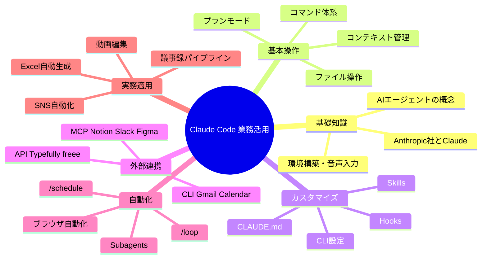

# Claude Code の全てを学べる最強ガイドブック（30日ロードマップ）

> **出典**: Notion「【30日ロードマップ】Claude Code の全てを学べる最強ガイドブック_20260329」／DigiRise（茶圓将裕）受講者向け特典  
> **関連（同一Vault）**: [[20_講座・セミナー資料/チャエン_20260329/ClaudeCode業務活用マスター講座]] ｜ [[20_講座・セミナー資料/チャエン_20260329/ClaudeCode業務活用QA132問]]  
> **公式Notionハブ**: [30日ロードマップ（Notion）](https://www.notion.so/30-Claude-Code-_20260329-3300c6378bf1814090c3e4efcf39bc3e?pvs=21)  
> **Vault 内の実行ハブ（30日×Phase×直近を1枚に）:** [[01_実行計画]]（`04_学習/01_実行計画.md`）

---

## この1ページで把握できること

- 全12章相当の構成イメージ × **動画 M1〜M10** と **Day 0〜30** の対応
- **API / MCP / CLI** の使い分け
- **チャエンの MCP 連携**（カテゴリ別）
- **X 活用事例 TOP20**（指標付き）
- **用語集**

> 各 Day の詳細は Notion の子ページ（下記リンク）を参照。

---

## プログラム概要（カリキュラム M1〜M10 対応）

| eラーニング | ワークショップ（全4回） | 事前課題 | 合計 |
|-------------|-------------------------|----------|------|
| 5時間50分（M1〜M10） | 6時間（WS1〜WS4 × 90分） | 2時間（各WS前に30分） | **13時間50分** |

- **eラーニング**: 自分のペース
- **ワークショップ**: ライブ実践・質疑
- **事前課題**: WS 前に手を動かすと効果が出やすい

---

## 学べること（マインドマップ）



---

## 動画コンテンツ 全10モジュール

| Phase | モジュール | テーマ | 時間 | レベル | 学べること |
|-------|------------|--------|------|--------|------------|
| 導入 | **M1** | AIエージェント概論 | 30分 | 初級 | Anthropic社、Claude体系、エージェントの概念 |
| 導入 | **M2** | 環境構築 | 40分 | 初級 | Cursor導入、Claude Codeインストール、音声入力 |
| 基本 | **M3** | 基本コマンド | 35分 | 初級 | `/help`、`/clear`、`/compact`、ファイル操作 |
| 基本 | **M4** | コンテキスト管理 | 30分 | 初級 | プランモード、`/btw`、精度を保つコツ |
| 中級 | **M5** | `CLAUDE.md` & Memory | 40分 | 中級 | 業務マニュアル、記憶の仕組み |
| 中級 | **M6** | Skills & Hooks | 45分 | 中級 | カスタムコマンド、自動実行スクリプト |
| 中級 | **M7** | CLI & Checkpoints | 30分 | 中級 | `--continue`、`--resume`、`/rewind`、`/fork` |
| 上級 | **M8** | MCP連携 | 50分 | 上級 | Notion / Slack / Figma / Gmail / Calendar |
| 上級 | **M9** | 自動化 | 45分 | 上級 | Subagents、`/schedule`、`/loop`、ブラウザ自動化 |
| 実践 | **M10** | 実務適用 | 45分 | 上級 | Excel、議事録、SNS、動画編集、業務設計 |

---

## 30日間 学習ロードマップ

> **目安**: 毎日 15〜30 分。急がなくてよい。

### レベル別スタート地点

| レベル | あなたの状態 | ここから始める | 所要時間（目安） |
|--------|--------------|----------------|------------------|
| **完全初心者** | Claude Code を聞いた程度 | Day 0〜2: 基礎 → 環境構築 | 約1.5時間 |
| **初心者** | 起動してチャットできる | Day 3〜9: 基本コマンド → Skills 手前 | 約3時間 |
| **中級者** | `CLAUDE.md` やカスタムコマンドが使える | Day 10〜16: Skills応用 → MCP | 約4時間 |
| **上級者** | MCP や Hooks を設定できる | Day 17〜30: 自動化 → 実務適用 | 約5時間 |

> **注**: 下表の「通算Day」は 0〜30 の連番。Notion 子ページのタイトルが「Day 1（基本コマンド）」のように **週内番号** になっている場合がありますが、URL・内容は元ページに準拠します。

---

### Week 0: 基礎知識とセットアップ（Day 0〜2）

| 通算Day | テーマ | やること | 時間 | 対応 | Notion |
|---------|--------|----------|------|------|--------|
| 0 | Anthropic社とClaude概要 | 企業・モデル体系・AIエージェント概念 | 30分 | M1 | [Day 0](https://www.notion.so/Day-0-Anthropic-Claude-AI-3310c6378bf181999461cbf1a7a8289e?pvs=21) |
| 1 | 環境構築 | Cursor、Claude Code CLI、動作確認 | 40分 | M2 | [Day 1 環境](https://www.notion.so/Day-1-Cursor-Claude-Code-3310c6378bf181ed921fd14f4b1eece9?pvs=21) |
| 2 | 音声入力 | スペース長押しと Typeless の使い分け | 15分 | M2 | [Day 2 音声](https://www.notion.so/Day-2-Typeless-3310c6378bf18105aad6ef81fc82db60?pvs=21) |

---

### Week 1: 基本操作を固める（通算 Day 3〜9）

| 通算Day | テーマ | やること | 時間 | 対応 | Notion |
|---------|--------|----------|------|------|--------|
| 3 | 基本コマンド | `/help` で確認。`/clear` `/compact` `/btw` を使う | 30分 | M3 | [子ページ（表記: Day 1）](https://www.notion.so/Day-1-help-clear-compact-btw-3300c6378bf181fd876fd52100fe31a0?pvs=21) |
| 4 | コンテキスト管理 | 膨張 → `/compact` → `/clear` で回復 | 30分 | M4 | [子ページ（表記: Day 2）](https://www.notion.so/Day-2-3300c6378bf181ad894fe22b0f5e8069?pvs=21) |
| 5 | ファイル操作 | 作成・編集・削除・検索 | 20分 | M3 | [子ページ（表記: Day 3）](https://www.notion.so/Day-3-3300c6378bf18172a254d51bf09436b8?pvs=21) |
| 6 | プランモード | Shift+Tab×2。設計 → `/clear` → 実装 | 30分 | M4 | [子ページ（表記: Day 4）](https://www.notion.so/Day-4-3300c6378bf18159a81cf7291c4fbc11?pvs=21) |
| 7 | 音声入力（応用） | スペース長押し、Typeless 比較 | 15分 | M2 | [子ページ（表記: Day 5）](https://www.notion.so/Day-5-3300c6378bf181c99e16c072dc8876ac?pvs=21) |
| 8 | Memory | `/memory`、`MEMORY.md` の仕組み | 30分 | M5 | [Day 6](https://www.notion.so/Day-6-Memory-memory-MEMORY-md-3300c6378bf181608631dbd392d7d3ea?pvs=21) |
| 9 | `CLAUDE.md` 作成 | Why / Structure / Rules / Workflow で手書き | 45分 | M5 | [Day 7](https://www.notion.so/Day-7-CLAUDE-md-AI-3300c6378bf181c8b1d8dcb4bde1bb23?pvs=21) |

---

### Week 2: 使いこなす（通算 Day 10〜16）

| 通算Day | テーマ | やること | 時間 | 対応 | Notion |
|---------|--------|----------|------|------|--------|
| 10 | Skills入門 | `.claude/skills/` に1つ作成し `/スキル名` | 45分 | M6 | [Day 8](https://www.notion.so/Day-8-Skills-3300c6378bf1814eb33ce6dca5fac0bd?pvs=21) |
| 11 | フォルダ整理スキル | Downloads 自動整理 | 30分 | M6 | [Day 9](https://www.notion.so/Day-9-Downloads-3300c6378bf181b7888bfc959f9d07ae?pvs=21) |
| 12 | 議事録スキル | 文字起こし → 議事録 + メール下書き | 45分 | M6 | [Day 10](https://www.notion.so/Day-10-3300c6378bf181b098b4d0b140fb65c5?pvs=21) |
| 13 | Hooks入門 | `settings.json`、deny list、`deny-check.sh` | 45分 | M6 | [Day 11](https://www.notion.so/Day-11-Hooks-settings-json-3300c6378bf181e2bf1ae3c3a20c21d1?pvs=21) |
| 14 | CLI Basics | `claude --continue` `--resume` `--permission-mode auto` | 30分 | M7 | [Day 12](https://www.notion.so/Day-12-CLI-Basics-continue-resume-permission-mode-3300c6378bf181b09eaedf3a80a2e5a9?pvs=21) |
| 15 | Checkpoints | `/rewind` `/fork` `/rename` | 30分 | M7 | [Day 13](https://www.notion.so/Day-13-Checkpoints-rewind-fork-3300c6378bf181fd8479ebd6029fa0ca?pvs=21) |
| 16 | `CLAUDE.md` 改善 | claude-md-improver、A〜F スコア | 30分 | M5 | [Day 14](https://www.notion.so/Day-14-CLAUDE-md-claude-md-improver-3300c6378bf1815eb056e0e33d250ec6?pvs=21) |

---

### Week 3: 自動化する（通算 Day 17〜23）

| 通算Day | テーマ | やること | 時間 | 対応 | Notion |
|---------|--------|----------|------|------|--------|
| 17 | MCP入門 | 仕組み理解、Notion or Slack を1つ | 60分 | M8 | [Day 15](https://www.notion.so/Day-15-MCP-MCP-1-3300c6378bf181c48989c0f6108d17ad?pvs=21) |
| 18 | Gmail/Calendar | GOG CLI で Workspace 操作 | 60分 | M8 | [Day 16](https://www.notion.so/Day-16-Gmail-Calendar-GOG-CLI-Google-Workspace-3300c6378bf1813487cee2c18a81e96d?pvs=21) |
| 19 | Firecrawl | Web検索・スクレイピング、`/firecrawl-search` 等 | 45分 | M8 | [Day 17](https://www.notion.so/Day-17-Firecrawl-Web-3300c6378bf1817aa0d5dcc11b064013?pvs=21) |
| 20 | Subagents | Agent Teams、並列調査 | 60分 | M9 | [Day 18](https://www.notion.so/Day-18-Subagents-Agent-Teams-3300c6378bf181449ecec0e19814e485?pvs=21) |
| 21 | `/schedule` | クラウド定期実行（例: 朝のブリーフィング） | 45分 | M9 | [Day 19](https://www.notion.so/Day-19-schedule-3300c6378bf1814e969dd544e23aa273?pvs=21) |
| 22 | `/loop` | ローカル繰り返し・ポーリング | 30分 | M9 | [Day 20](https://www.notion.so/Day-20-loop-3300c6378bf181288771c11c8df605d4?pvs=21) |
| 23 | ブラウザ自動化 | Chrome DevTools / Playwright | 60分 | M9 | [Day 21](https://www.notion.so/Day-21-Chrome-DevTools-Playwright-3300c6378bf181a5839bf9a0f994162c?pvs=21) |

---

### Week 4: 実務に適用（Notion表記 Day 22〜30・全9本）

| Day | テーマ | やること | 時間 | 対応 | Notion |
|-----|--------|----------|------|------|--------|
| 22 | Excel自動生成 | ヒアリングメモから提案書一式 | 60分 | M10 | [Day 22](https://www.notion.so/Day-22-Excel-3300c6378bf18156a821fb15f36bba95?pvs=21) |
| 23 | 議事録パイプライン | Notta → 議事録 → Gmail → Slack | 60分 | M10 | [Day 23](https://www.notion.so/Day-23-Notta-Gmail-Slack-3300c6378bf18178bf78c6034221cba0?pvs=21) |
| 24 | SNS自動化 | X投稿スキル、Typefully API | 60分 | M10 | [Day 24](https://www.notion.so/Day-24-SNS-X-Typefully-API-3300c6378bf181cf8c84e5891e5fac16?pvs=21) |
| 25 | Figma連携 | デザイン・スライド生成 | 45分 | M10 | [Day 25](https://www.notion.so/Day-25-Figma-Claude-Code-3300c6378bf18122bd9ec8b75402da01?pvs=21) |
| 26 | freee連携 | 請求書・家計簿アプリ | 60分 | M10 | [Day 26](https://www.notion.so/Day-26-freee-3300c6378bf181488b7fe77cb4d3d292?pvs=21) |
| 27 | 動画編集自動化 | 縦型・字幕・BGM・無音カット | 60分 | M10 | [Day 27](https://www.notion.so/Day-27-BGM-3300c6378bf1819faac9d9370823bec1?pvs=21) |
| 28 | Advanced Features | `/remote-control`、並列、Writer/Reviewer | 60分 | M9 | [Day 28](https://www.notion.so/Day-28-Advanced-Features-remote-control-Writer-Reviewer-3300c6378bf181428a5bc9ac1fa16870?pvs=21) |
| 29 | 業務設計 | 業務棚卸し、MCP/CLI/API/スキル接続設計 | 90分 | M10 | [Day 29](https://www.notion.so/Day-29-3300c6378bf18161a9bfc16028392cb7?pvs=21) |
| 30 | 自動化ロードマップ | 3ヶ月計画、優先順位、実行開始 | 60分 | M10 | [Day 30](https://www.notion.so/Day-30-3-3300c6378bf1811e9c19e02164c5ae1b?pvs=21) |

> **注**: Week 1 の子ページだけ Notion 上のタイトルが「Day 1（基本コマンド）」のように **週内の別番号** になっているため、上記「通算Day」（0〜2 → 3〜9 → …）と Notion の **Day 8〜** 以降の番号は一致しません。迷ったら **Notion の子ページ URL** を正としてください。

---

## API / MCP / CLI 完全解説と使い分け

> Claude Code を使いこなすうえで最重要の3概念。

### API（Application Programming Interface）

ソフトウェア同士が通信するための**規約・窓口**。

```
あなたのアプリ → 「メールを送って」→ Gmail API → Gmailサーバー → 送信完了
```

| API | 提供元 | できること | 料金 |
|-----|--------|------------|------|
| Claude API | Anthropic | Claude を直接呼び出し | 従量課金 |
| Gmail API | Google | 送受信・検索・ラベル | 無料枠あり |
| Typefully API | Typefully | X 投稿スケジュール | 有料プラン |
| freee API | freee | 請求・経費・申告 | 契約に含む |
| Salesforce API | Salesforce | 商談・顧客・レポート | SF 契約に含む |

### MCP（Model Context Protocol）

Claude Code と外部サービスをつなぐ**接続規約**。`settings.json` に追記するイメージ。

```json
{
  "mcpServers": {
    "notion": {
      "command": "npx",
      "args": ["-y", "@notionhq/notion-mcp-server"]
    }
  }
}
```

### CLI（Command Line Interface）

ターミナルから使うツール。Claude Code が `--help` を読んで利用方法を把握する、という運用が可能。

```
Claude Code: gogcli のヘルプを読む → コマンドを実行
```

| CLI | 対象 | インストール例 | 主な操作 |
|-----|------|----------------|----------|
| gogcli 等 | Google Workspace | `go install` 等（ツールにより異なる） | Gmail / Calendar / Drive / Sheets / Docs |
| gh | GitHub | `brew install gh` | PR / Issue / リポジトリ |
| sf | Salesforce | `npm install -g @salesforce/cli` | 商談・レポート |
| firecrawl | Web | `npm install -g firecrawl` 等 | 検索・スクレイピング |

### 3つの使い分け（まとめ）

| | API | MCP | CLI |
|---|-----|-----|-----|
| 難易度 | 中〜高 | **低（設定中心）** | 低〜中 |
| 設定 | コードで呼び出し | **`settings.json`** | インストール |
| 最適 | MCP未対応サービス | **対応があれば第一候補** | Google Workspace 等 |

**鉄則**: MCP 対応があれば **MCP 優先** → なければ CLI → それもなければ API。

---

## チャエンの MCP 連携（6カテゴリ・資料抜粋）

### 開発支援

| サービス | 接続方法 | できること | 活用例（資料） |
|----------|----------|------------|----------------|
| GitHub | 公式プラグイン | PR・レビュー・Issue | PR 自動修正クラウド対応 等 |
| Figma | 公式プラグイン | デザイン読取・Code Connect | サムネ作成 |
| Playwright | 公式プラグイン | E2E・ブラウザ自動化 | 求人票作成 等 |
| Context7 | 公式プラグイン | 最新ドキュメント参照 | ライブラリ仕様確認 |

### デザイン

| サービス | 接続方法 | できること |
|----------|----------|------------|
| Canva | 公式プラグイン | 生成・編集・エクスポート |
| Excalidraw | 公式プラグイン | ダイアグラム |
| Mermaid Chart | 公式プラグイン | Mermaid 検証・描画 |

### ドキュメント

| サービス | 接続方法 | できること |
|----------|----------|------------|
| Notion | 公式プラグイン | ページ・DB・検索 |
| Google Drive | gogcli CLI | ファイル・ドキュメント |
| Google Sheets | gogcli CLI | スプレッドシート |

### コミュニケーション

| サービス | 接続方法 | できること |
|----------|----------|------------|
| Gmail | gogcli CLI | 検索・送信・下書き |
| Google Calendar | gogcli CLI | 予定の一覧・作成・更新 |
| Slack | 公式プラグイン | 投稿・検索・Canvas 等 |
| Discord | 公式プラグイン | メッセージ・リアクション |

### 会計・営業

| サービス | 接続方法 | できること |
|----------|----------|------------|
| freee | freee-mcp（カスタム等） | 請求・経費・残高 |
| Salesforce | sf CLI | 商談・レポート |
| Ahrefs | 公式プラグイン | SEO・キーワード |

### ブラウザ

| サービス | 接続方法 | できること |
|----------|----------|------------|
| Chrome DevTools | カスタム MCP | 操作・フォーム・Lighthouse 等 |
| Claude in Chrome | 拡張 | ページ読取・GIF 等 |
| Firecrawl | npm CLI | 検索・クロール |

---

## チャエンの X 活用事例 TOP20（資料数値）

| # | テーマ | IMP | BM | カテゴリ |
|---|--------|-----|-----|----------|
| 1 | `CLAUDE.md` で能力を10倍 | 626,431 | 7,900 | CLAUDE.md |
| 2 | LINE運用代行の駆逐可能性 | 448,775 | 1,995 | ユースケース |
| 3 | 夜間大量タスク処理 | 394,499 | 2,872 | /schedule |
| 4 | ハッカソン優勝者のCC攻略 | 240,462 | 2,787 | プロンプト |
| 5 | Claude / Cowork / CC 使い分け | 201,159 | 1,505 | 概要 |
| 6 | Browser Use CLI 2.0 | 192,865 | 1,464 | ブラウザ |
| 7 | LINE Harness 実装 | 157,556 | 810 | ユースケース |
| 8 | Chrome DevTools MCP | 154,056 | 1,170 | MCP |
| 9 | freee 連携・家計簿アプリ | 148,001 | 567 | MCP |
| 10 | Anthropic 学習曲線データ | 127,318 | 589 | 概要 |
| 11 | 動画編集自動化 | 123,615 | 1,049 | ユースケース |
| 12 | Skills 活用の知見 | 121,658 | 1,156 | スキル |
| 13 | スマホから PC 直接操作 | 120,038 | 433 | ユースケース |
| 14 | Notion→Linear 移行検討 | 112,865 | 449 | MCP |
| 15 | auto mode 公開 | 105,329 | 450 | セキュリティ |
| 16 | Figma MCP + Skills | 102,147 | 636 | MCP |
| 17 | /schedule 定期実行 | 91,548 | 944 | 自動化 |
| 18 | `.claude` フォルダ解説 | 71,050 | 741 | フォルダ設計 |
| 19 | 議事録自動化 BP | 67,489 | 239 | ユースケース |
| 20 | ハーネス設計の解説 | 48,185 | 636 | 技術解説 |

---

## 用語集（抜粋・50+ のうち主要項目）

| 用語 | 説明 |
|------|------|
| AIエージェント | 指示に沿って自律的にタスクを進める AI |
| LLM | 大規模言語モデル |
| Claude Code | Anthropic のターミナルエージェント。ローカルファイル操作 |
| Cursor | VS Code 系の AI エディタ |
| API / MCP / CLI | 外部連携の3レイヤー（上記参照） |
| `CLAUDE.md` | プロジェクトのルール・文脈（自動読込） |
| `MEMORY.md` | 自動蓄積される記憶ファイル |
| Skills | `.claude/skills/` のカスタムプロンプト（`/名前`） |
| Hooks | ツール実行前後のフック |
| Agent Teams / Subagents | 並列・委任の仕組み |
| コンテキスト / トークン | 文脈の総量と課金・ウィンドウの単位 |
| Cowork | Claude デスクトップの GUI 系ワークフロー |
| `/compact` `/clear` `/btw` | 圧縮・全消去・脇道質問 |
| `/schedule` `/loop` | クラウド定期・ローカル繰り返し |
| `/rewind` `/fork` | 巻き戻し・分岐 |
| `/remote-control` | スマホブラウザから操作 |
| Plan Mode | Shift+Tab×2。設計寄りのモード |
| Auto Mode | 承認の自動化（deny list と併用推奨） |
| deny list | 危険コマンドのブロック一覧 |
| Constitutional AI / RLHF | Anthropic の安全・学習の枠組み |
| OAuth 2.0 | 外部サービス認証 |
| settings.json | Claude Code の設定 |
| frontmatter | スキル先頭のメタデータ |
| Typeless / Notta | 音声入力・文字起こし |
| ハーネス設計 | CLAUDE.md・Skills・MCP・Hooks などの総合設計 |

---

## ドキュメントについて（元ページの注記）

- Claude Code 業務活用マスター講座（茶圓将裕 / DigiRise）向け特典資料として配布された内容の再構成です。
- 記載は **2026年3月28日時点** の情報に基づく旨が元資料にありました。最新仕様は [Claude Code 公式ドキュメント](https://code.claude.com/docs) 等で確認してください。
- 質問・フィードバック（元ページ）: [m.chaen@digirise.ai](mailto:m.chaen@digirise.ai)

**最終更新（元Notion）**: 2026-03-28  
**本Markdown作成**: Vault 取り込み用（2026年4月）
