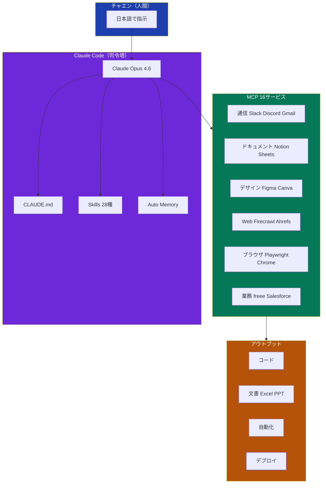
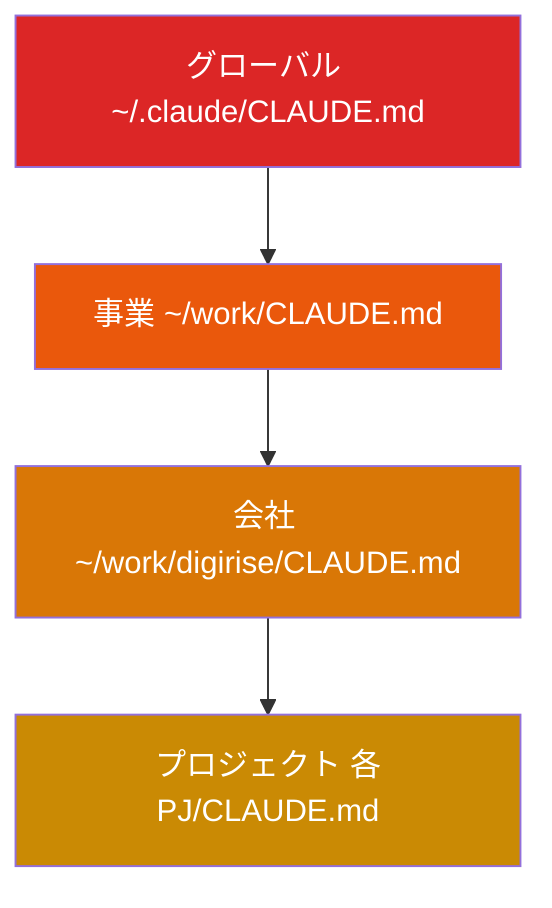
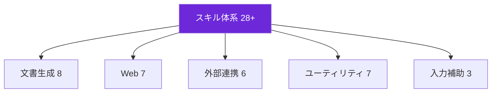
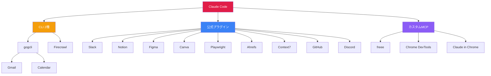
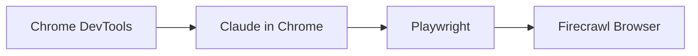
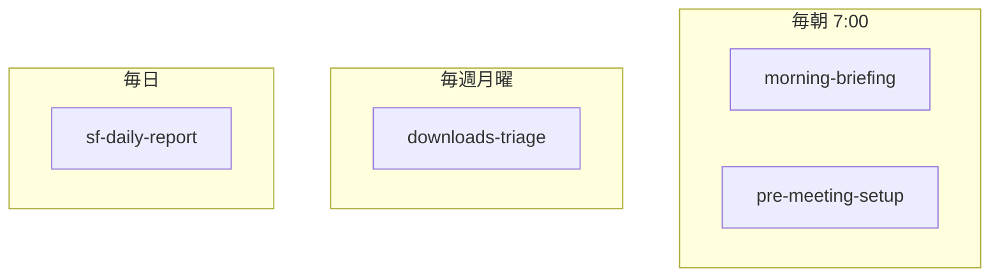
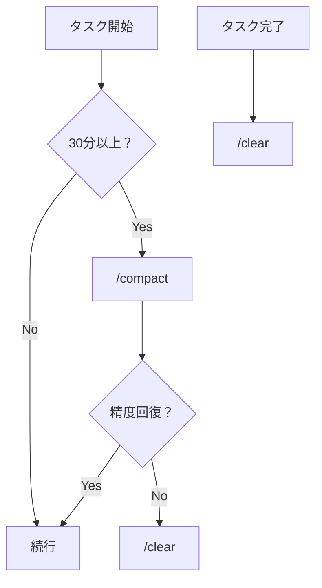

# チャエンの Claude Code 完全まとめ — スキル・MCP・コマンド・運用設計

> **Claude Code 完全マスターガイド【講座特典】**  
> 茶圓将裕（チャエン）の実運用に基づくリファレンス（スキル・MCP・コマンド・`CLAUDE.md`・運用思想）。  
> **28+ スキル ｜ 16 MCP サービス ｜ コマンド一覧 ｜ Tips 30選 ｜ 自動化スケジュール**  
> **最終更新（元資料）**: 2026年3月28日

**関連（同一Vault）**: [[ClaudeCode_業務活用マスター講座_完全レジュメ_20260329]] ｜ [[ClaudeCode_業務活用マスター講座_QA132問_20260329]] ｜ [[ClaudeCode_30日ロードマップ_最強ガイドブック_20260329]] ｜ [[ClaudeCode_バイブコーディング完全マスター講座_概念からClaudeCodeまで]]

**元Notion**: [チャエンの Claude Code 完全まとめ](https://www.notion.so/Claude-Code-MCP-3300c6378bf1818d8ee6d31464c0bc4f?pvs=21)

---

## 目次

1. 全体アーキテクチャ  
2. 第1章 `CLAUDE.md`  
3. 第2章 スキル完全カタログ（28種+）  
4. 第3章 MCP 連携（16サービス）  
5. 第4章 コマンド＆ショートカット  
6. 第5章 自動化スケジュール  
7. 第6章 運用設計の思想  
8. 第7章 活用 Tips 30選  
9. 第8章 X 投稿 TOP15（資料数値）

---

# 全体アーキテクチャ

まず Claude Code の全体像を掴む。以下はチャエン流の運用イメージ。

## Claude Code の基本公式

> **フォルダ設計 + `CLAUDE.md` + 装備（Skills/MCP/コマンド）** を揃えると、非エンジニアでも業務の多くを回しやすい、というメッセージ（資料）。

---

# 第1章 `CLAUDE.md` — AI への業務マニュアル

プロジェクトに置く設定ファイル。起動時に読み込まれ、振る舞いを制御する。**使うほど精度が乗りやすい**設計の中心。

## 階層構造

**鉄則**: `/init` の自動生成だけに頼らず、**手書きで**核を書く。AI が丸ごと生成しただけの `CLAUDE.md` は精度が上がらない・下がるという研究の言及あり（資料）。

## 書く4つの情報

| 項目 | 内容 | 例 |
|------|------|-----|
| **Why** | このフォルダの存在理由 | 顧客向けコンサルの提案書・契約・議事録を管理する |
| **Structure** | ディレクトリの役割 | `clients/` 顧客別 / `templates/` テンプレ / `output/` 生成物 |
| **Rules** | 守らせるルール・禁止 | 日本語応答、スネークケース、`.env` はコミット禁止 |
| **Workflow** | 定番手順 | 商談後は `/post-meeting`、新規顧客は `/pre-meeting-setup` |

## 品質チェック

`/claude-md-improver` で **6基準・100点満点** の採点・改善提案（資料）。

**採点の観点（6項目）**: 目的の明確さ、構造の網羅性、ルールの具体性、ワークフロー、スキル連携の記述、簡潔さ。

**よくある失敗**

- 長すぎて情報過多  
- 抽象的すぎる（「良いコードを」だけ等）  
- 更新が止まる  

→ **簡潔に、階層で分散** が鉄則。

---

# 第2章 スキル完全カタログ（28種+）

`.claude/skills/` に置くカスタムプロンプト。`/スキル名` で再利用。

## スキル全体マップ

---

## 2-1. 文書生成スキル（8種）

### `/post-meeting` — 会議後の自動化

| # | 成果物 | 形式 | 保存先（例） |
|---|--------|------|----------------|
| 1 | 議事録 | .md | `clients/顧客/minutes/` |
| 2 | 議事録整形 | .docx | 同上 |
| 3 | 御礼メール下書き | Gmail 下書き | Gmail |
| 4 | 社内報告 | Slack | #meeting-notes 等 |
| 5 | Notion 更新 | DB | Meetings DB |

**依存**: gogcli（Gmail）、Google Calendar、Notion MCP、Slack MCP

### `/generate-proposal-excel` — 11シート提案書 Excel

| Sheet | 名前 | 内容 |
|-------|------|------|
| 1 | サマリー | タイトル、クライアント、概要、課題と概算 |
| 2 | AI活用課題一覧 | チェック、優先度、難易度、解決策、効果、工数、概算 |
| 3 | お見積り（統合） | 総額、工数、単価、カテゴリ別 |
| 4-8 | 見積り詳細 A〜E | カテゴリ別詳細 |
| 9 | 実行ロードマップ | ガント（例: 24週） |
| 10 | プロジェクト体制 | 支援/クライアント体制 |
| 11 | 次回アジェンダ | 会議情報・準備依頼 |

### その他の文書生成

| # | スキル | コマンド | 用途 |
|---|--------|----------|------|
| 3 | 汎用議事録 | `/universal-meeting-minutes` | 汎用、多成果物ワークフロー |
| 4 | Zoom 議事録 | `/auto-minutes` | 録画ファイル投入 |
| 5 | 人事評価 Excel | `/generate-eval-excel` | 15シート HR 評価 |
| 6 | 提案ダッシュボード | `/digirise-proposal` | Vite+React+Tailwind + Excel |
| 7 | PowerPoint | `/digirise-presentation` | デザインシステム準拠スライド |
| 8 | 請求書 | `/talmood-invoice` | freee API + Sheets 入出金 |

---

## 2-2. Web・リサーチ（7種）— Firecrawl ファミリー

**エスカレーション**: URL 不明 → `search` → 判明 → `scrape` → サイト内 → `map` → 全体 → `crawl` → 構造化 → `agent` → JS/ログイン → `browser` → 保存 → `download`

| # | コマンド | 用途 |
|---|----------|------|
| 9 | `/firecrawl-search` | Web 検索＋全文 |
| 10 | `/firecrawl-scrape` | URL→Markdown |
| 11 | `/firecrawl-map` | サイト内 URL 一覧 |
| 12 | `/firecrawl-crawl` | サイト一括 |
| 13 | `/firecrawl-agent` | JSON 構造化抽出 |
| 14 | `/firecrawl-browser` | ログイン・フォーム |
| 15 | `/firecrawl-download` | ローカル保存 |

---

## 2-3. 外部連携・自動化（6種）

| # | コマンド | 内容 | 連携先 | 実行 |
|---|----------|------|--------|------|
| 16 | `/gogcli` | Workspace 一括 | Google | 手動 |
| 17 | `/sf-daily-report` | SF 日次レポート | Salesforce | 毎日自動 |
| 18 | `/sync-client-registry` | Notion 顧客 DB とローカル同期 | Notion | 手動 |
| 19 | `/pre-meeting-setup` | カレンダーから新規会議フォルダ・`CLAUDE.md` | Calendar | 毎朝自動 |
| 20 | `/morning-briefing` | ニュース・メール・予定・Slack → テキスト+音声 | 複数 | 毎朝自動 |
| 21 | `/remotion-video` | Remotion で解説動画 | Remotion | 手動 |

### `/morning-briefing` フロー（概念）

---

## 2-4. ユーティリティ（7種）

| # | コマンド | 内容 | 頻度（例） |
|---|----------|------|------------|
| 22 | `/downloads-triage` | Downloads 整理 | 毎週月曜 自動 |
| 23 | `/claude-md-improver` | `CLAUDE.md` 監査 | 月1 |
| 24 | `/generate-article-images` | Gemini で図解画像 | 記事時 |
| 25 | `/edit-vertical-video` | 縦動画 字幕・無音・BGM | 動画時 |
| 26 | `/job-eyecatch` | 求人アイキャッチ | 採用時 |
| 27 | `/revise-claude-md` | セッション学習を `CLAUDE.md` に反映 | セッション末 |
| 28 | `/simplify` | コードレビュー・リファクタ提案 | 変更後 |

---

## 2-5. 入力補助（3種）

長文ペースト制限の回避用。

| コマンド | 入力元 |
|----------|--------|
| `/lp` | クリップボード |
| `/le` | エディタ |
| `/lf` | ファイルパス |

---

# 第3章 MCP 連携 — 16サービス

MCP = Claude Code と外部をつなぐ標準。**設定で手足を増やす**イメージ。

## MCP 全体マップ

## 3-1. コミュニケーション系

| サービス | 接続 | 認証 | 主な操作 | 連携スキル例 |
|----------|------|------|----------|----------------|
| Gmail | gogcli | OAuth | 検索・送信・下書き | `/post-meeting`, `/morning-briefing` |
| Google Calendar | gogcli | OAuth | 予定 CRUD | `/pre-meeting-setup`, `/morning-briefing` |
| Slack | 公式 | OAuth | 投稿・検索・Canvas | `/share-internal-minutes`, `/morning-briefing` |
| Discord | 公式 | Bot | メッセージ等 | — |
| Notion | 公式 | OAuth | ページ・DB | `/sync-client-registry`, `/universal-meeting-minutes` |

## 3-2. 会計・営業系

| サービス | 接続 | 操作 | スキル例 |
|----------|------|------|----------|
| freee | freee-mcp 等 | 請求・経費 | `/talmood-invoice` |
| Salesforce | カスタム | 商談・レポート | `/sf-daily-report`, `/post-meeting` |
| Ahrefs | 公式 | SEO | — |

## 3-3. ブラウザ自動化

| ツール | 接続 | 得意分野 |
|--------|------|----------|
| Chrome DevTools | カスタム MCP | DOM・Lighthouse 等 |
| Claude in Chrome | 拡張 | 視覚的操作・GIF |
| Playwright | 公式 | E2E・ヘッドレス |
| Firecrawl | CLI | 大量ページ・検索 |

## 3-4. デザイン・開発支援

| サービス | 用途 |
|----------|------|
| Figma | 読取・Code Connect・FigJam |
| Canva | 生成・編集・ブランド |
| Context7 | ライブラリ最新ドキュメント |
| GitHub | `gh` CLI で PR・Issue |

---

# 第4章 コマンド＆ショートカット

## 4-1. 毎日（必須級）

| コマンド | 役割 | タイミング |
|----------|------|------------|
| `/clear` | コンテキスト全リセット | **作業単位の区切り** |
| `/compact` | 履歴圧縮 | 長時間後・精度低下時 |
| `Esc` | 停止 | 方向違い |
| `/btw` | 本題を汚さず質問 | 脇の疑問 |

## 4-2. 週1〜

| コマンド | 内容 |
|----------|------|
| `Shift+Tab×2` | プランモード |
| `/model` | Opus / Sonnet / Haiku |
| `/fast` | 高速モード |
| `/rewind` | 巻き戻し |
| `/fork` | 分岐 |
| `/memory` | Auto Memory 管理 |
| `/schedule` | 定期実行 |
| `/remote-control` | スマホから操作 |

## 4-3. セッション管理

| コマンド | 内容 |
|----------|------|
| `claude --continue` | 前回続き |
| `claude --resume` | 過去セッション選択 |
| `/rename` | セッション名 |
| `claude --permission-mode auto` | Auto Mode（**deny list 併用推奨**） |

## 4-4. ショートカット（資料）

- `Shift+Tab×2` — プランモード  
- `Ctrl+C×2` — 即停止  
- `Esc×2` — 中断  
- `Ctrl+G` — エディタ長文  
- スペース長押し — 音声  
- `/lp` `/le` `/lf` — 長文入力  

---

# 第5章 自動化スケジュール

`/schedule` 等で回す例（資料）。

| 頻度 | 時間 | スキル | 内容 |
|------|------|--------|------|
| 毎朝 | 7:00 | `/morning-briefing` | ニュース・Gmail・予定・Slack |
| 毎朝 | 7:00 | `/pre-meeting-setup` | 新規予定検出・フォルダ作成 |
| 毎週月曜 | — | `/downloads-triage` | Downloads 整理 |
| 毎日 | — | `/sf-daily-report` | Salesforce 集計 |

> `/schedule` の仕様（有効期限・クラウド実行など）は公式ドキュメントで要確認。講座レジュメでは **繰り返しタスクの失効** に言及あり（[[ClaudeCode_業務活用マスター講座_完全レジュメ_20260329]]）。

---

# 第6章 運用設計の思想

装備より **使い方** が重要、という前提（資料）。

## 3つの鉄則

1. **フォルダ設計** — 開いた瞬間に構造が伝わる。デスクトップ散乱を避ける。  
2. **`CLAUDE.md` は手書き核** — Why / Structure / Rules / Workflow。  
3. **コンテキスト管理** — 終了時 `/clear`、低下時 `/compact`、連続失敗なら `/clear` で切り直し。  

## コンテキスト管理フロー（概念図）

## 避けるべき5パターン

| パターン | 症状 | 対策 |
|----------|------|------|
| キッチンシンク | 1セッションに詰め込み | 1タスク1セッション、`/clear` |
| 修正ループ | 同じ修正の繰り返し | 切り戻し・`/clear` の方が速い場合あり |
| `CLAUDE.md` 肥大 | 情報過多 | 階層分割・簡潔化 |
| 検証なし信頼 | そのまま本番 | 検証・レビューをセット |
| 無限探索 | ゴール不明の調査 | ゴールと時間を区切る |

---

# 第7章 活用 Tips 30選（ダイジェスト）

**セットアップ（8）**: 手書き `CLAUDE.md`、階層、フォルダ命、Cursor×CC、Auto Memory、claude-md-improver、MCP、CLI。

**日常操作（8）**: コンテキスト3鉄則、プランモード、検証セット、具体指示、/btw、探索→計画→実装→コミット、インタビュー活用、失敗パターン回避。

**上級（6）**: Agent Teams、スキル化、並列、議事録パイプライン、Auto Mode、リモート。

**業務（6）**: 提案資料一括、Excel、長尺動画解析、SF CLI、Playwright、統一メモリー。

**マインド（2）**: 「小サービスで満足」より **既存業務に自然に入り込む設計**；巨大な `CLAUDE.md` だけが本質ではない。

---

# 第8章 X 投稿 TOP15（資料の IMP/BM）

| テーマ | IMP | BM | 分類 |
|--------|-----|-----|------|
| `CLAUDE.md` で能力10倍 | 626,431 | 7,900 | CLAUDE.md |
| LINE 運用代行の話 | 448,775 | 1,995 | ユースケース |
| 夜間大量タスク | 394,499 | 2,872 | /schedule |
| ハッカソン CC 攻略 | 240,462 | 2,787 | プロンプト |
| Claude/Cowork/CC | 201,159 | 1,505 | 概要 |
| Browser Use CLI 2.0 | 192,865 | 1,464 | MCP |
| Channels | 193,858 | 1,034 | MCP |
| LINE Harness | 157,556 | 810 | ユースケース |
| Chrome DevTools MCP | 154,056 | 1,170 | MCP |
| freee 家計簿 | 148,001 | 567 | MCP |
| 学習曲線データ | 127,318 | 589 | 概要 |
| Skills 知見 | 121,658 | 1,156 | スキル |
| スマホ→PC 操作 | 120,038 | 433 | ユースケース |
| auto mode | 105,329 | 450 | Auto Mode |
| Figma MCP + Skills | 102,147 | 636 | MCP |

---

## このドキュメントについて

Claude Code 業務活用マスター講座（茶圓将裕 / DigiRise）向け特典の **Markdown 再構成**です。ツール名・料金・機能は変更が早いため、利用前に [Claude Code 公式](https://code.claude.com/docs) および各サービスで確認してください。
