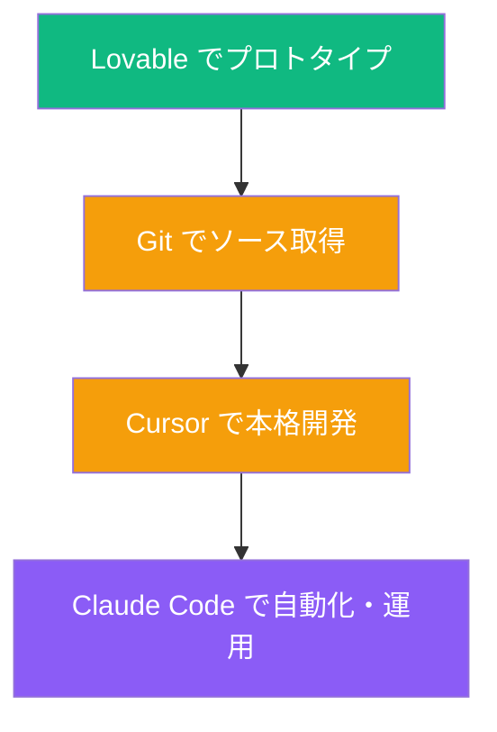
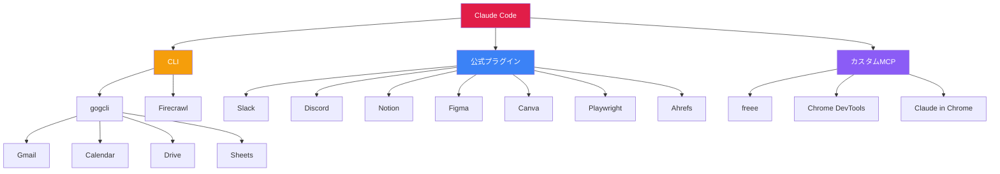

# バイブコーディング完全マスター講座 〜概念から Claude Code まで〜

> **出典**: 配布資料「【配布資料】バイブコーディング完全マスター講座」／DigiRise・Claude Code 講座系特典  
> **関連（同一Vault）**: [[ClaudeCode_業務活用マスター講座_完全レジュメ_20260329]] ｜ [[ClaudeCode_30日ロードマップ_最強ガイドブック_20260329]]

---

## 時間割（タイムテーブル）

> 投影・収録版によってセクション時間が異なる場合があります。動画教材・スライドの目次を併せて参照してください。

---

# 第1章｜バイブコーディングとは何か

## 1-1. 定義：Andrej Karpathy の原点

> **"There's a new kind of coding I call 'vibe coding', where you fully give in to the vibes, embrace exponentials, and forget that the code even exists."**  
> — Andrej Karpathy（2025年2月4日、X投稿・1億+インプレッション）

**バイブコーディングとは**

AI に自然言語（日本語）で指示し、**自分でコードを書かずに**アプリやサービスを作る開発スタイル。「バイブ（Vibe）」＝ 雰囲気・ノリ・フィーリング。細部の技術に固執せず、AI と「ノリ良く」進める。

| 項目 | 内容 |
|------|------|
| 一言で言うと | AI に自然言語で指示し、コードを書かずにアプリを作る開発スタイル |
| 命名者 | Andrej Karpathy（OpenAI 共同創業者、元 Tesla AI 責任者） |
| 命名時期 | 2025年2月 |
| 英語＝新しいプログラミング言語 | Karpathy「英語は最もホットなプログラミング言語だ」（2023年） |

---

## 1-2. 従来のコーディングとの違い

**従来のコーディング**  
人間がコードを1行ずつ書く → テスト → デバッグ → デプロイ。技術力が必須、学習コストは数ヶ月〜数年。

**バイブコーディング**  
人間が日本語で「こういうアプリ作って」→ AI がコード生成 → 動作確認 → 修正指示。アイデアと指示力があれば誰でもプロトタイプ〜製品に近づけやすい。

---

## 1-3. AI活用コーディングの4段階スペクトラム

| 段階 | 手動コーディング | AIアシスト | バイブコーディング | エージェンティック・エンジニアリング |
|------|------------------|------------|--------------------|----------------------------------------|
| 概要 | 人間が全て書く | AI が補完・提案 | AI に丸投げ、人間は指示のみ | 複数 AI エージェントを人間が統制 |
| ツール例 | メモ帳, VS Code | GitHub Copilot, ChatGPT | Lovable, Bolt.new, Replit | Claude Code, Cursor Agent |
| 制御 | ← 人間の制御が多い | | | → AI の自律性が高い |

---

## 1-4. 衝撃の数字で見る現在地

| 指標 | データ | 出典 |
|------|--------|------|
| Collins 辞書 2025 Word of the Year | 「vibe coding」選出 | Collins English Dictionary |
| MIT 2026年ブレークスルー技術 | 10選に選出 | MIT Technology Review |
| Y Combinator W2025 | 25%のスタートアップがコードの95%以上をAI生成 | Y Combinator |
| 開発者のAIツール利用率（米国） | 92%が日常的に使用 | Stack Overflow 2025 |
| Fortune 500 | 87%が少なくとも1つ導入 | 業界調査 |
| AI生成コード比率（2025年） | 全新規コードの41% | GitClear |
| AI生成コード予測（2026年末） | 60%に到達見込み | Gartner |
| 市場規模 | $4.7B → 2027年に$12.3B | 業界推計 |
| Cursor 企業価値 | $9.9B（約1.5兆円） | Series C 2025年6月 |
| Lovable ARR | $100M を8ヶ月で達成 | 公式発表 |

---

## 1-5. 歴史タイムライン

| 時期 | 出来事 |
|------|--------|
| 2023年1月 | Karpathy「英語は最もホットなプログラミング言語」 |
| 2024年 | GitHub Copilot 普及、AIコーディング黎明期 |
| 2025年2月 | Karpathy「vibe coding」命名（1億+インプレッション） |
| 2025年3月 | Merriam-Webster「スラング＆トレンド」に登録 |
| 2025年7月 | Wall Street Journal「プロ開発者もバイブコーディング採用」 |
| 2025年11月 | Collins 辞書「2025年 Word of the Year」 |
| 2026年1月 | Linus Torvalds もバイブコーディング使用と報道 |
| 2026年2月 | Karpathy「エージェンティック・エンジニアリング」提唱 |
| 2026年3月 | MIT「2026年ブレークスルー技術」選出 |

---

# 第2章｜レベル別ツール完全ガイド

## 2-1. レベル別ロードマップ

---

## 2-2. Lv.1 入門｜まずはAIと会話してみる

**対象**: プログラミング経験ゼロ、AI に触れたことがない人

| ツール | 特徴 | 料金 |
|--------|------|------|
| ChatGPT | コード説明・生成、Canvas でリアルタイム編集 | 無料〜$20/月 |
| Claude（Artifacts） | 対話で HTML アプリ即生成・プレビュー | 無料〜$20/月 |
| Google AI Studio | Gemini でブラウザ内に簡単アプリ | 無料 |

**この段階でやること**: 「電卓アプリ作って」「ToDoリスト作って」と頼む → **自分でもアプリが作れる**という成功体験。

---

## 2-3. Lv.2 初級｜ノーコードで MVP を作る（Lovable 推し）

**対象**: アイデアはあるが技術力がない起業家・ビジネスパーソン

| ツール | 特徴 | 料金 | 速度（資料） |
|--------|------|------|----------------|
| **Lovable** | UI 品質、Supabase 連携で認証・DB・ストレージ | 無料〜$100/月 | ~35分 |
| [Bolt.new](https://bolt.new) | 高速プロトタイプ、マルチフレームワーク | 無料〜$20/月 | ~28分 |
| Replit | エディタ+ホスティング+DB+AI | 無料〜$25/月 | ~45分 |
| v0 | React+Tailwind コンポーネント、Vercel 連携 | 無料〜$20/月 | ~50分 |

**なぜ Lovable が初心者向きに強いか（資料の要点）**

1. 日本語指示でフルスタックに近い成果物  
2. UI の仕上がりが高い  
3. Supabase で認証・DB・ストレージを組み込みやすい  
4. デプロイまで簡単  
5. Git 連携で Cursor へのステップアップもしやすい  

---

## 2-4. Lv.3 中級｜エディタ統合で本格開発

**対象**: 基本のプログラミング知識がある人・エンジニア

| ツール | 特徴 | 料金 |
|--------|------|------|
| **Cursor** | AI native IDE、コードベース理解、マルチファイル編集 | 無料〜$200/月 |
| Windsurf | Cascade エージェント、自律タスク | 無料〜$15/月 |
| GitHub Copilot | VS Code / JetBrains 統合、導入しやすい | 無料〜$39/月 |

---

## 2-5. Lv.4 上級｜Claude Code で自動化（最終到達点の一つ）

**対象**: 開発を極めたい人、業務全体を AI 化したい人 → **第3章**で詳述。

---

## 2-6. ステップアップの流れ

多くのチームが **Lovable → Cursor → Claude Code** の流れを取る、という紹介（資料）。

---

## 2-7. ツール比較サマリー

| 項目 | Lovable | Bolt.new | Cursor | Claude Code |
|------|---------|----------|--------|-------------|
| レベル | 初級 | 初級 | 中級 | 上級 |
| UI | ブラウザ | ブラウザ | IDE | ターミナル（CLI） |
| コード知識 | 不要 | 不要 | あると良い | あると最強 |
| 大規模対応 | △ | △ | ○ | ◎ |
| デプロイ | ワンクリック | ワンクリック | 別途 | 別途 |
| Git | ○ | △ | ◎ | ◎ |
| 料金 | 無料〜$100 | 無料〜$20 | 無料〜$200 | $20〜$200 |
| ユースケース | MVP・検証 | 高速プロト | 既存PJ改良 | 大規模・自動化 |
| 一言 | 見せるものを最速 | 動くものを最速 | 良いコードを効率 | 実行を任せる |

---

# 第3章｜Claude Code が最強な理由（資料上の整理）

## 3-1. ポジショニング（比喩）

| 比喩 | ツール |
|------|--------|
| 頭脳（答える） | ChatGPT |
| デザイナー（きれいなアプリ） | Lovable |
| ペアプロ（一緒に書く） | Cursor |
| 右腕（実行する） | Claude Code |

| 項目 | 内容 |
|------|------|
| リリース | 2025年（Anthropic） |
| デフォルトモデル（例） | Claude Opus 4.6（2026年3月時点・資料表記） |
| 動作環境 | ターミナル / デスクトップ / Web / IDE 拡張 |
| GitHub 全パブリックコミット | 4% が Claude Code 経由（資料） |
| 大規模コード | 50,000行以上で成功率約75%（資料） |

---

## 3-2. 他と違う5つの理由（要約）

### ① コーディング「だけ」ではない

- コード生成・修正・リファクタ  
- ファイル作成・整理・一括処理  
- Excel / Word / PowerPoint 自動生成  
- 議事録・メール下書き  
- データ分析・グラフ  
- Git（コミット・PR・レビュー）  
- スクレイピング・API 連携  
- Slack / Notion / Gmail 等（MCP 経由）  

### ② `CLAUDE.md` で「育てる」

プロジェクトのルール・慣例・手順を書いた **業務マニュアル**。起動時に読み込まれ、使うほど精度が乗りやすい。

### ③ Skills で「技」を再利用

`/commit` や議事録スキルなど、`/スキル名` で定型業務を再実行。

### ④ MCP で外部ツールと接続

Slack、Notion、Gmail、Calendar、Figma、GitHub、freee、ブラウザ操作など。

### ⑤ エージェント的に自律実行

ゴールを渡すと計画→実行→検証→修正→報告まで進めやすい、という位置づけ（資料）。

---

## 3-3. チャエンが使っているスキル全28種（一覧）

詳細・更新は Notion を参照: [チャエンの Claude Code「最強装備」一覧](https://www.notion.so/3310c6378bf1812a9116e6d245779ea4?pvs=21)

### 文書生成スキル（8種）

| # | スキル名 | 一言 | 内容 |
|---|----------|------|------|
| 1 | `/post-meeting` | 会議後の自動化 | 文字起こし→議事録(MD+DOCX)+お礼メール+Slack+Notion |
| 2 | `/universal-meeting-minutes` | 汎用議事録 | 論点・決定・次アクション抽出 |
| 3 | `/auto-minutes` | Zoom録画→議事録 | 録画から生成・分類・保存 |
| 4 | `/generate-proposal-excel` | 提案書 Excel | ヒアリングから多シート Excel |
| 5 | `/generate-eval-excel` | 人事評価 Excel | 15シート構成の HR 評価 |
| 6 | `/digirise-proposal` | インタラクティブ提案書 | Vite+React+Tailwind ダッシュボード |
| 7 | `/digirise-presentation` | PowerPoint 自動 | デザインシステム準拠スライド |
| 8 | `/talmood-invoice` | 請求書 | freee API 連携 |

### Web・リサーチ（7種）— Firecrawl ファミリー

**エスカレーションの考え方（資料）**: URL 不明 → `search` → URL 判明 → `scrape` → サイト内 → `map` → 全体 → `crawl` → 構造化 → `agent` → JS 操作 → `browser` → 保存 → `download`

| # | スキル名 | 用途 |
|---|----------|------|
| 9 | `/firecrawl-search` | Web検索＋全文取得 |
| 10 | `/firecrawl-scrape` | URL→Markdown |
| 11 | `/firecrawl-map` | サイト内 URL 一覧 |
| 12 | `/firecrawl-crawl` | サイト一括抽出 |
| 13 | `/firecrawl-agent` | 構造化 JSON 抽出 |
| 14 | `/firecrawl-browser` | ログイン・フォーム |
| 15 | `/firecrawl-download` | ローカル保存 |

### 外部連携・自動化（6種）

| # | スキル名 | 内容 |
|---|----------|------|
| 16 | `/gogcli` | Google Workspace 一括操作 |
| 17 | `/sf-daily-report` | Salesforce 日次レポート |
| 18 | `/sync-client-registry` | Notion 顧客 DB 同期 |
| 19 | `/pre-meeting-setup` | 会議前フォルダ自動作成 |
| 20 | `/morning-briefing` | 朝のブリーフィング |
| 21 | `/remotion-video` | Remotion で解説動画 |

### ユーティリティ（7種）

| # | スキル名 | 内容 |
|---|----------|------|
| 22 | `/downloads-triage` | Downloads 整理 |
| 23 | `/claude-md-improver` | `CLAUDE.md` 品質監査 |
| 24 | `/generate-article-images` | Gemini で図解画像 |
| 25 | `/edit-vertical-video` | 縦動画（字幕・無音・BGM） |
| 26 | `/job-eyecatch` | 求人アイキャッチ |
| 27 | `/revise-claude-md` | セッション学習から `CLAUDE.md` 更新 |
| 28 | `/simplify` | コードレビュー・リファクタ |

---

## 3-4. MCP 連携 16サービス（全体マップ）

| カテゴリ | サービス | できること |
|----------|----------|------------|
| コミュニケーション | Slack / Discord / Gmail / Google Chat | メッセージ・メール・Canvas 等 |
| ドキュメント | Notion / Google Docs / Sheets | ページ・DB・表計算 |
| デザイン | Figma / Canva | 読取・生成・書き出し |
| Web | Firecrawl / Ahrefs / Context7 | スクレイピング・SEO・ドキュメント |
| ブラウザ | Playwright / Chrome DevTools / Claude in Chrome | 操作・E2E・記録 |
| 会計・営業 | freee / Salesforce | 請求・経費・商談 |
| 開発 | GitHub | PR・レビュー・Issue |

---

## 3-5. 実例（資料）

- **事例①**: 寝る前の短い指示 → 数十分で大量ファイル・行数のコード（SNS で拡散された例として紹介）  
- **事例②**: 月間多数の PR を自動生成し、人間はレビューに集中  
- **事例③**: セミナー準備・議事録・請求・顧客 DB・朝のブリーフィングなど業務の自動化  

---

## 3-6. 毎日使うコマンド＆ショートカット

| コマンド | 役割 | タイミング |
|----------|------|------------|
| `/clear` | コンテキストリセット | 作業単位の区切り |
| `/compact` | 履歴圧縮 | 精度低下時 |
| `Esc` | 停止 | 方向違い時 |
| `/btw` | 本題を汚さず質問 | 脇道の疑問 |
| `Shift+Tab×2` | プランモード | 設計と実装の分離 |
| `/schedule` | 定期実行 | 朝レポート等 |
| スペース長押し | 音声入力 | 長文・手を止めたい時 |

---

## 3-7. 始め方（3ステップ・資料）

1. Anthropic アカウント → Claude の有料プラン（例: Pro $20/月）  
2. `npm install -g @anthropic-ai/claude-code`  
3. 作業フォルダで `claude` を起動  

**推奨の組み合わせ**: Cursor のターミナルから Claude Code（エディタの視認性 + CLI の実行力）。

---

## 3-8. プロンプト例

| やりたいこと | プロンプト例 |
|--------------|--------------|
| Webアプリ | ToDo を React + Tailwind で。ダークモード対応 |
| 整理 | Downloads を種類別に整理 |
| Excel | 売上データからピボット付き Excel |
| 議事録 | この文字起こしから議事録を Notion に |
| スライド | この内容で PowerPoint 20枚 |
| Git | 変更をコミットして PR を作成 |
| レビュー | この PR をレビューして問題を指摘 |

---

# 第4章｜注意点と未来

## 4-1. セキュリティリスク（資料の統計・注意喚起）

- AI 生成コードのかなりの割合にセキュリティ上の問題が付きまとう、という第三者調査の引用  
- 生成コードの脆弱性密度が高いという比較  
- AI 起因の CVE が増えている、という趣旨の記述  
- 「速く感じるが、デバッグ込みでは遅くなる」という調査引用  

※ **数値は資料発表時点**。最新は各レポートで確認。

## 4-2. 守るべき5つの鉄則

1. APIキー・パスワードをコードに直書きしない（環境変数・`.env`、`.gitignore`）  
2. AI 生成コードはレビューする（認証・決済・個人情報まわり）  
3. テスト・動作確認（「テストも書いて」と明示）  
4. Git でバージョン管理  
5. プロトタイプと本番を分ける（本番前にプロレビュー）  

---

## 4-3. 未来：エージェンティック・エンジニアリング

> **「vibe coding はもう古い。これからは agentic engineering だ」**  
> — Andrej Karpathy, 2026年2月（資料引用）

**バイブコーディング（2025年）**: 人間 → AI に指示 → 生成。1対1 の対話が中心。

**エージェンティック・エンジニアリング（2026年〜）**: 計画・実装・テスト・セキュリティなど複数エージェントをチームとして扱う。Claude Code はその方向の実装例として紹介される、という整理（資料）。

---

## 4-4. あなたの最適ルート（資料）

- **コードをほとんど書いたことがない** → ChatGPT / Artifacts → Lovable で最初のアプリ  
- **多少の経験** → Cursor でペアプロ → Claude Code を併用  
- **効率を極めたい** → Claude Code 中心 + `CLAUDE.md` / Skills / MCP  

**共通の到達点の一つとして Claude Code** が推される、というメッセージ（資料）。

---

## 参考リンク集

| リソース | URL |
|----------|-----|
| Karpathy 原文 | [X投稿](https://x.com/karpathy/status/1886192184808149383) |
| Claude Code | [https://claude.ai/code](https://claude.ai/code) |
| Lovable | [https://lovable.dev](https://lovable.dev) |
| Cursor | [https://cursor.com](https://cursor.com) |
| Bolt.new | [https://bolt.new](https://bolt.new) |
| Replit | [https://replit.com](https://replit.com) |
| チャエン X | [@masahirochaen](https://x.com/masahirochaen) |
| デジライズ | [https://digirise.ai](https://digirise.ai) |
| 最強装備一覧（Notion） | [Notion](https://www.notion.so/3310c6378bf1812a9116e6d245779ea4?pvs=21) |

---

**メモ**: ツールの料金・モデル名・統計は更新が早いです。利用前に各公式サイトで最新情報を確認してください。
