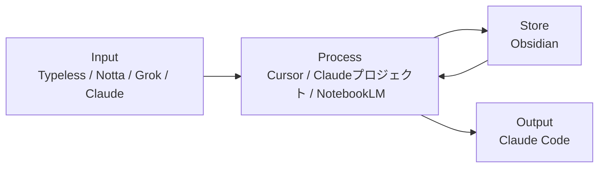
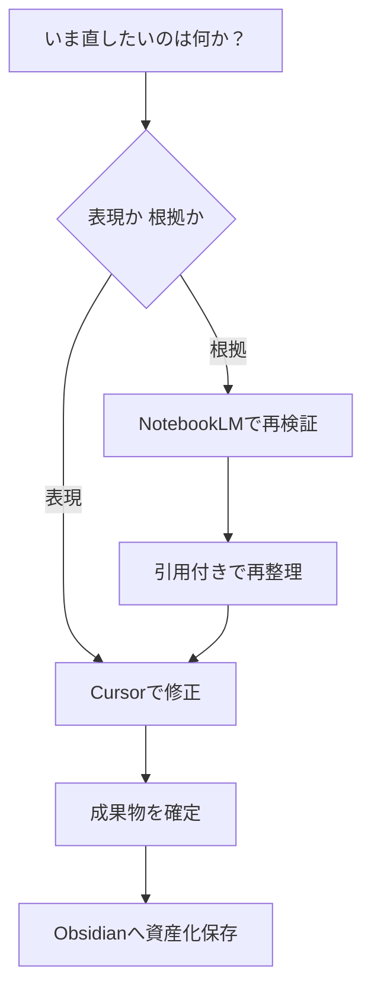

# AI活用整理

環境・ツール運用の正本（旧：AI戦略_01／ファイル名 `01_AI活用整理.md`）

---

## 0. 全体像

- Input：Typeless / Notta / Grok / Claude
- Process：Cursor / Claudeプロジェクト / NotebookLM
- Store：Obsidian
- Output：Claude Code

---

## 0.5 ツール構成図



補足：
- 図の Input は**日常の主経路**のみ。`Gemini` は利用を限定しているため図に含めない。**役割と出番の定義は §1・§2 を正とする**。
- 日常の入力・壁打ちは `Claude` を優先
- `Gemini` は Googleサービス連携が必要なとき、または NotebookLMソース前提で補助推論するときのみ利用

---

## 1. ツール役割定義（確定版）

| ツール | 役割 | 一言定義 |
|--------|------|----------|
| Typeless | 音声入力 | 思考を瞬時にテキスト化 |
| Notta | 議事録・書き起こし | 会議・面談を自動テキスト化 |
| Grok | リアルタイム情報収集 | 最新トレンド・X情報のキャッチアップ |
| Gemini | Google連携のみ | Gmail・カレンダー統合 |
| Claude（通常） | 壁打ち・下書き | その場の問い・短いドラフト（文脈の長期蓄積はプロジェクトへ） |
| Claudeプロジェクト | 戦略壁打ち・文脈蓄積 | 会話履歴が育つ思考パートナー |
| Cursor | 全操作の中核UI・最終出力 | あらゆるアウトプットの起点 |
| NotebookLM | ソース限定の壁打ち・履歴追従 | 一次情報に基づき、文脈を維持したまま改善・思考を深める |
| Obsidian | 知識の永久保存 | 第二の脳 |
| Claude Code | 業務自動化・エージェント | 業務をフローとして再現する |

補足：`Gemini` は上表どおり **Google連携が主**。NotebookLMソース前提の補助推論は例外として §2 を参照。

---

## 2. ツールの使い分け判断

「リアルタイム情報・トレンドを収集したい」  
→ Grok

「Google系サービスと連携したい」  
→ Gemini

「特定のソース・領域に限定して深掘りしたい」  
→ NotebookLM（該当ノートブック）

「過去の会話の文脈を踏まえて戦略を考えたい」  
→ Claudeプロジェクト

「その場の壁打ち・短い初稿だけで足りる」  
→ Claude（通常）

「会議・面談をテキスト化したい」  
→ Notta（入力パターンの細部は §5.5）

「文章・コンテンツ・アウトプットを作りたい」  
→ Cursor（全操作の起点）

「業務を自動化・フロー化したい」  
→ Claude Code

「音声で素早くインプットしたい」  
→ Typeless → 各ツールへ

### Claude と Claudeプロジェクトの切り替え

- **Claude（通常）**：その場の壁打ち・下書き・短い問いへの回答。セッションをまたいで参照しないならこちらで足りる。
- **Claudeプロジェクト**：同テーマで**複数回**壁打ちし、**文脈・前提・過去のやり取りを蓄積**したいとき。戦略・設計・長期タスクの判断軸をプロジェクト側に残す。

---

## 3. 情報フロー

### 原則（5段階）

1. 収集
2. 理解
3. 構造化
4. 実行
5. 蓄積

補足：Obsidianには「生ログ」ではなく「資産化済みアウトプット」を保存する。

### パターン別

#### パターンA：直接蓄積

良い記事・読書ハイライト・気づき  
↓  
Obsidian（直接保存）  
↓  
Cursor で読み込んでアウトプット生成

#### パターンB：NotebookLM経由

業務資料・音声ジャーナル・特定テーマのソース群  
↓  
NotebookLM（こねる・分析・パターン抽出）  
↓  
出てきた洞察・ノウハウ・気づきのみ  
↓  
Obsidian（パーマネントノートとして保存）  
↓  
Cursor で横断的に活用

#### パターンC：Claude経由

Claude プロジェクトで戦略設計・壁打ち  
↓  
重要な意思決定・気づきのみ抽出  
↓  
Obsidian（意思決定ログとして保存）

#### パターンD：統一オペレーションフロー

① 収集 — Grok / Claude Web検索で情報取得  
② 理解 — NotebookLMで精読・構造把握  
③ 構造化 — Cursorで骨格を組む  
④ 実行 — Claude Codeで自動化・量産  
⑤ 蓄積 — Obsidianに知識として保存

---

## 4. NotebookLM運用

- 11冊構成で領域分離（Career / Business / RINGBELL / Asset / Athlete / Beauty / Life / Relationship / Culture / Journal / AI活用）
- すべてのノートは「意思決定のため」に運用し、概念ではなく実態ベースで分類する
- NotebookLMで抽出した洞察のみをObsidianへ転記し、生ログはNotebookLM側で保持する
- 「答えられない質問」を記録し、ソース追加と分類見直しで精度を改善する
- 詳細設計は `11_AI/01_tools-ops/03_NotebookLM運用.md` を参照

### NotebookLM × Gem（Gemini）— 現状の見立て

- 外部発信では「NotebookLMに知識、Gemに役割固定」等、**NotebookLM×Gem の有用性**が訴求されることがある。
- **同一ノートブック（ソース束）を読む前提**で比較すると、**NotebookLM単体（チャット・カスタム指示・ルールをソース化）との差分は主に UI・動線**（例：Gemini から Gem を選んで開く、Instructions を Gem 側に持つ）と理解している。倉庫が同じなら **載せられる知識量や引用の発想は同系**。
- **推論・引用のエンジンが別物になる**、という整理には至っていない。**よって NotebookLM × Gem の積極採用は一旦保留**する。見直すトリガー例：スマホで Gemini 中心の時間が長い、用途別の名前付き入口が欲しい、他者に共有するプリセットが欲しい、など。

詳細メモ・比較表は `11_AI/01_tools-ops/NotebookLM×Gem.md` を参照。

---

## 5. Android 運用設計

### 移動中：Typeless（音声入力）

↓

```
├── 業務・日常の思考ログ → NotebookLM【10 Journal】
├── 重要な気づき → Obsidian【00_Inbox】
└── 戦略の壁打ち → Claude アプリ
```

### 移動中：Grok（リアルタイム情報収集）

↓

気になった情報 → Obsidian【20_Clippings】または NotebookLM【11 AI活用】

### 帰宅後（週次）

- `00_Inbox` を各フォルダへ整理
- NotebookLM【10 Journal】の月次分析 → Obsidian【09_Daily】へ

補足：会議・面談の取り込みは §5.5。Vault 内の `00_Inbox` / `20_Clippings` / `09_Daily` 等の有無・命名は環境に合わせて読み替える。NotebookLMの番号体系は `03_NotebookLM運用.md`（11冊）を正とする。

---

## 5.5 会議運用（資産化）

- 入力（場合分け）：
  - オンライン
    - botを入れられる：Notta
    - botを入れられない
      - イヤホンあり：Hidock P1
      - イヤホンなし：Nottaスマホ録音 or Hidock P1
  - オフライン
    - Nottaスマホ録音 or Hidock P1
- 処理：Notta等で得た**録音・文字起こしテキスト（または要約）をNotebookLMのソースとして投入**し理解・検証 -> 要点をObsidianに保存 -> Cursorで議事録・成果物化 -> 必要ならClaude Codeでタスク化
- 原則：会議は一過性の記録ではなく、再利用可能な業務資産として残す

---

## 5.6 CursorとNotebookLMの使い分け（実務判断）

### まず結論

- NotebookLM：ソースに基づく壁打ち・検証、履歴を踏まえたブラッシュアップ（ソース限定）
- Cursor：横断統合・文章化・最終成果物化
- Obsidian：再利用価値のある知識だけを保存

### 迷ったときの判断基準

- 表現を直す（文体、構成、読みやすさ） -> Cursor
- 根拠を直す（前提、引用、事実確認） -> NotebookLM
- 複数ノートをつないで実行計画にする -> Cursor
- 根拠資料が更新された -> NotebookLMで再検証

### 1分で判断するクイックチャート



---

## 5.7 標準オペレーション（初心者向け）

1. NotebookLMに対象ソースを入れる（領域別ノート）
2. 目的を1行で定義して壁打ちする（何を決めるか）
3. 引用付きで論点と判断軸を出す
4. Cursorで実務成果物に整える（提案文、議事録、計画）
5. 確定版のみObsidianへ保存する
6. 繰り返し業務はClaude Codeで自動化する

実務メモ：
- 「とりあえず保存」はしない。再利用できる形にしてから保存する
- 判断に使った根拠ソースは、成果物の末尾にメモで残す

---

## 5.8 運用品質チェック（プロ向け）

### 最低限の記録ルール

- 重要文書には「更新日時」「根拠ソース」を記載
- NotebookLMソースは週次で棚卸し（古い資料を除外）
- 機微情報は投入前に匿名化し、必要時は承認を取る（**データ区分・投入可否・承認の詳細は `02_AIキャッチアップ.md` を正とする**）

### 自動化の優先順位（小さく始める）

1. 問い合わせ返信生成
2. 面談準備
3. 面談後レポート整理

この順で進めると、成果が見えやすく改善ループを作りやすい。

---

## 6. 運用品質ルール

- 1ツール1責任（役割を混ぜない）
- 生成物は利用前に事実・文脈を確認
- ツール停止時は代替経路を準備（例：Notta停止時は標準書き起こし）

---

## 7. 他ドキュメントへの委譲

- データ区分・投入可否・保存ルールは `02_AIキャッチアップ.md` を正本とする
- 品質ゲート（Green/Yellow/Red判定含む）は `02_AIキャッチアップ.md` を正本とする
- KPI実績・対外説明の**実数・本文**は `01_Career` 等で管理する（定型枠の参考は `99_archive/AI戦略_02_実績と対外説明.md`）

---

## 8. 拡張ツール（任意）

- Google Workspace Studio / Opal：権限/承認/ログを重視したチーム運用時に採用
- Whisk / Veo / nanobanana Pro：画像・動画生成の試作/本番を分離して運用
- 導入判断は「再現性」「監査性」「運用コスト」の3点で行う

---

## 9. リサーチと文章制作の実務プロトコル（今回の学び）

### 結論

- リサーチと文章制作は、**Cursorを起点**に進めると最もスループットが高い
- NotebookLMは「特定ソースで深掘り・壁打ち」が必要な場面に限定して使う

### 進め方（固定）

1. 先に調査範囲を固定する（対象URL、記事数、期間）
2. Cursorで一次要約を作る（各記事5-10行）
3. Cursorで丁寧版に拡張する（要旨、根拠、実務示唆、注意点）
4. NotebookLM投入用の索引版を同時に作る（URL付き）
5. 確定版だけObsidianへ保存する（未整理メモは残さない）

### 品質チェック（最低限）

- 各要約に元URLを付ける
- 数値は「母数」「期間」「定義」を1セットで残す
- 断定が強い箇所は「示唆」「傾向」として表現を調整する

---

## （補足）NotebookLMのソースをCursorから編集する最適構成

### ■ 概要

- CursorでMarkdownを編集し、NotebookLMで分析する構成
- 編集・蓄積・分析を分離し、知識を資産化する

### ■ 解決する課題

- AI内編集のみ → データが残らない
- 情報が分散 → 再利用できない
- 毎回ゼロ説明 → 非効率

### ■ 原則

1. 正本はローカルMarkdown（Single Source of Truth）
2. 編集と分析を分離（Cursor / NotebookLM）
3. 継続優先（自動同期・最小手間）

### ■ 構成

- Cursor：編集
- Obsidian：管理（任意）
- Git / iCloud：同期
- NotebookLM：分析

### ■ フォルダ

12_NotebookLM_Sync/

├── 04_Asset/
└── 05_Athlete/

※ここがNotebookLMのソース

### ■ フロー

1. Cursorで編集
2. 保存（Cmd+S）＝更新完了
3. 自動同期
4. NotebookLMで反映・利用

### ■ ルール

- NotebookLMは編集しない
- Syncフォルダ以外は無効
- 保存＝更新

### ■ 本質

- Cursorで書き、NotebookLMで使う
- 知識を「消費」から「資産化」へ
